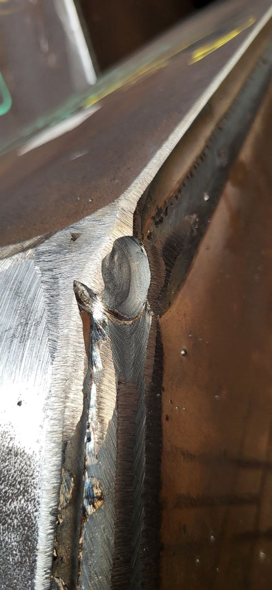
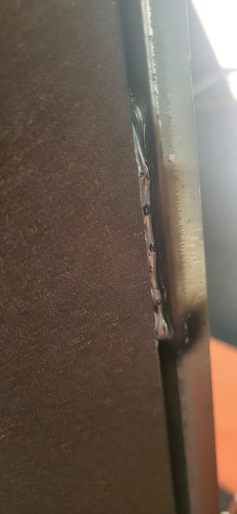
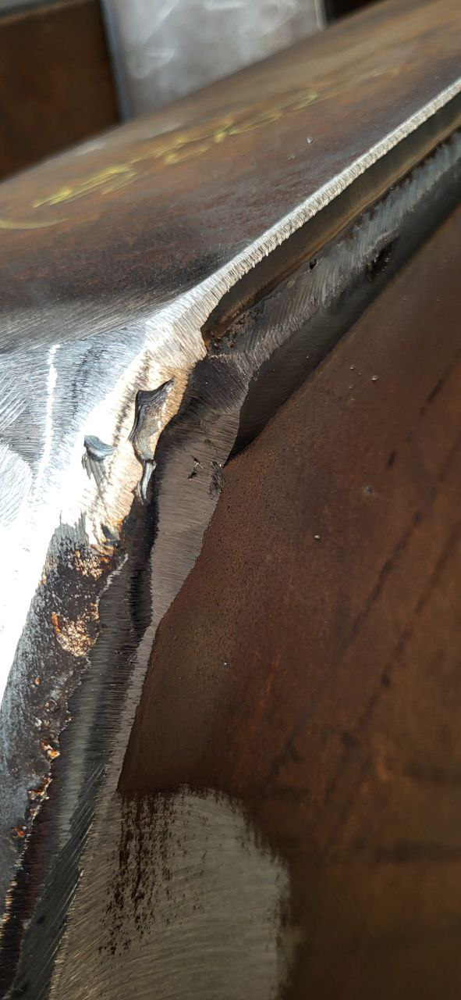
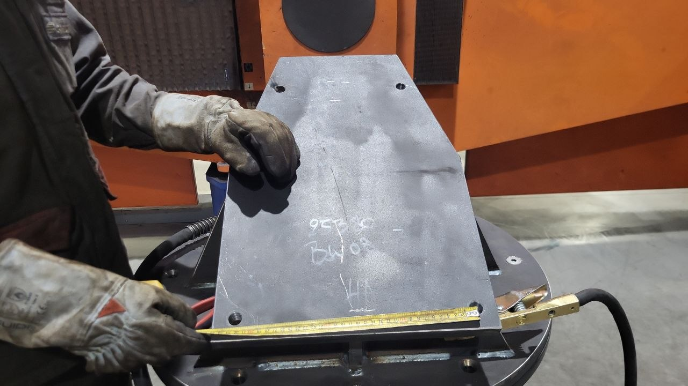
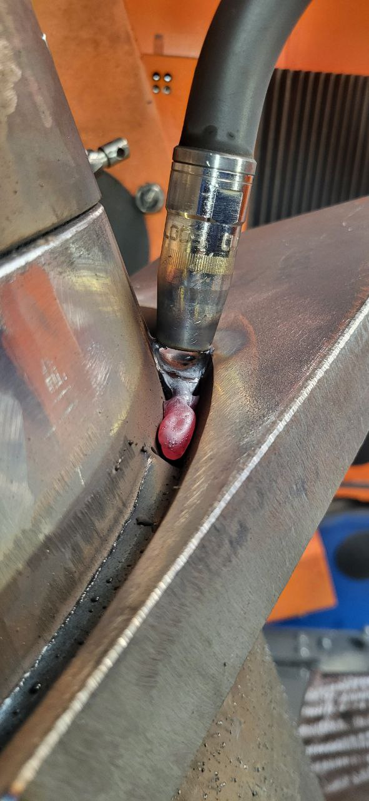

# QC Log — 27390 germannbridge

---
## 27/02/2026

- Pores in root of bridge attachement,  needs fixing on site and recheck ndt — [weld_porosity_bridge_attachment_defect_20260227_201725.jpg]
  

- ❌ REJECT – Bridge attachment weld | Photo: weld_porosity_bridge_attachment_defect_20260227_201725.jpg
Defects: (1) Severe porosity – numerous pores/pits in root/intermediate weld pass, upper central area. (2) Irregular weld profile at upper toe line – possible lack of fusion and slag inclusion toward right side. (3) Crumbly weld metal, poor fusion with base metal in red-marked rejection zone.
Action required: On-site repair + NDT re-inspection (VT mandatory, MT/PT recommended on repaired zone). Do not proceed to coating until re-inspection passed.

---
## 28/02/2026

- Mt fault on triangle part 2401 41 needs repair before release — [27390_germannbridge_part_2401_41_weld_fault_20260228_061157.jpg]
  

- 📸 Photo: 27390_germannbridge_part_2401_41_weld_fault_20260228_061157.jpg | Part: Triangle 2401-41 | Defect: MT fault — large irregular void/crater at weld start/stop point. Indicates inadequate fill, possible porosity or lack of fusion at weld termination. Uneven bead profile with spatter visible near fault zone. Coarse grinding marks on surrounding base metal. ❌ HOLD — Repair required before release. NDT re-check (MT) mandatory after repair.

- Not good for mt testing , need touchup and grinding before relaqe , part 2401-41 triangle structure — [weld_porosity_uneven_bead_not_ready_mt_20260228_062834.jpg]
  

- Part 2401-41 triangle structure — weld NOT ready for MT or re-lacquer. Defects observed: widespread porosity along entire weld length, highly irregular/lumpy bead profile, potential cold lap/lack of fusion at lower sections, minor spatter. Surface too rough and porous for reliable MT testing — false indications risk. Touchup, grinding and re-weld required before MT inspection and re-coating. Photo: weld_porosity_uneven_bead_not_ready_mt_20260228_062834.jpg

- [thermal_cut_edge_heavy_dross_on_steel_plate_20260228_062904.jpg]
  

- 📸 Photo: thermal_cut_edge_heavy_dross_on_steel_plate_20260228_062904.jpg | No part number specified. Thermal cut edge on steel plate showing severe dross/slag accumulation along lower and middle sections, with uneven striations and rough cut quality. Adjacent metal surface shows heavy rust and oxidation. No welds present. Edge is NOT suitable for welding as-is — requires grinding/cleaning to remove dross before fit-up or welding. No coating present. Status: ❌ HOLD — grind/clean cut edge before proceeding.

---
## 02/03/2026

### Welding

- Holes on this part are not drilled axcording to measurement, on holding needs redrilling — [incorrectly_drilled_holes_on_plate_20260302_141700.jpg]
  

### Coating / Galva

### NDT

### General

- Part BW08 / H1 (trapezoidal plate, ref 95780) — Holes drilled incorrectly, not according to measurement. Dimensional non-conformance confirmed with measuring tape on-site. Component on HOLD — redrilling required before release. Photo: incorrectly_drilled_holes_on_plate_20260302_141700.jpg

---
## 03/03/2026

### Welding

- Fillet weld — bad weld quality identified. Defects: (1) Excessive spatter on base metal / vertical plate, (2) Irregular & uneven weld bead profile, (3) Potential underlying defects suspected: porosity, slag inclusion, undercut, lack of fusion. Action required: grind weld, then MT before release. Photo: bad_weld_spatter_irregular_profile_p27390_20260303_140229.jpg

### Coating / Galva

### NDT

- Bad weld , needs grinding , then mt before release — [bad_weld_spatter_irregular_profile_p27390_20260303_140229.jpg]
  

### General

