# QC Log — DAVIT CRANES 25380

*Project: Seasight Davit Cranes — Order 25380*
*Inspection by: Nick Geudens*
*Source: WhatsApp group chat, enriched with AI vision analysis*

---
## 25/02/2026

### Wel een plus punt

*Non-QC photo: Image shows Wi-Fi connection instructions, likely from an airplane or airport, not related to davit crane inspection.*

*Non-QC photo: The image shows a USB-C charging port, likely in an airplane or vehicle, illuminated with a blue light and indicating 60W power output. It is not related to welding or coating inspection of a davit crane.*

*Non-QC photo: This image displays instructions for connecting to Wi-Fi on an airplane, featuring the KLM logo and Wi-Fi symbol. It is not related to welding, coating, or davit crane inspection.*

<a href="seasight_25380_usb_c_port_60w_m09_blue_light_plus_.jpg">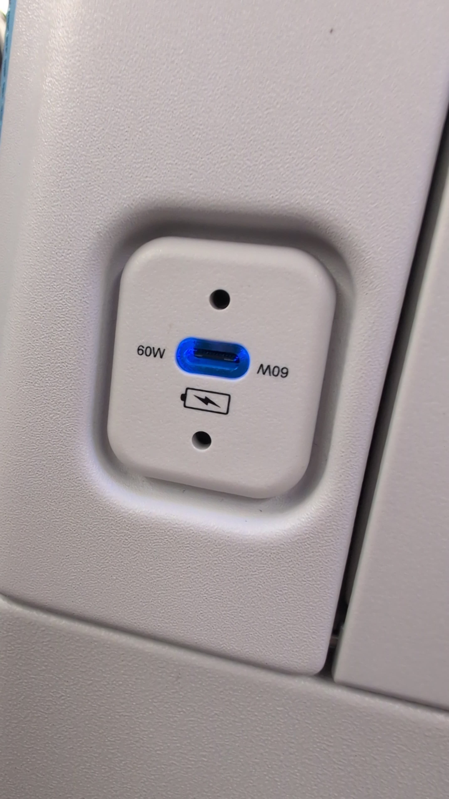</a>
*Non-QC photo: The image shows a USB-C charging port with a "60W" label and a glowing blue indicator, commonly found in airline seats or other travel settings.*

---
## 26/02/2026

### Amai das 4 sterren

*Non-QC photo: Image depicts a hotel room with a bed, small sink area, TV, and luggage on the floor, not a davit crane or industrial equipment.*

*Non-QC photo: Interior view of a modern bathroom with a toilet and shower area.*

<a href="project_25380_arrival_hotel_room.jpg">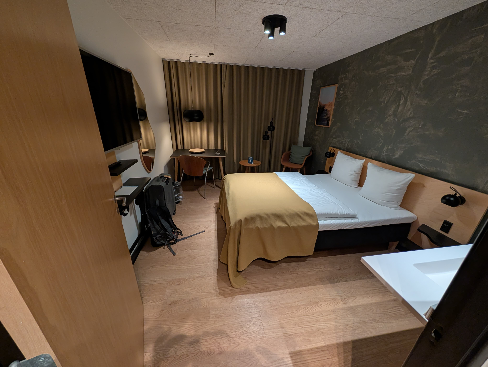</a>
*Non-QC photo: The image displays a hotel room with a bed, desk, chair, suitcase, and various room furnishings.*

<a href="hotel_room_arrival_1.jpg">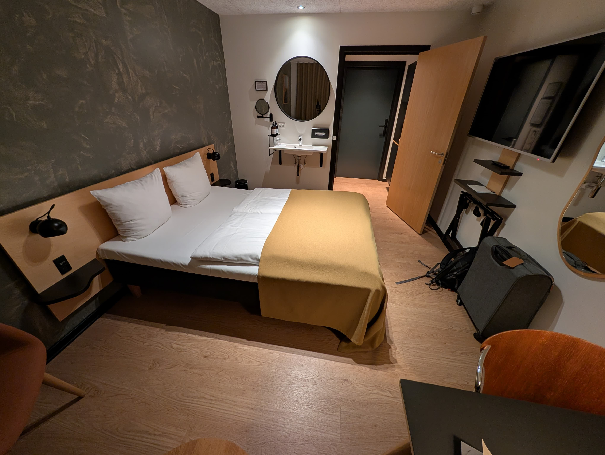</a>
*Non-QC photo: This is a photo of a hotel room, not related to davit crane inspection or welding/coating quality control.*

<a href="25380_seasight_4_star_bathroom.jpg">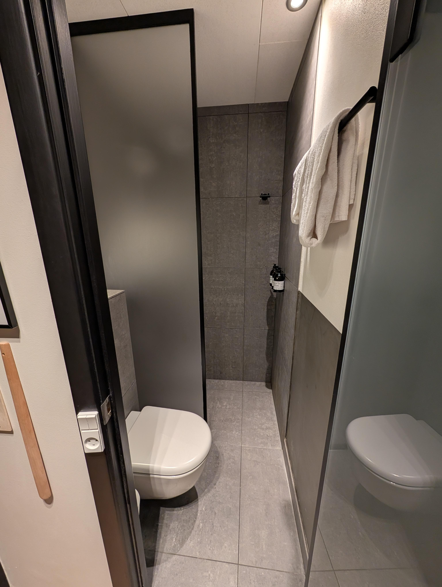</a>
*Non-QC photo: This image depicts a bathroom interior, featuring a toilet, tiled walls and floor, and a towel rail.*

*00:38 — Jan Verheyen:* Veel plezier daar, just de wieken op de brug gezien, waren er 3 <Dit bericht is bewerkt>

### Jelle vroeg foto's van de kamer. Alle ik ga slapen

*The image displays a fillet weld on a davit crane component (Undercover op nr 30, project 25380 Seasight) with good profile and fusion to the base material. The weld appears acceptable via visual inspection (VT). A pronounced granular texture is visible on both the vertical and horizontal coated surfaces. This feature could be an intentional coating characteristic (e.g., anti-skid, high-build system) or a paint defect such as severe dry spray if a smooth finish was specified; further assessment requires coating specification review.*

<a href="crane_30_undercover.jpg">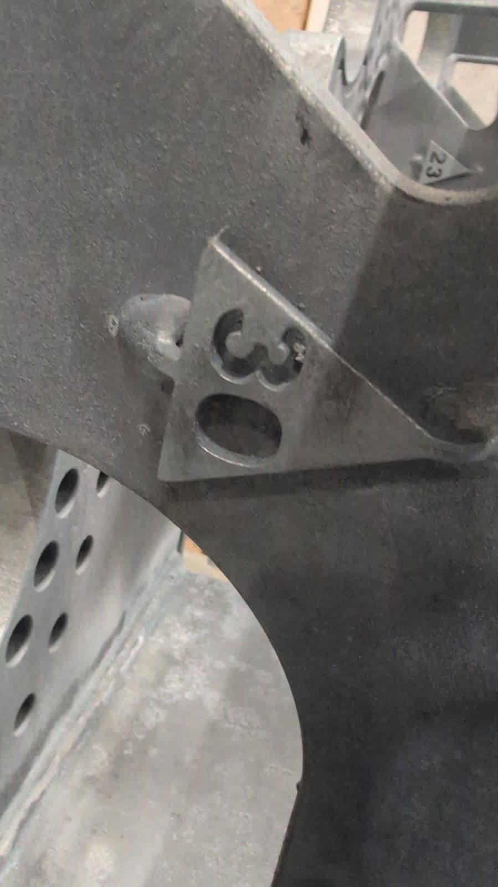</a>
*Non-QC photo: The accompanying chat context indicates this is a personal photo of a room requested by Jelle, not a quality control inspection photo.*

<a href="davit_part_30_galva.jpg">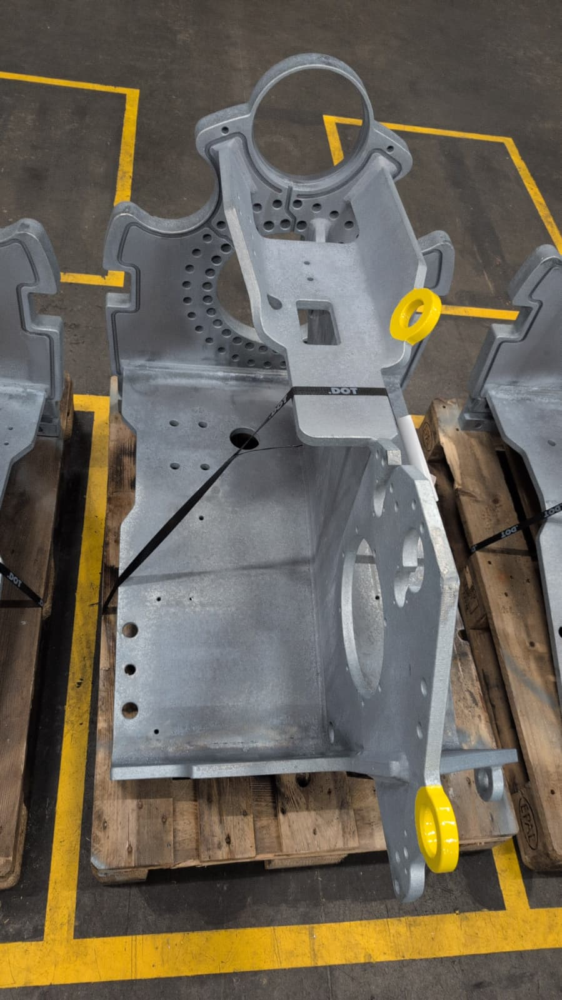</a>
*The davit crane components exhibit a grey industrial coating, likely hot-dip galvanization. Minor surface irregularities and inconsistent coating texture, such as localized darker patches and flow lines, are visible on the large flat panel in the central foreground and other sections. These are considered minor cosmetic "galva issues" and are likely acceptable for the functional purpose of the components. A thorough Visual Test (VT) against project-specific coating specifications is recommended to confirm final acceptance.*

<a href="davit_crane_30_galva_main_struct_parts.jpg">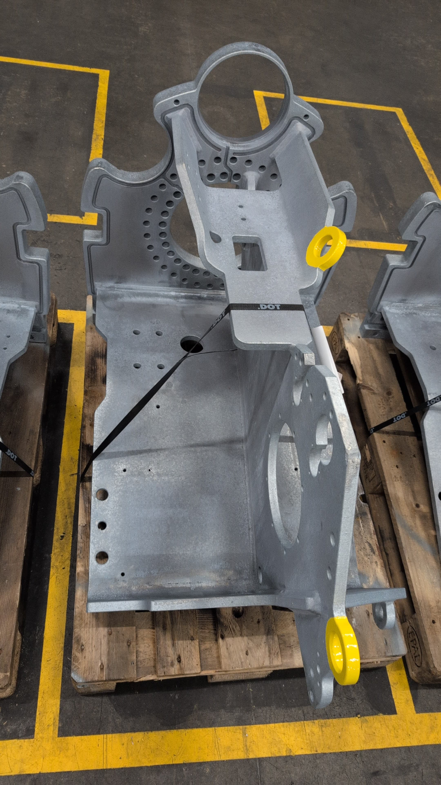</a>
*The davit crane components (project 25380 Seasight) display a coarse, textured surface finish characteristic of hot-dip galvanizing. No critical galvanizing defects such as bare spots, excessive dross, or severe delamination are visible upon visual inspection (VT). The overall surface quality appears acceptable for the intended structural application.*

<a href="crane30_weld_textured_coating.jpg">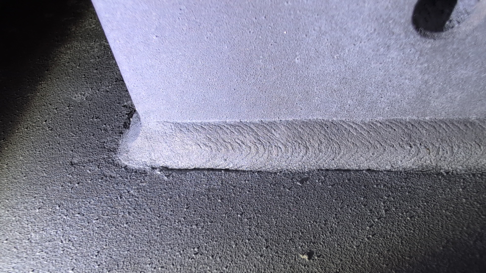</a>
*Visual inspection (VT) of a davit crane component reveals a coated fillet weld. The weld bead exhibits a consistent and acceptable profile with no apparent structural defects. The applied textured protective coating shows minor localized surface irregularities and dark specks, identified as minor coating defects. These areas may require further assessment against coating specifications, but the weld itself appears sound.*

*Component numbers '30' and '23' are visible as identifiers on triangular plates attached to the davit crane structure. The primary surface exhibits a textured grey coating, which, while appearing somewhat rough, shows no immediately obvious severe defects such as large pores, undercut, or coating failures from this perspective. Minor surface irregularities, possibly indicative of rough galvanizing or paint finish, are present and require assessment against project specifications, with a comprehensive visual inspection (VT) recommended for all welds and coated areas.*

<a href="crane_28_pore.jpg">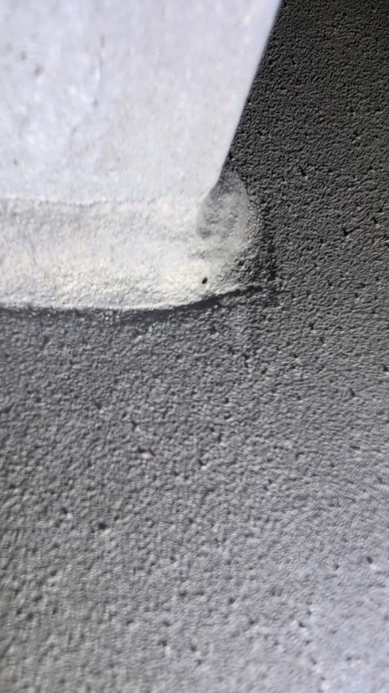</a>
*A minor, isolated pore is identified via Visual Testing (VT) at the weld toe/material transition on davit crane #28. This single pore appears small and its acceptability should be confirmed against project-specific weld quality standards. No further non-destructive testing (NDT) is indicated in the provided context.*

*Visible galvanizing defects, including runs and uneven coating thickness, are present on multiple surfaces of the davit crane components. These imperfections are notably visible on the large flat and vertical sections of the main frame parts. Depending on the project specification (25380 Seasight), these issues may require repair to ensure adequate corrosion protection. Visual Testing (VT) confirms these surface irregularities.*

<a href="seasight_crane_28_pore.jpg">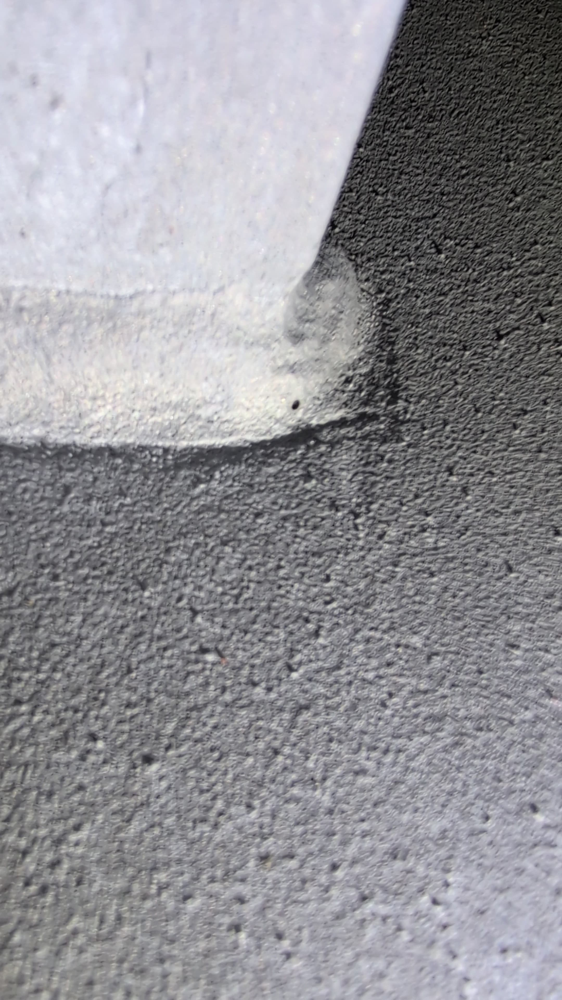</a>
*VT inspection of Davit Crane #28 reveals a single pore in the coating. While appearing minor in size, this discontinuity compromises the protective layer, especially critical for marine applications. Localized repair of the coating is needed to ensure optimal corrosion resistance and long-term integrity. NDT status is Visual Testing (VT).*

<a href="crane_28_pore_1.jpg">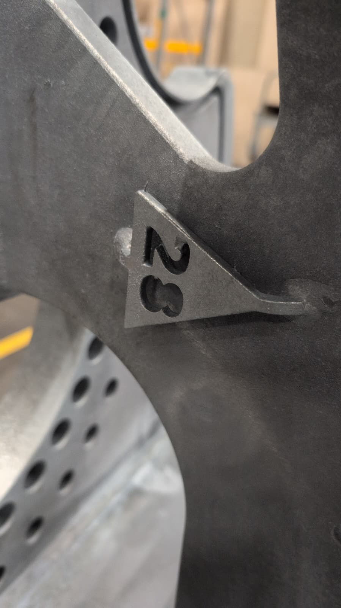</a>
*Identification tag '23' is visible, securely welded to a davit crane component. A minor weld irregularity or small spatter is present at the tag's attachment point. This is considered an acceptable minor visual feature for an identification tag, confirmed by Visual Testing (VT).*

<a href="crane28_davit_component_surface_pores.jpg">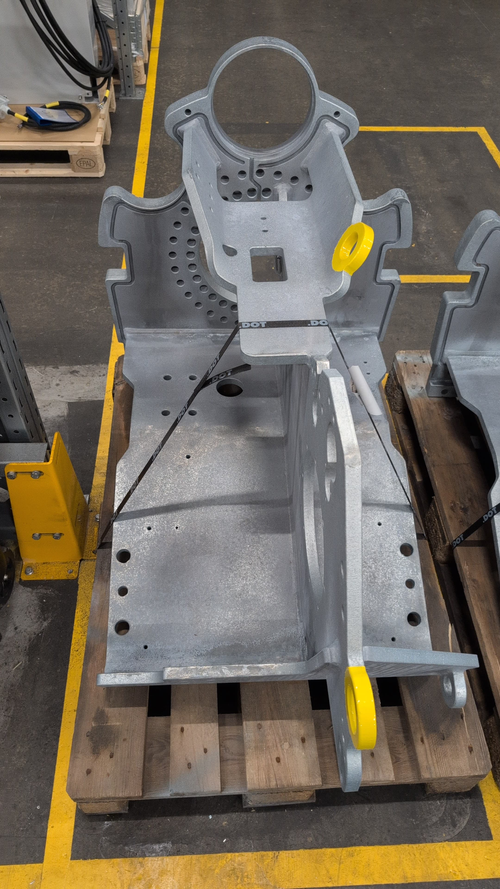</a>
*The main structural component displays a hot-dip galvanized coating. The surface exhibits a typical, somewhat uneven industrial finish with minor texture variations and crystallization patterns across the component. These cosmetic irregularities are considered acceptable for a corrosion protection coating on this type of industrial equipment and do not warrant repair, thereby passing visual inspection (VT).*

<a href="nr28_pores.jpg">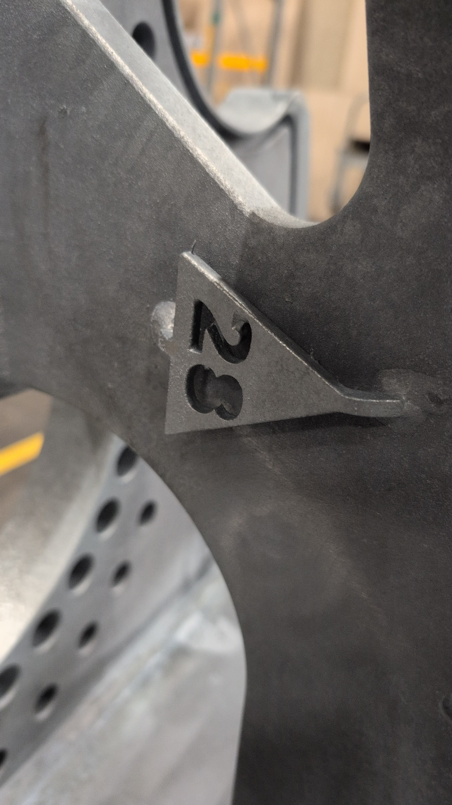</a>
*The component identification '28' is visible on a structural member. A minor weld spatter is observed at the attachment point of the identifier plate, adjacent to the numeral '2'. This is a minor surface defect typically addressed by Visual Testing (VT) and may require removal if not compliant with cosmetic specifications or before coating application.*

*Visible defect is severe galvanizing blistering/swelling on component number 23, as indicated by the raised, irregular area in the illuminated section. This condition suggests a localized coating failure or issue during the galvanizing process, which compromises corrosion protection. This defect is unacceptable and requires repair. Visual Testing (VT) confirms the presence of this issue.*

<a href="crane_23_galva_opgezwollen.jpg">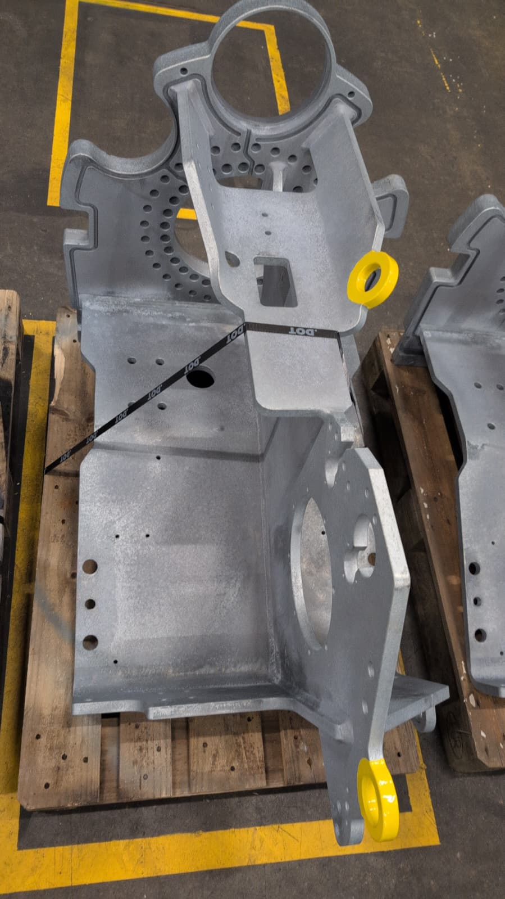</a>
*The davit crane components for Project 25380 Seasight display a uniform and consistent grey surface finish, suggesting a proper coating application such as galvanization or primer. No visible welding defects (pores, undercut, end craters) or significant paint defects are apparent. Based on visual inspection (VT), the overall quality of the coating and the components appears acceptable, with no discernible issues requiring repair.*

<a href="crane23_galva_swelling.jpg">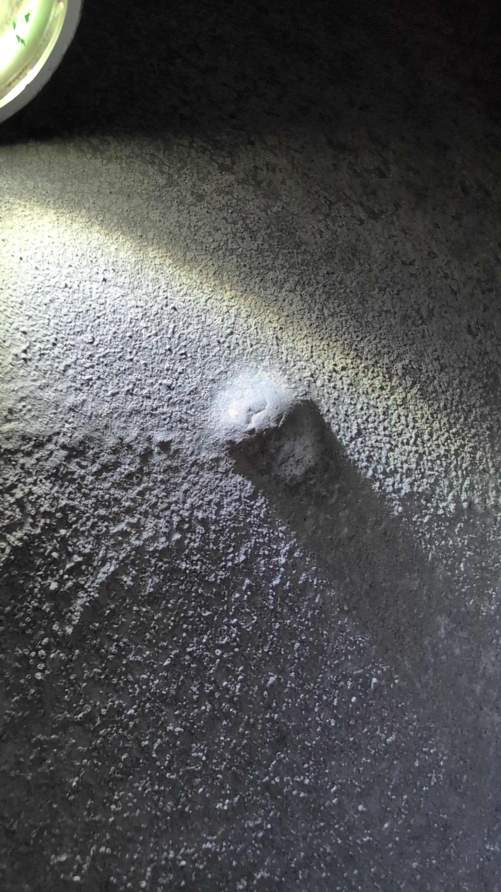</a>
*Visible galvanizing swelling/blistering is clearly present on component #23. This defect indicates poor adhesion or gas entrapment during the galvanizing process, making the coating unacceptable for long-term corrosion protection. Repair is required to address this issue. The defect was identified through Visual Testing (VT).*

*Identification number "23" is visible on a dark grey structural component, likely part of the davit crane. The surface exhibits a coarse, textured finish, potentially a heavy-duty coating or a surface treated for grip/adhesion. This texture appears consistent throughout the visible area upon visual inspection (VT), suggesting it may be acceptable if within coating specifications. A definitive quality assessment requires comparing the visible texture against the specified coating finish for project 25380 Seasight.*

<a href="crane_23_galva_opgezwollen_1.jpg">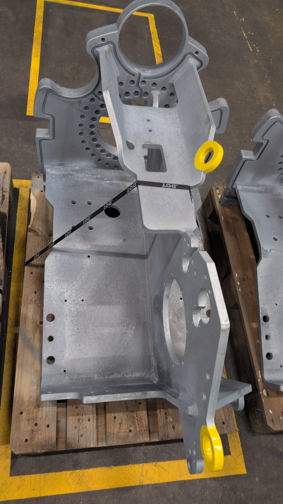</a>
*Visible widespread surface inconsistencies on the galvanized crane components, specifically multiple white speckled patches and a generally rough texture across various surfaces. These conditions may indicate zinc ash inclusions or early stages of white rust, which could impact long-term corrosion performance or subsequent coating adhesion for project 25380 Seasight. A detailed Visual Inspection (VT) is required to determine if these areas meet the galvanizing specifications; depending on the findings, cleaning or rework may be necessary.*

<a href="crane_23_galva_swollen.jpg">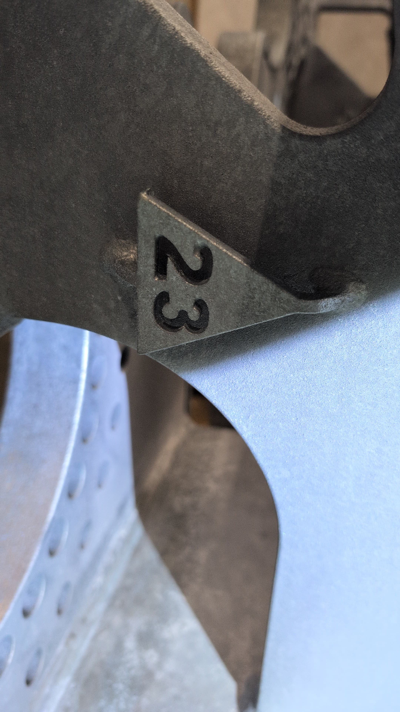</a>
*Visual inspection (VT) reveals identification number '23' on a triangular marker plate, attached to a davit crane component. The dark gray protective coating on the component and plate shows a consistent textured finish. No major paint defects like blistering, cracking, or significant runs are visible, and the component's condition is considered acceptable.*

*The davit crane (Crane No. 10, Project 25380) is documented as ready for a Factory Acceptance Test (FAT) with the customer. From the visible general surfaces, the coating appears uniform and free from obvious major defects such as peeling, severe rust, or significant mechanical damage. While no specific weld seams or coating close-ups are provided for detailed analysis of micro-defects like pores or undercut, the overall visual appearance suggests an acceptable condition for this stage, implying prior visual inspection (VT) of the structural components has been satisfactory to declare readiness for FAT.*

<a href="davit_crane_10_ready_for_fat_test_seasight.jpg">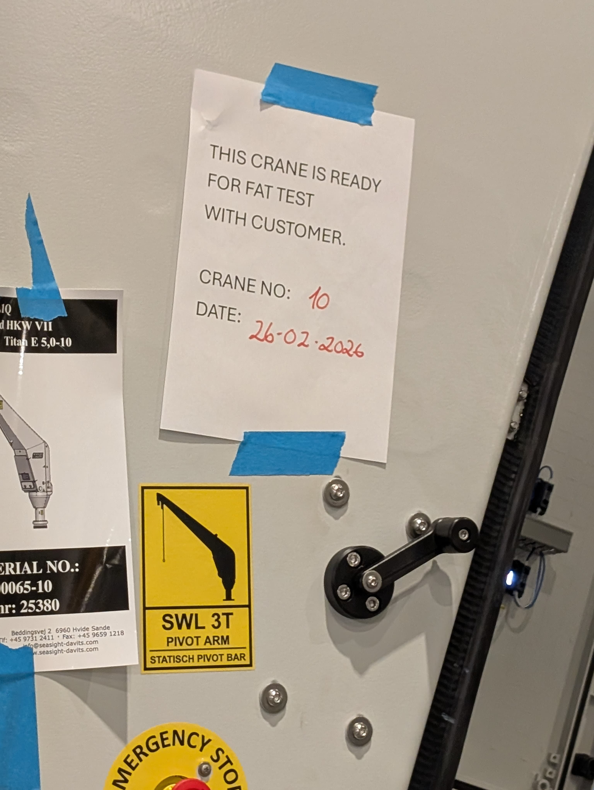</a>
*This image shows Crane No. 10 (Project 25380, Seasight) is declared ready for Factory Acceptance Test (FAT) with the customer on 26-02-2026. This administrative milestone implies all prior quality control stages, including NDT and visual inspection of welds and coatings on accessible surfaces, are considered completed and acceptable. No specific defects or NDT markings are visible in the captured area.*

<a href="seasight_davit_10_overload_test_1300kg.jpg">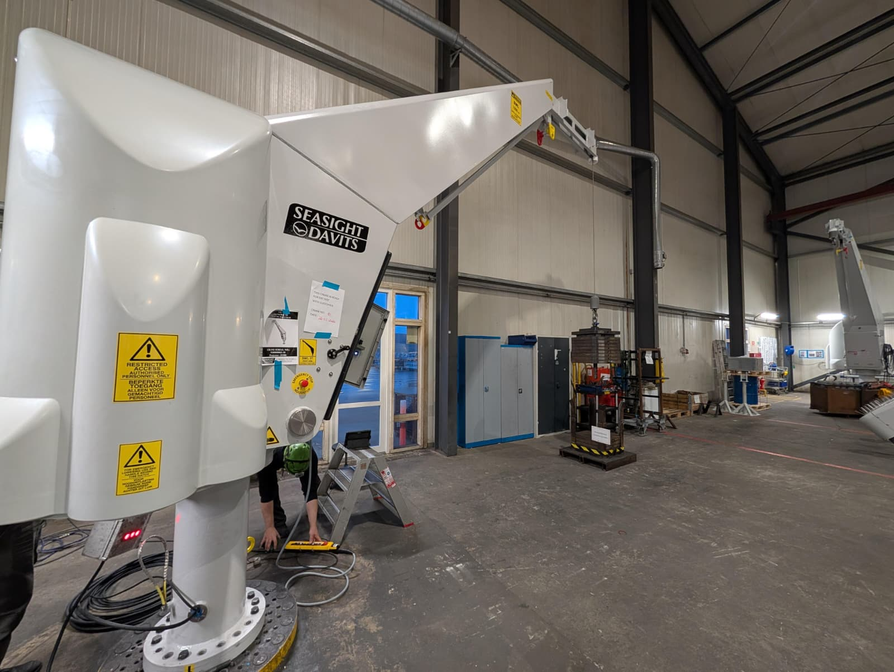</a>
*The visible white protective coating on the Seasight Davits crane (Project 25380) appears uniform and free of major paint defects such as significant runs, sags, blistering, or delamination. No obvious welding discontinuities like undercut or severe porosity are discernible through the applied paint finish. Based on visual inspection (VT), the coating condition is acceptable. Underlying weld quality cannot be assessed by this photo.*

*The davit crane (Crane No: 10, Project 25380) displays a consistent and uniform white paint finish across its visible surfaces. No significant paint defects such as runs, sags, or blistering are discernible through this visual inspection. While specific weld defects like porosity or undercut cannot be fully assessed due to the paint coating and image resolution, the overall fabrication and finish appear to be of an acceptable quality standard. The crane is noted as being ready for its Factory Acceptance Test (FAT), implying prior visual inspections (VT) and necessary NDT have been completed and approved.*

<a href="crane_10_overload_test_1300kg.jpg">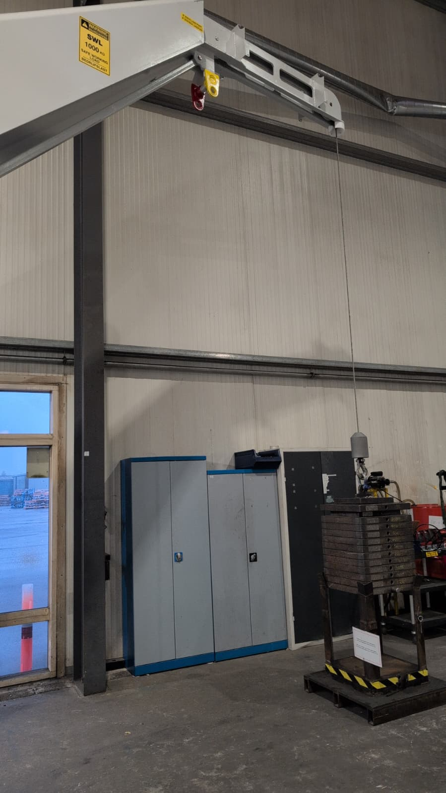</a>
*The image documents a davit crane (Project 25380 Seasight) undergoing an overload test. A warning sticker on the crane arm clearly indicates a Safe Working Load (SWL) of 1000kg. The reported overload test of 1300kg (130% of SWL) is depicted, with no visible structural deformation or coating defects observed. This observation serves as visual documentation (VT) of the load test procedure.*

<a href="project_25380_davit_crane_overload_test_1300kg.jpg">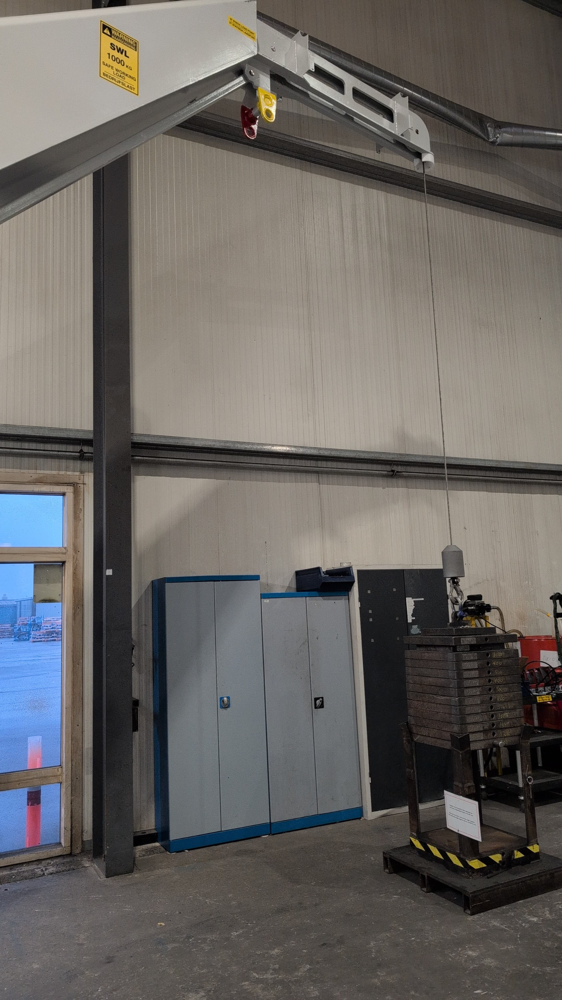</a>
*The photo documents the overload testing of the davit crane for project 25380 Seasight. A load of 1300 kg is visible on the test setup, confirming the specified overload test at 130% of the 1000 kg Safe Working Load (SWL). No visible defects such as cracks, deformation, or coating issues are apparent on the crane structure or its connection points during this visual inspection (VT). The structural integrity appears acceptable.*

<a href="davit_crane_bolts_tightening_verified.jpg">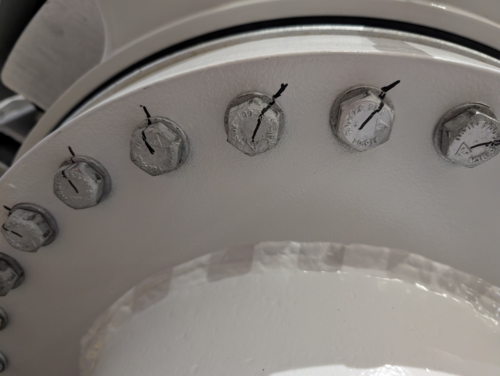</a>
*The image displays a series of flange connection bolts with clear torque stripe marks applied. These marks confirm that the bolts have been tightened to the specified moment, as indicated by the chat context "Bouten op moment vast gezet," and provide visual assurance against loosening. This feature is an acceptable and good practice for fastener integrity verification, considered a positive finding from a Visual Testing (VT) standpoint.*

<a href="davit_crane_25380_rough_paint_finish.jpg">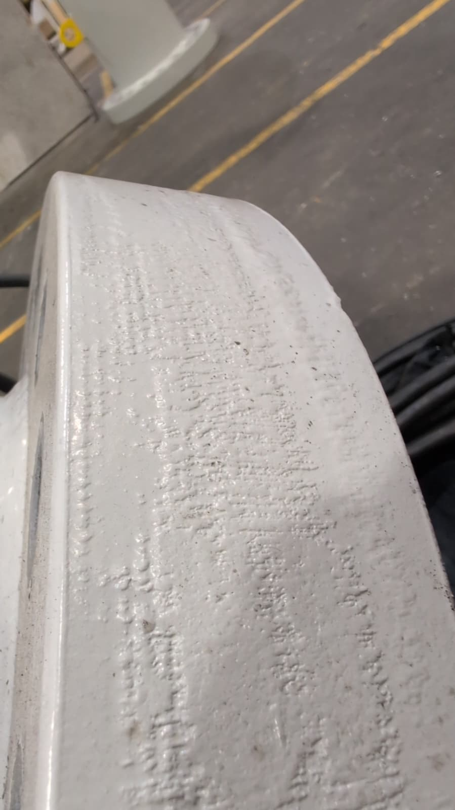</a>
*Visible paint defect showing severe surface roughness and texture, possibly indicating poor application, bubbling, or pitting. This is located on a flange or structural component of the davit crane (Project 25380 Seasight). This level of surface irregularity is likely unacceptable and may compromise the coating's long-term protective properties, requiring repair (surface preparation and re-coating) per specification. This observation is a result of Visual Testing (VT).*

*Visible mechanical damage, specifically a chip or gouge, is noted on the edge of a bolt hole on the davit crane flange (Project 25380 Seasight). This VT-identified defect exposes the base material, potentially affecting bolt seating and corrosion resistance. It is assessed as minor damage requiring further evaluation for fit-up and a localized coating touch-up or repair.*

<a href="crane_paint_roughness_25380.jpg">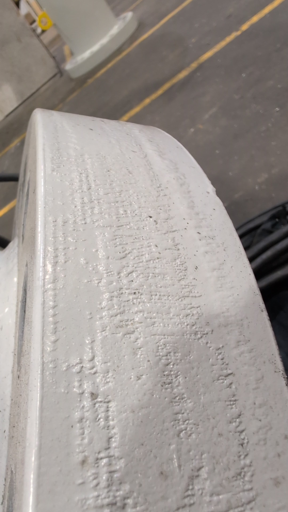</a>
*Significant surface roughness and texture defects (coarse finish) are visible on the coating of the davit crane component, likely a flange or cylindrical section. This condition indicates an issue with paint application or surface preparation. The coating is unacceptable and requires repair or further assessment to ensure adequate corrosion protection and adhesion. Visual Testing (VT) confirms the extensive coating texture defect.*

<a href="crane_25380_flange_paint_roughness.jpg">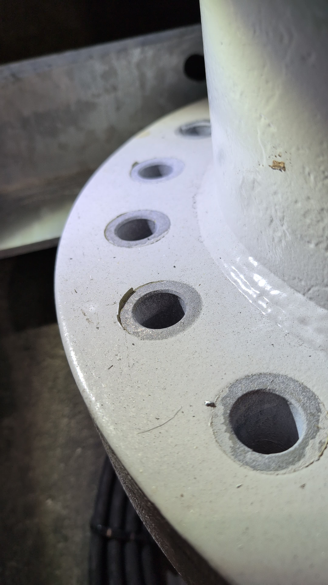</a>
*Visible paint damage and chipping are present around multiple bolt holes on the davit crane flange (project 25380 Seasight). The coating exhibits poor adhesion or mechanical damage at these locations, revealing uneven edges of the underlying material. This is a minor paint defect identified by Visual Testing (VT) that needs to be recorded in the report. Repair is recommended to restore corrosion protection.*

### Idd in rapport zetten

<a href="davit_crane_hole_sharp_edge.jpg">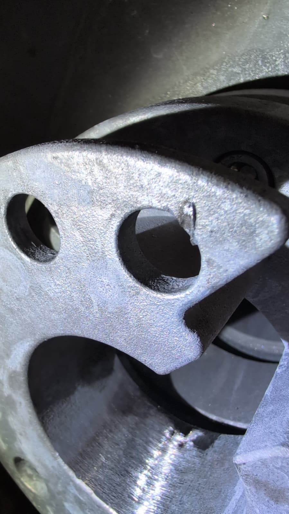</a>
*A sharp edge/burr is visible on the rim of a hole on a metal component of the davit crane (Project 25380 Seasight). This constitutes a finishing defect that could pose a safety hazard or affect component fit. The edge should be deburred to an acceptable radius. This feature was identified via Visual Testing (VT).*

<a href="25380_davit_spool_flange_sharp_edge_on_hole.jpg">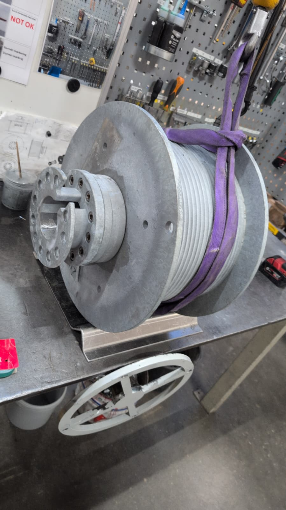</a>
*Visible galvanization issues on the sheave/drum component, particularly rough texture and inconsistent coating coverage, are apparent on the flat flange faces and around the central hub. These patches and unevenness suggest potential defects such as rough galvanizing or areas of inadequate adhesion. This condition requires further visual inspection (VT) to assess severity against coating standards for corrosion protection and determine if a repair is needed.*

*Visual inspection (VT) reveals a sharp edge or burr on the perimeter of the upper right hole of the metallic davit crane component (Project 25380 Seasight). This sharp edge is a manufacturing defect that needs deburring to prevent injury and ensure proper fitment or coating integrity. The defect is not acceptable and requires immediate rework.*

<a href="davit_31_winch_drum_flange_burr.jpg">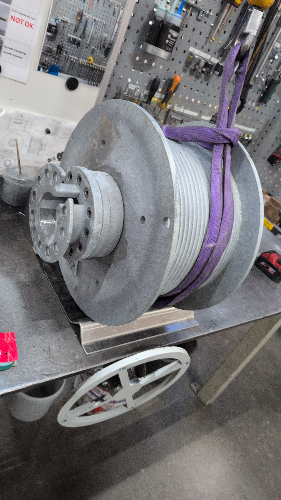</a>
*The large, grooved drum component, likely a winch drum or large sheave for the davit crane, is hot-dip galvanized. The galvanizing exhibits a typical mottled surface finish with some minor texture variations, which is common for the process. No critical defects such as severe pores, undercut, excessive dross, bare spots, or other significant galva issues are clearly discernible via visual inspection (VT). The component appears acceptable based on this image.*

<a href="crane31_sharp_edge_hole.jpg">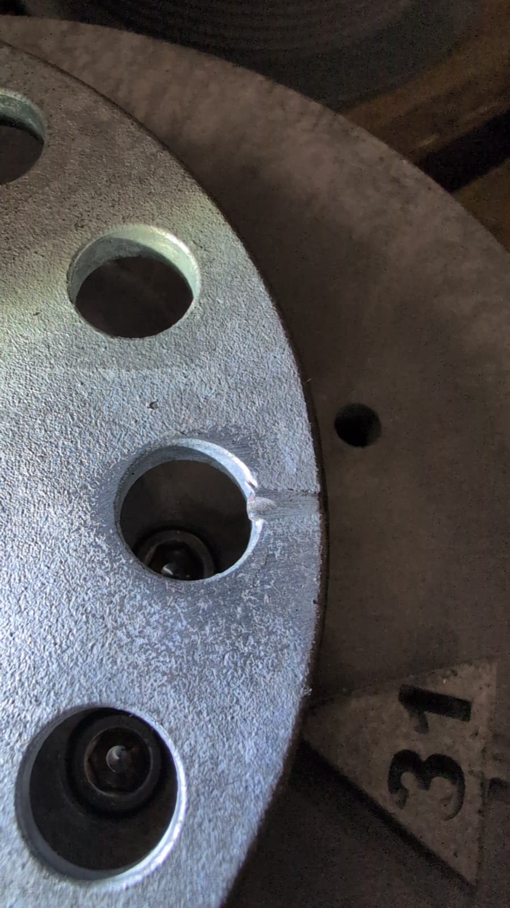</a>
*Visual inspection of davit crane component Nr 31 reveals a localized gouge/chip on the edge of a bolt hole, with an associated linear imperfection across the galvanized surface. This likely indicates mechanical damage to the galvanized coating and potentially the base material, creating a corrosion risk. Recommend further investigation via MT/PT to assess the depth and nature of the imperfection, followed by coating repair as needed.*

<a href="crane31_hole_edge_crack.jpg">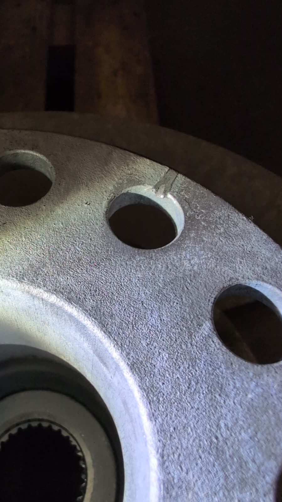</a>
*A crack is visible on the flange, originating from the edge of a bolt hole. This is a critical defect and is unacceptable, requiring immediate repair. Further Magnetic Particle Testing (MT) or Dye Penetrant Testing (PT) is recommended to ascertain the full extent of the crack and to verify the quality of any repair.*

<a href="davit_crane_31_galva_surface_streaks.jpg">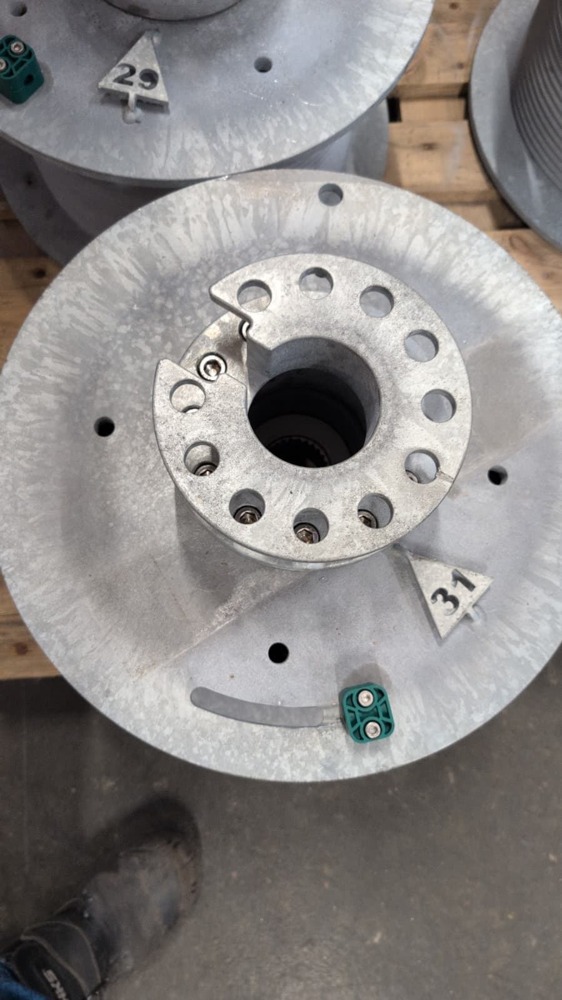</a>
*Visual inspection (VT) reveals inconsistent surface finish on the large circular metallic components, identified by markers 29 and 31. This appears to be a galvanization issue or coating defect, characterized by a mottled, uneven appearance across the surface. While the severity is likely minor, it may affect aesthetics and potentially long-term corrosion protection. Further assessment against coating specifications is recommended.*

*A heavily textured, galvanized coating is visible on component Nr 31. A precisely cut keyway or notch is also present at the edge of one through-hole. Based on Visual Testing (VT), the coating's roughness appears typical for hot-dip galvanizing on a davit crane, and the notch is interpreted as an intentional design feature, rendering both acceptable without further indication of failure.*

<a href="crane_31_flange_crack_from_bolt_hole.jpg">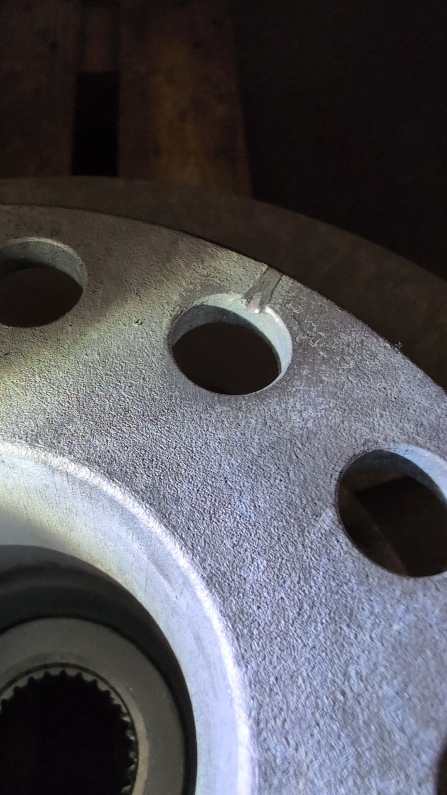</a>
*Visible defect is a crack originating from a bolt hole on the flange component. This is a critical defect requiring immediate repair as it compromises structural integrity and can lead to component failure. The crack is visible via VT, and further NDT (MT or PT) is recommended to fully assess its depth and extent.*

<a href="crane_31_galva_reels_flanges.jpg">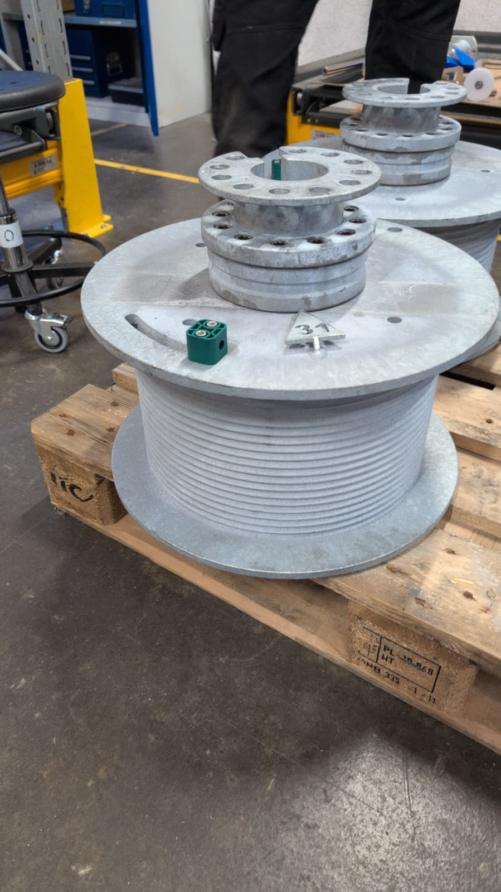</a>
*The components, likely davit crane spools and flanges from project 25380 Seasight, exhibit a visibly rough and uneven hot-dip galvanization finish. This coarse texture is a feature of the coating. A thorough Visual Test (VT) against project specifications is required to assess the uniformity, adhesion, and overall quality of the galvanization to determine if it is acceptable or requires repair.*

<a href="davit_31_galva_finish.jpg">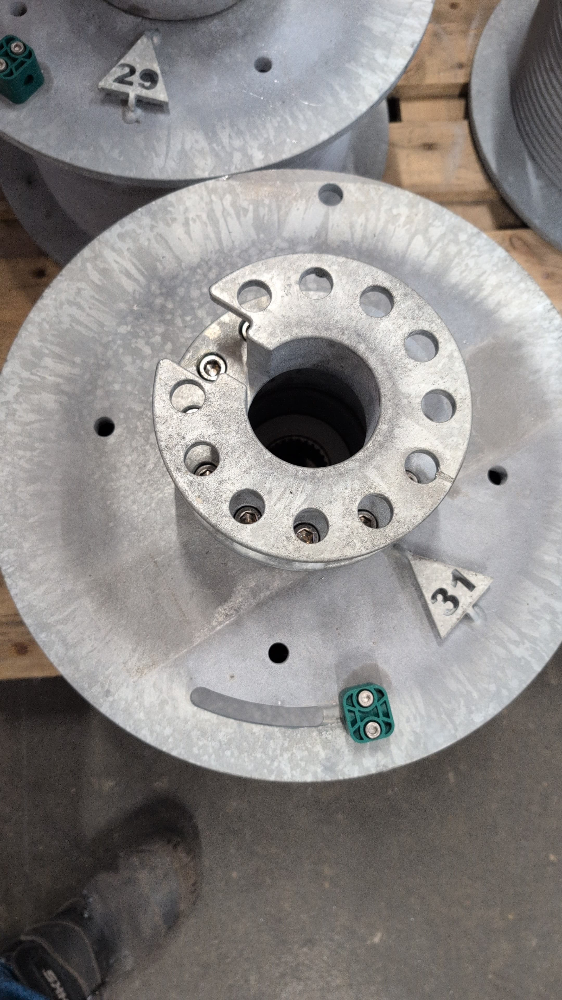</a>
*Visual inspection (VT) reveals significant galvanizing issues on the main disc components, specifically an uneven and mottled surface finish consistent with dross inclusions or inconsistent coating thickness. These coating anomalies are visible on parts marked 29 and 31. The severity requires further assessment against project coating specifications to determine if the finish is acceptable or necessitates rework for corrosion protection and aesthetic requirements.*

<a href="davit_crane_31_galva_residue.jpg">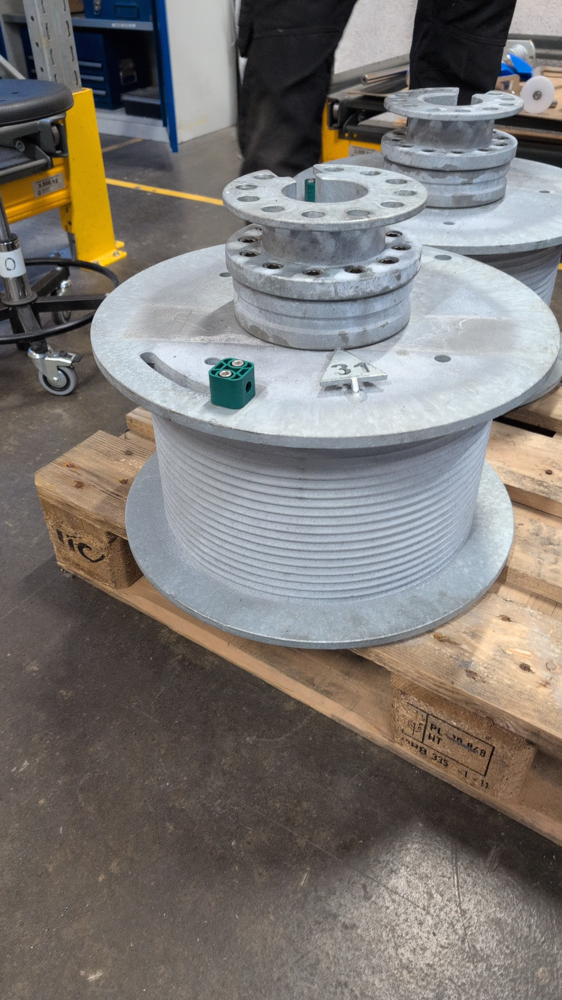</a>
*The components are hot-dip galvanized parts for a davit crane, with item "31" identifiable on a spool flange. Visual Testing (VT) indicates the galvanization is generally acceptable, exhibiting typical surface irregularities and a mottled texture inherent to the process. No severe defects such as significant bare spots, excessive dross, or major coating discontinuities are visible that would necessitate repair.*

*Visible mechanical damage, presenting as a chip and localized coating breach, is evident on the edge of a bolt hole of a galvanized component (likely a flange or wheel) belonging to crane number 29. This defect compromises the protective coating, making the area vulnerable to corrosion. Repair to restore the coating integrity is recommended, based on Visual Testing (VT).*

*A fracture/crack and associated chipping are visible at the edge of a bolt hole on a structural flange component (davit crane, project 25380 Seasight). This defect is unacceptable, compromising structural integrity, and requires immediate repair or replacement of the component. Visual Testing (VT) has identified the issue; further Magnetic Particle Testing (MT) or Liquid Penetrant Testing (PT) is recommended to determine the full extent of the cracking.*

<a href="crane29_galva_defect_hole_rim_chip.jpg">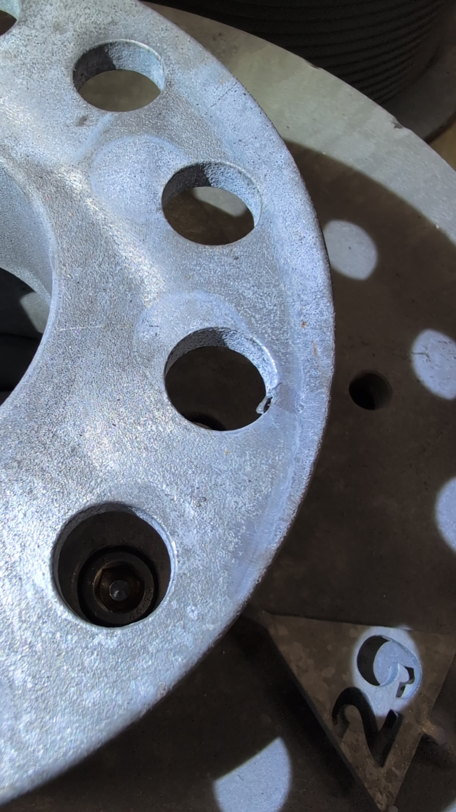</a>
*A galvanization defect is visible on component #29, presenting as a missing coating area near a bolt hole on the flange. This discontinuity is unacceptable for optimal corrosion protection, especially for a davit crane. Repair by re-galvanizing or applying an approved cold galvanizing compound is recommended based on Visual Testing (VT).*

<a href="crane29_galva_flange_hole_chipped_edge.jpg">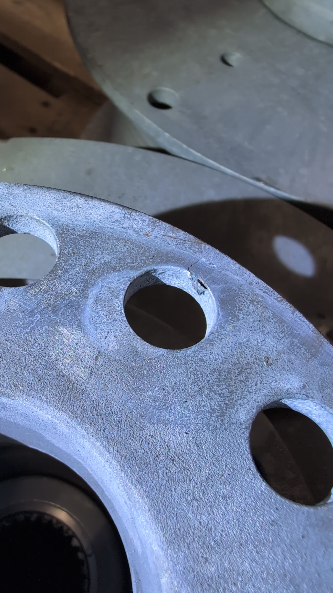</a>
*Visible localized galvanization flaking is present on the flange edge of a bolt hole, exposing the base material. This is a minor coating defect that compromises corrosion protection for Davit Crane, Project 25380 Seasight. It requires touch-up to prevent localized corrosion and was observed during Visual Testing (VT).*

<a href="crane_29_galva_surface_issue.jpg">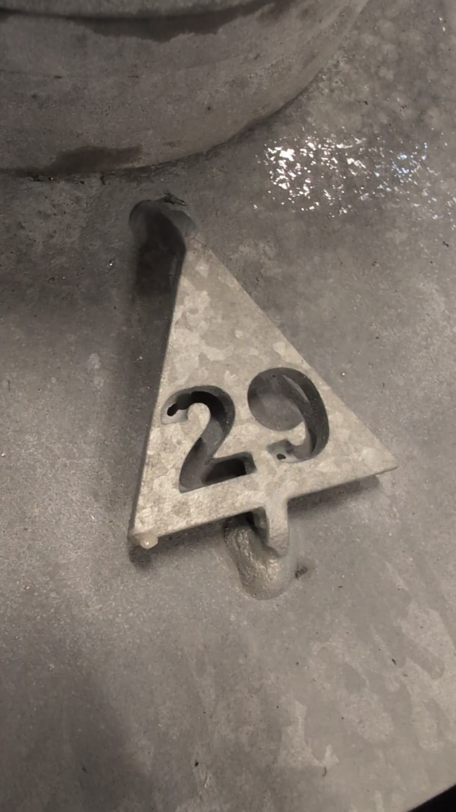</a>
*The image displays a galvanized metal identifier "29" attached to a larger galvanized crane component. No significant welding defects, such as undercut or porosity, are visible at the attachment points. The galvanization exhibits a typical spangled finish, with no apparent bare spots or excessive dross. Based on visual inspection (VT), the feature and its attachment are acceptable.*

*Visual inspection (VT) of hot-dip galvanized identification plate '29' on the davit crane reveals a rough and uneven surface texture. This finish is typical for hot-dip galvanization on structural components and is considered generally acceptable under standards such as ASTM A123. However, conformity should be verified against specific project surface finish requirements. No other coating defects or structural imperfections are evident on the plate itself.*

*Localized galvanizing defect and associated base metal chip/void is visible at a bolt hole on the flange of Set 30. This feature could compromise proper bolt seating and requires further engineering assessment for its severity. Depending on the evaluation, it may necessitate repair; identified via Visual Testing (VT).*

<a href="set30_uneven_galva.jpg">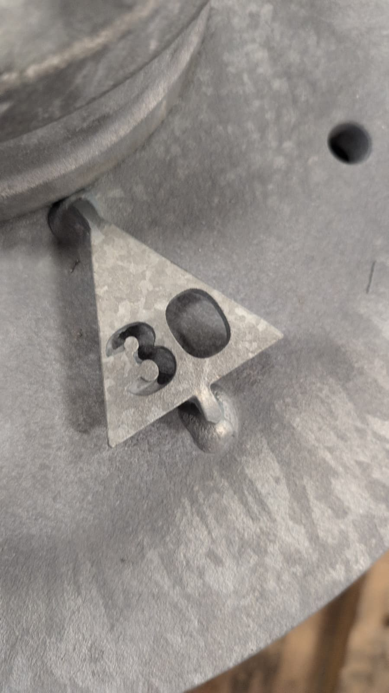</a>
*Visual inspection (VT) of the davit crane component reveals a hot-dip galvanized surface with characteristic spangle and an identification tag marked "30". Minor surface irregularities, potentially dross inclusions, are observed on the main galvanized surface but are considered acceptable for this industrial application. The integrity of the galvanization and attachment welds for tag "30" appear sound.*

<a href="set30_hole_edge_galva_chip.jpg">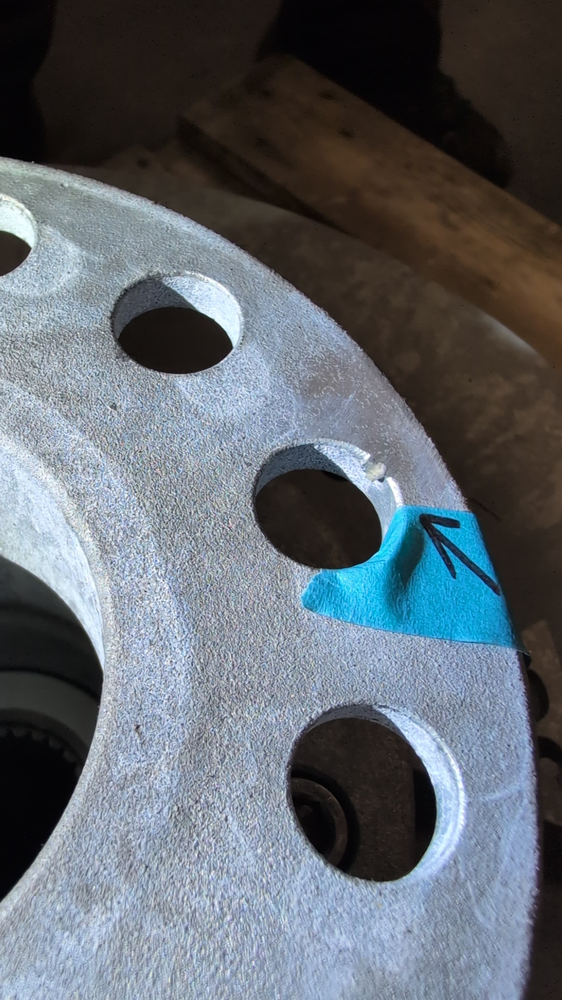</a>
*Visible is localized coating damage, presenting as a chip or discontinuity on the edge of a flange from a davit crane component, marked by inspection tape. This is a minor coating defect that will compromise corrosion protection at that specific point. A visual inspection (VT) confirms the defect, and it likely requires local surface preparation and coating touch-up to prevent future corrosion, similar to findings on set 30.*

<a href="crane_set_30_galva_defect.jpg">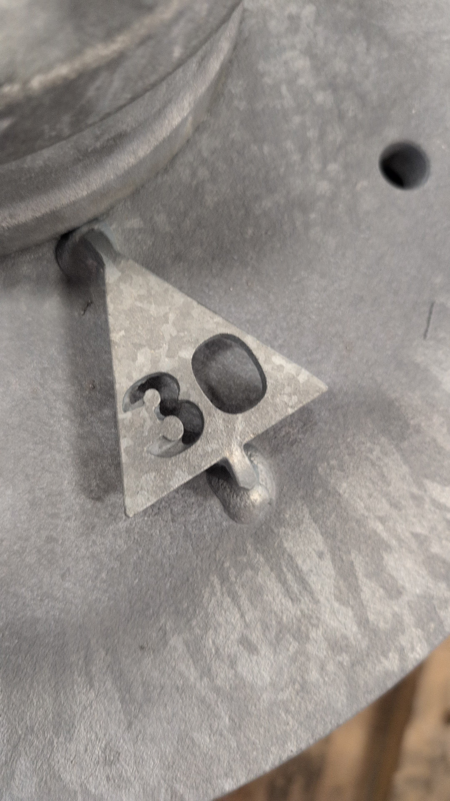</a>
*Visible: Galvanized identification tag '30' welded to a davit crane component. The fillet welds exhibit minor surface irregularities and a slightly uneven profile, consistent with hot-dip galvanization on welds. No critical defects such as undercut, severe porosity, or significant galvanizing issues are evident in the provided image. The overall condition is acceptable based on visual inspection (VT).*

*QC analysis: Galvanization issues are visible on multiple davit crane components, including #30 and #29. The coating exhibits an uneven and mottled surface texture, indicating inconsistencies in the galvanization process. These defects have been identified via Visual Testing (VT) and require repair as previously indicated.*

<a href="davit_cranes_set29_30_galva_white_rust.jpg">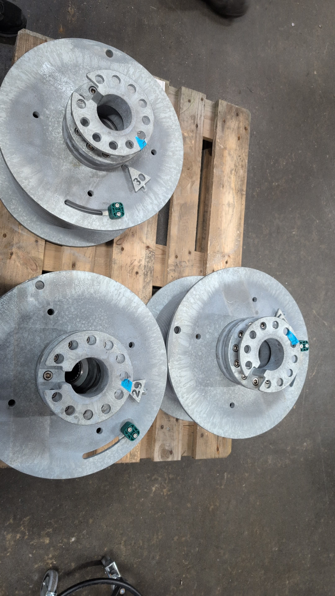</a>
*QC Analysis: Significant galvanizing defects, including uneven coating and white surface irregularities, are evident on multiple davit crane components, specifically identified as sets 29 and 30. These issues point to sub-standard galvanizing quality. As indicated in the chat context, these defects have been flagged for repair, confirmed by Visual Testing (VT).*

<a href="25380_davit_galva_hook_tear.jpg">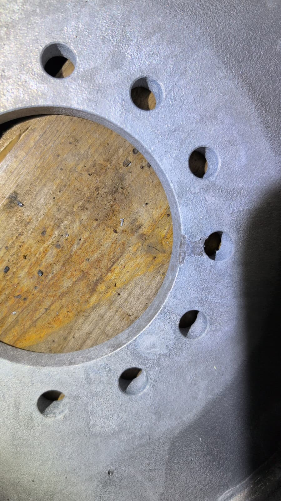</a>
*The photo shows a visible crack in the base metal originating from the central bore and extending towards a bolt hole on a galvanized component of davit crane project 25380 Seasight. This defect is located at the specified hook point used during the galvanizing bath, exhibiting an irregular surface and potential damage to the galvanization in this area. The crack constitutes a severe defect that requires immediate repair and further investigation. A detailed VT combined with MT or PT is recommended to determine the full extent of the crack and ensure proper remediation.*

<a href="davit_crane_25380_galva_hook_mark_area.jpg">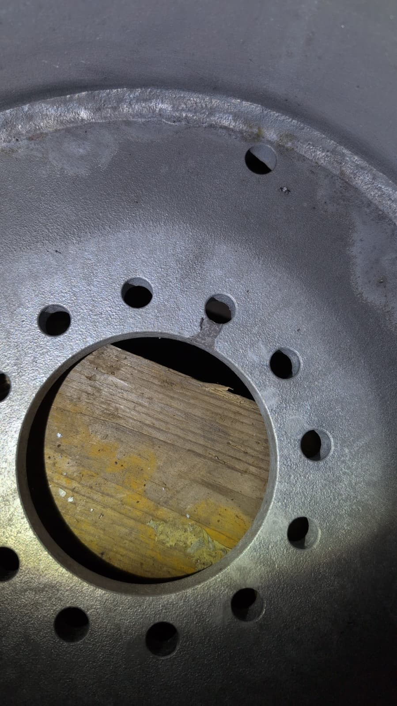</a>
*Visual inspection (VT) of the davit crane flange reveals a noticeable casting irregularity or damage at the central bore's edge, visible as a small protuberance around the 1 o'clock position. Additionally, the flange surface shows an uneven finish with localized areas of discoloration or oxidation. The central bore irregularity warrants further evaluation for component fitment and potential stress concentration, while the surface finish issues appear minor unless a critical coating is compromised.*

<a href="davit_crane_galva_hook_mark_inspection.jpg">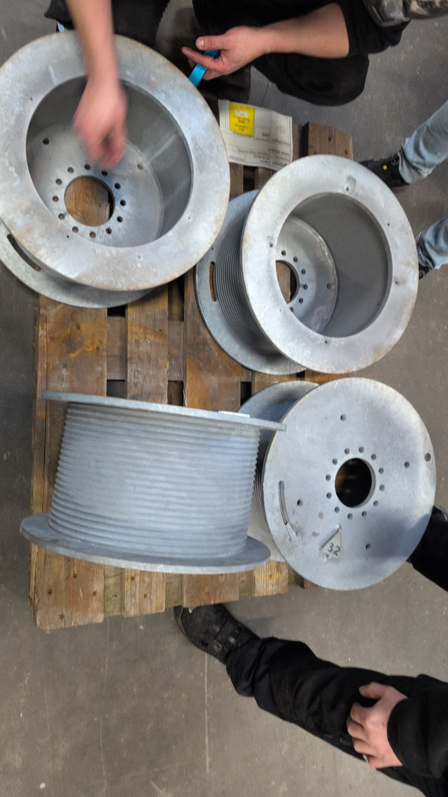</a>
*Minor galvanization inconsistencies and localized white residue are visible on the surfaces of multiple davit crane components, including a ribbed spool and circular flanges (e.g., component '32'). These features appear to be minor in severity and primarily cosmetic. Visual Testing (VT) is recommended to confirm acceptability against specific galvanization standards for project 25380 Seasight.*

*Visual inspection (VT) of a davit crane component (Project 25380 Seasight) reveals mechanical damage and coating discontinuity at a galvanizing hook attachment point. One bolt hole exhibits significant deformation, likely from the hot-dip galvanization process or subsequent hook removal. This defect is beyond a minor cosmetic issue and requires further engineering assessment to determine its impact on fitment and structural integrity, potentially necessitating repair.*

<a href="davit_crane_parts_galva_bath_hook_marks.jpg">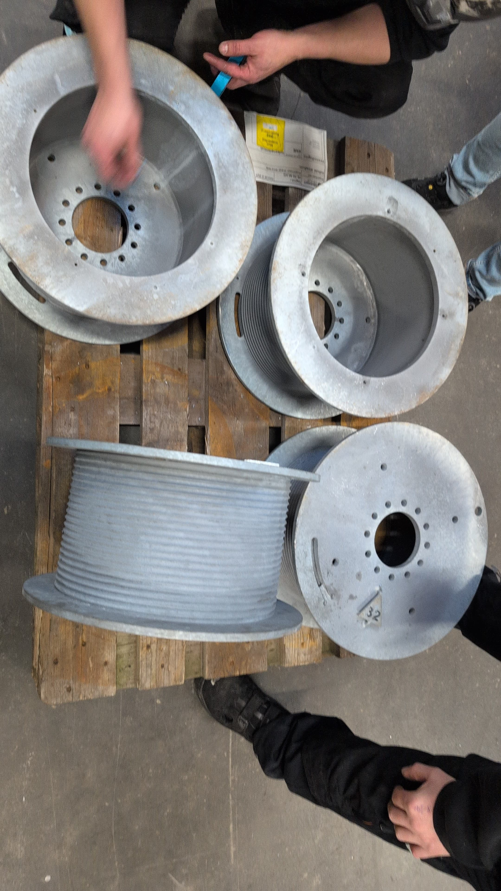</a>
*Galvanized steel components, likely crane sheaves or drum parts, are visible on a wooden pallet. Minor surface irregularities and texture variations are observed on the grey coating of several components, which could indicate slight galvanization inconsistencies. These appear to be minor issues, likely acceptable unless specific coating standards are violated. Visual testing (VT) is being performed through photo analysis.*

*Visual inspection (VT) of this davit crane component (likely a flange/hub) identifies a critical crack originating from one of the bolt holes, extending towards the central bore. A distinct weld seam shows an uncoated or poorly applied coating, exhibiting surface irregularities and potential porosity which compromises corrosion protection. This critical crack requires immediate repair and further NDT (MT/PT) for full assessment, while the weld area needs remediation for proper corrosion resistance.*

<a href="seasight_davits_25380_crane_arm_galva_hook_locatio.jpg">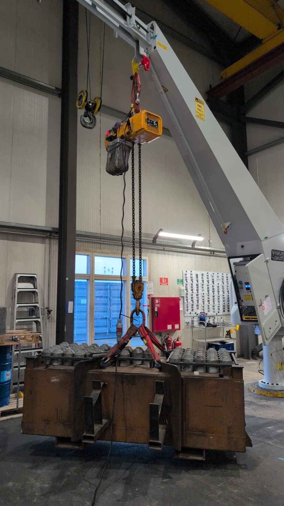</a>
*No significant welding or coating defects are visually apparent on the davit crane structure or lifting accessories. The "SML 1500kg" label is clearly visible on the main boom, indicating the safe working load. The paint finish on the crane appears acceptable, exhibiting minor operational wear consistent with use. Based on visual inspection (VT), the equipment's visible surface integrity is acceptable.*

*Non-QC photo: The image shows a davit crane lifting a large, rusty container filled with conical metal objects. No welding or coating defects are visible on the crane itself.*

<a href="25380_davit_crane_paint_dots.jpg">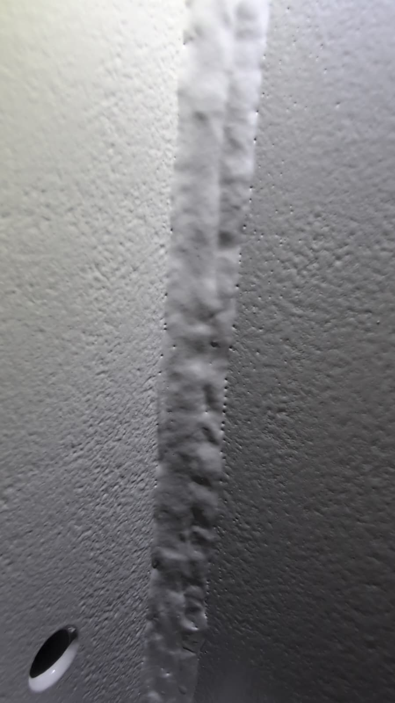</a>
*The image reveals numerous surface irregularities, or 'dots,' within the paint coating, primarily along a weld seam on a davit crane component (Project 25380 Seasight). These are identified as paint defects, possibly micro-blistering, pinholes, or trapped contaminants, rather than substrate porosity, as indicated by the inspector's notes. While visually minor, further Visual Testing (VT) is required to determine their impact on coating integrity and corrosion protection, potentially necessitating repair based on specification criteria.*

*This image reveals widespread paint defects on a davit crane component (project 25380 Seasight), including numerous small, irregular bumps/dots and a distinct vertical stripe of uneven texture. These are identified as surface irregularities, potentially from solvent popping or improper application, rather than true pores as suggested by the chat context. A Visual Testing (VT) confirms these anomalies; further assessment of coating thickness and adhesion is required to determine the impact on protective properties and if repair is necessary.*

<a href="paint_dots.jpg">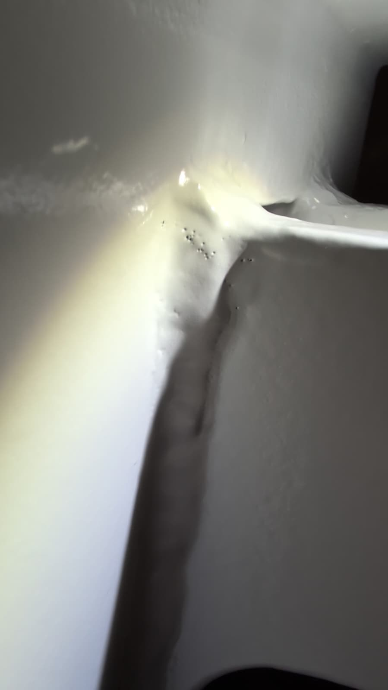</a>
*Pores are visible along a weld seam on Crane 8. The significant concentration of porosity indicates a welding defect that likely requires repair. This condition was identified via Visual Testing (VT).*

<a href="crane_8_paint_pores.jpg">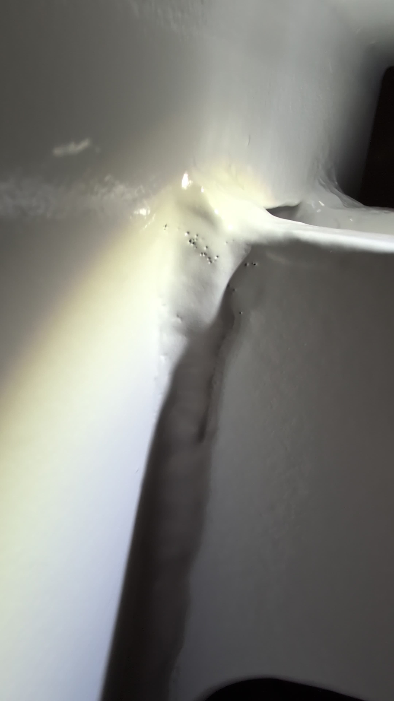</a>
*Visible are a cluster of coating pores/pinholes and a distinct coating run or streak on Crane 8. These defects compromise the protective coating and likely require repair to ensure adequate corrosion protection for the davit crane. This assessment is based on a visual inspection (VT).*

<a href="crane_8_fat_test_ready.jpg">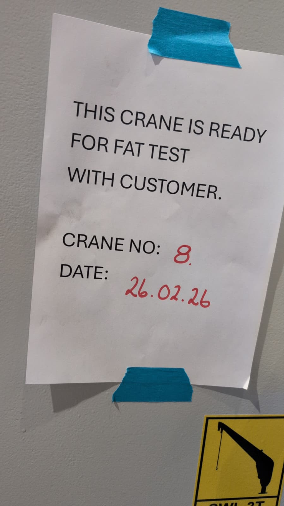</a>
*Non-QC photo: This image shows a printed sign stating "THIS CRANE IS READY FOR FAT TEST WITH CUSTOMER. CRANE NO: 8. DATE: 26.02.26". It is an administrative note regarding a crane's readiness for a Factory Acceptance Test, not an inspection photo of the crane or its components for welding or coating quality.*

<a href="IMG-20260226-WA0093.jpg">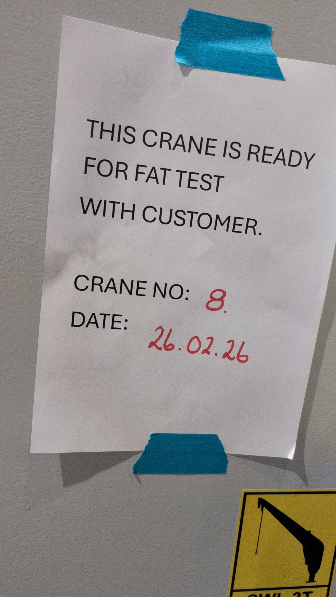</a>
*Non-QC photo: The image displays a notice indicating that Crane No. 8 is ready for a Factory Acceptance Test (FAT) with the customer on 26.02.26. No defects of the crane, welds, or coatings are visible in this document photo.*

<a href="crane_8_paint_pores_1.jpg">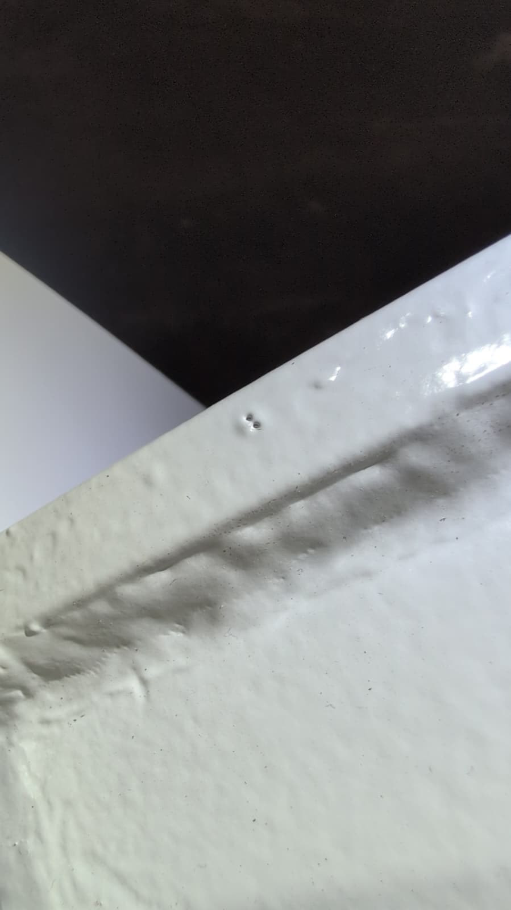</a>
*Minor paint defects are visible on a structural component of the davit crane, characterized by two distinct pinholes/craters and general unevenness in the coating application. While the pinholes are minor, the overall finish suggests suboptimal paint application quality. This is a VT observation requiring evaluation against coating specifications for potential touch-up or repair.*

*Visible paint defects, specifically two distinct pinholes/craters and generally uneven application, are observed on a white coated surface of a davit crane component (VT). These are considered minor coating imperfections that require further evaluation to assess depth and potential exposure of the substrate. If the defects compromise corrosion protection, repair will be necessary.*

### Pinholes zijn dat

<a href="davit_cranes_25380_paint_pinholes.jpg">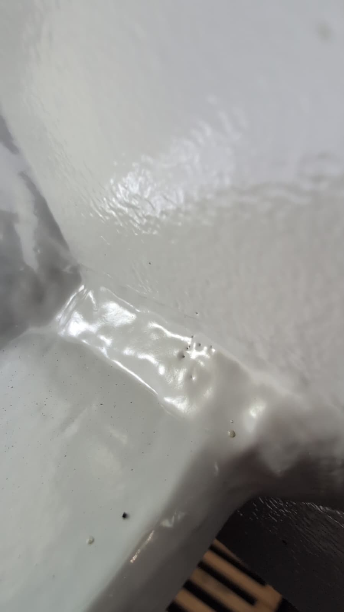</a>
*VT identified multiple pinholes and localized porosity in the coating on a curved surface of a davit crane component (Project 25380 Seasight). These minor coating defects may compromise corrosion protection. Further evaluation against project specifications is required to determine if repair is necessary.*

*Pinholes are visible in the white protective coating on a davit crane component. These coating defects can compromise corrosion resistance, particularly in a marine environment. Depending on their depth and density, this condition typically requires repair to ensure the long-term integrity of the protective system. This defect was identified via Visual Testing (VT).*

<a href="davit_crane_25380_coating_cracks_rough.jpg">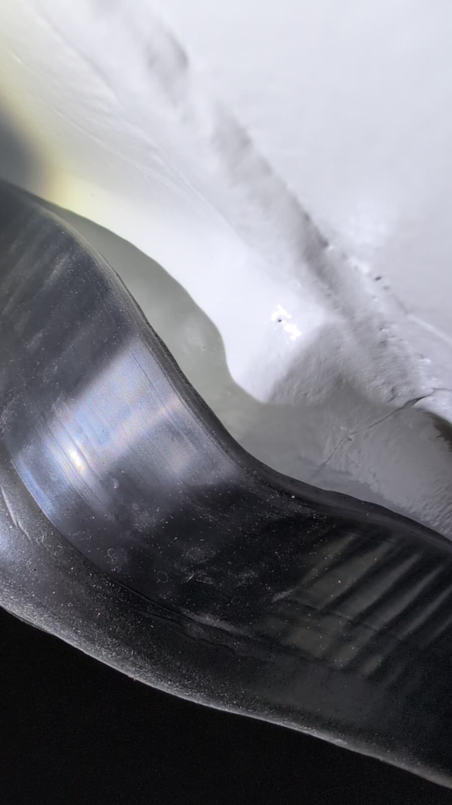</a>
*VT: Visible pinholes and porosity are present on the white, coated surface of the davit crane component. This constitutes a minor coating defect that can compromise corrosion protection and may require repair depending on project specifications.*

*VT identified scattered pinhole porosity within the protective coating on the surface of a structural component, likely part of the davit crane. These small surface voids could compromise the coating's integrity and long-term corrosion resistance. Depending on the coating specification and environmental exposure, this condition may necessitate touch-up or repair. A holiday detector may be used to further assess coating continuity.*

<a href="davit_crane_galva_edge_pores_poor_grind.jpg">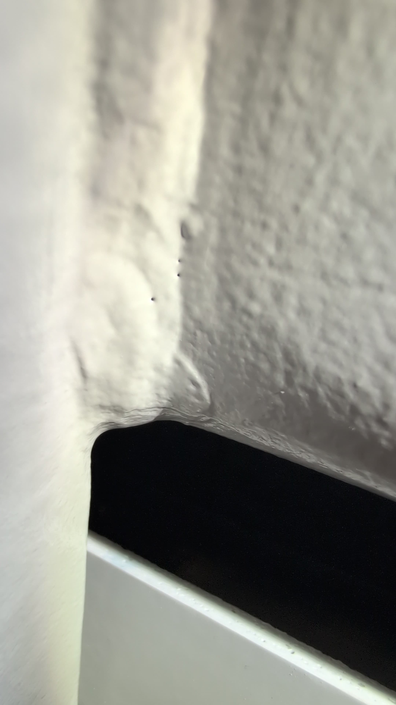</a>
*Minor pinhole coating defects are visible on the coated surface of a structural component, likely near a weld or edge, and the coating exhibits some surface irregularity. These pinholes can compromise corrosion resistance; therefore, further assessment, such as holiday testing, is recommended to determine if localized repair is necessary per project specifications. This observation is from a Visual Test (VT).*

<a href="davit_crane_badly_ground_galva_edge.jpg">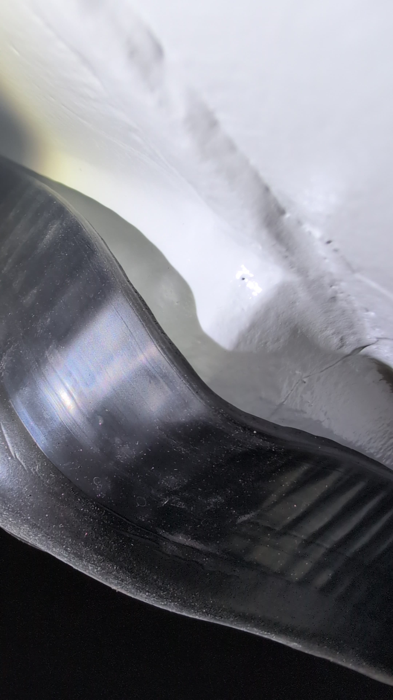</a>
*Minor coating irregularities, including slight orange peel and possible fine crazing, are present on a lighter painted davit crane component. The adjacent darker curved part also shows surface contamination with dust and minor scuffs. While these defects appear cosmetic and may be acceptable, a detailed visual inspection (VT) is recommended for Project 25380 Seasight to confirm service suitability.*

<a href="25380_davit_crane_galva_poor_grind_finish.jpg">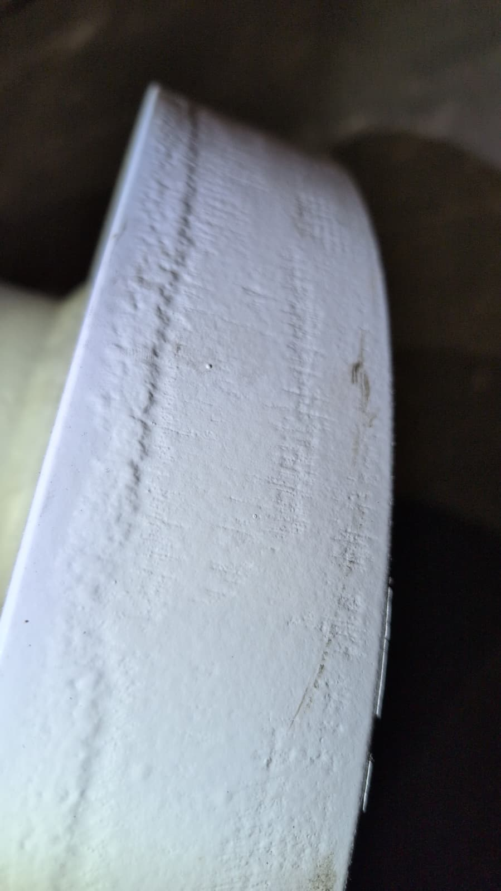</a>
*Visible are significant coating defects, including uneven texture, potential blistering/bubbling, and evidence of inadequate surface preparation (poor grinding marks) on the galvanized or painted component surface. These irregularities suggest issues with coating adhesion and application, likely due to improper substrate preparation. The severity is significant, impacting both aesthetics and long-term corrosion protection, and requires further assessment and probable repair. This condition is primarily identified through Visual Testing (VT).*

*Visible paint/coating defects are evident, characterized by a severe orange peel texture, uneven application, and linear surface irregularities on a davit crane component. These issues appear to stem from inadequate surface preparation, consistent with poor grinding prior to coating application. This is a significant aesthetic and potential protective coating defect that likely compromises corrosion resistance, indicating a need for repair. VT performed.*

<a href="davit_crane_galva_excess_run.jpg">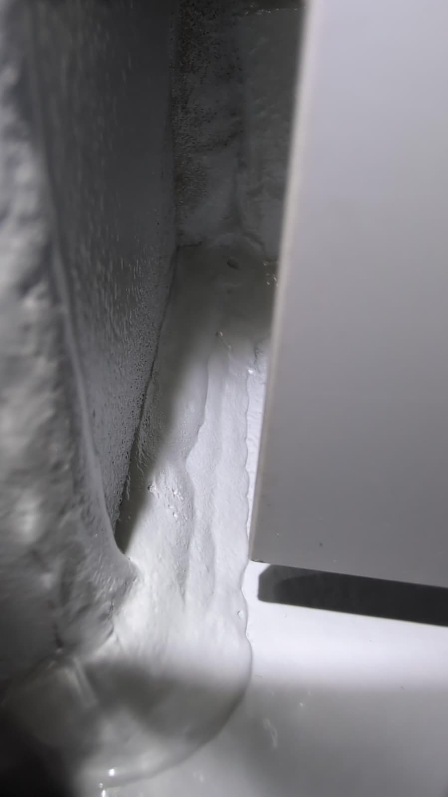</a>
*An area identified as "Set 1 eindkrater" is visible, but a significant accumulation of an unknown white, foamy or frost-like substance completely obscures the underlying weld or surface. This condition prevents accurate visual inspection (VT) and assessment of the end crater's severity. Removal of the obscuring material is required for proper evaluation and to determine if repair is needed. NDT status for the weld is currently undetermined.*

*A painted structural component for project 25380 Seasight is shown with a process tag indicating it has undergone Factory Acceptance Testing. The tag also states 'NOW NEED LAST PAINT REPAIR + FINAL CHECK', suggesting minor paint defects or touch-ups are required. The visible paint surface shows some texture, possibly orange peel, which aligns with the need for final paint repair prior to final visual (VT) inspection. The component is in the final stages of coating completion.*

<a href="set_1_qc_note_fat_paint_repair_final_check.jpg">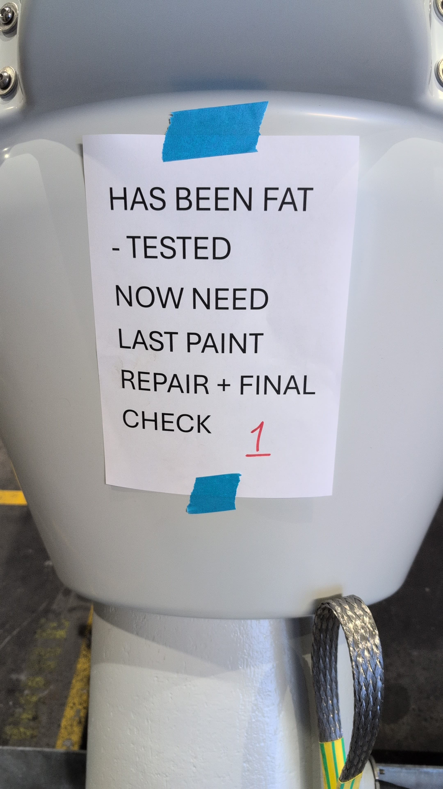</a>
*The image shows a davit crane component with a note indicating that it has passed FAT but requires "LAST PAINT REPAIR." This implies existing paint defects, such as scratches or blemishes, that are deemed unacceptable and necessitate rectification. The severity is such that repairs are mandatory before the "FINAL CHECK" and release. The NDT status indicates completed FAT, with a final visual inspection (VT) of the repaired paint surface pending.*

<a href="set_1_eindkrater_corner_buildup.jpg">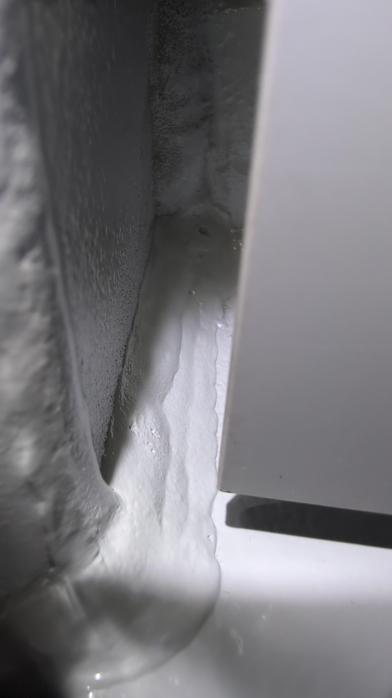</a>
*Visual inspection (VT) of Set 1 reveals a prominent weld end crater, visible as a depression in the applied coating. This area also shows significant coating sagging, pooling, and drips, indicating poor application quality. The combination of a visible weld defect and compromised coating integrity is unacceptable and requires immediate repair.*

<a href="set1_end_crater_coating.jpg">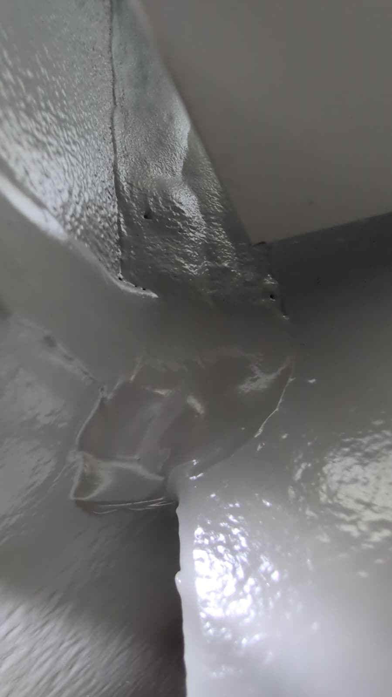</a>
*Visible paint defects include a significant run/sag in the coating, particularly prominent at the bottom center, and potential pinholes/porosity in the upper and central areas. These defects are located within an internal corner or crevice of a coated davit crane component. The prominent sag is a major coating defect that will likely require repair to ensure proper film thickness, adhesion, and corrosion protection. This observation is based on Visual Testing (VT).*

<a href="set_1_end_crater_coating_defects.jpg">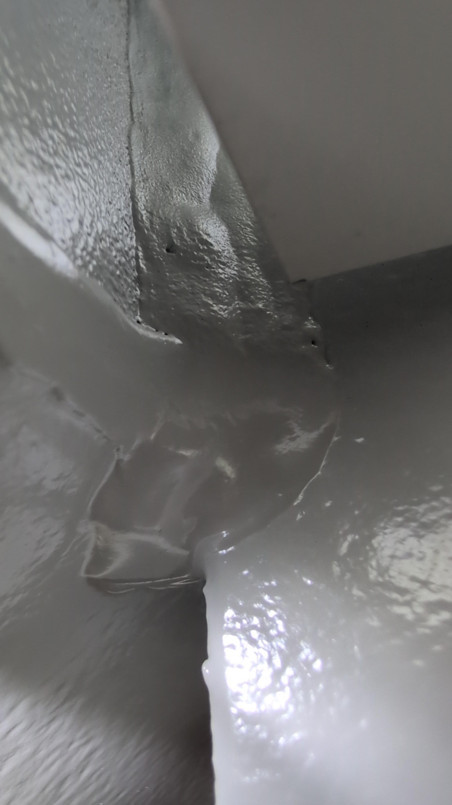</a>
*The image displays significant coating defects, including prominent runs/sags, numerous pinholes/pores, and an uneven surface texture on a davit crane component. These issues indicate poor coating application quality that compromises corrosion protection. The defects observed via Visual Testing (VT) are severe enough to require repair.*

<a href="davit_crane_set1_end_crater_porosity.jpg">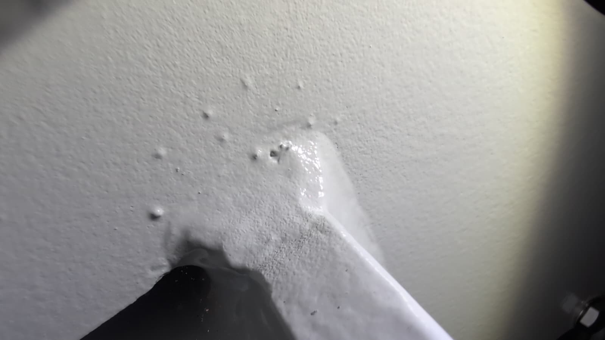</a>
*Visible coating blistering and bubbling, with a wet appearance, is identified at weld end crater number 9 on the davit crane. This indicates potential solvent entrapment, moisture ingress/egress, or underlying weld porosity causing coating failure. The defect is unacceptable and requires repair to ensure adequate corrosion protection and structural integrity. This observation is made via Visual Testing (VT).*

<a href="crane_paint_blisters_end_crater_nr9.jpg">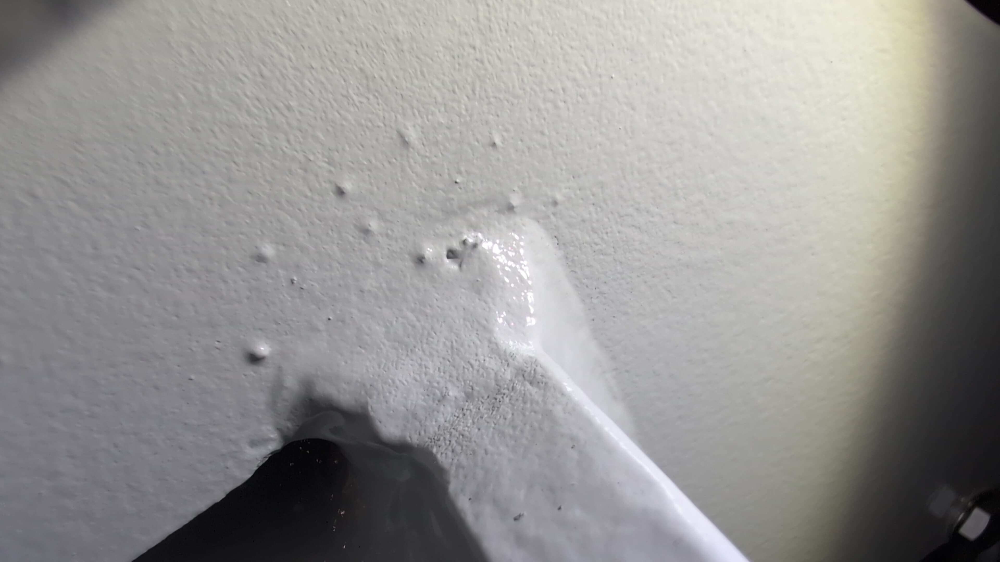</a>
*Visible are an end crater and extensive coating porosity/blistering on what is identified as weld seam number 9 of the davit crane. The end crater appears unevenly filled and coated, presenting a localized depression. The numerous small pores in the coating indicate potential adhesion or application issues. This condition requires further Visual Testing (VT) to assess severity against coating and welding specifications, and may necessitate repair to ensure proper corrosion protection and structural integrity.*

<a href="crane_9_fat_test_ready.jpg">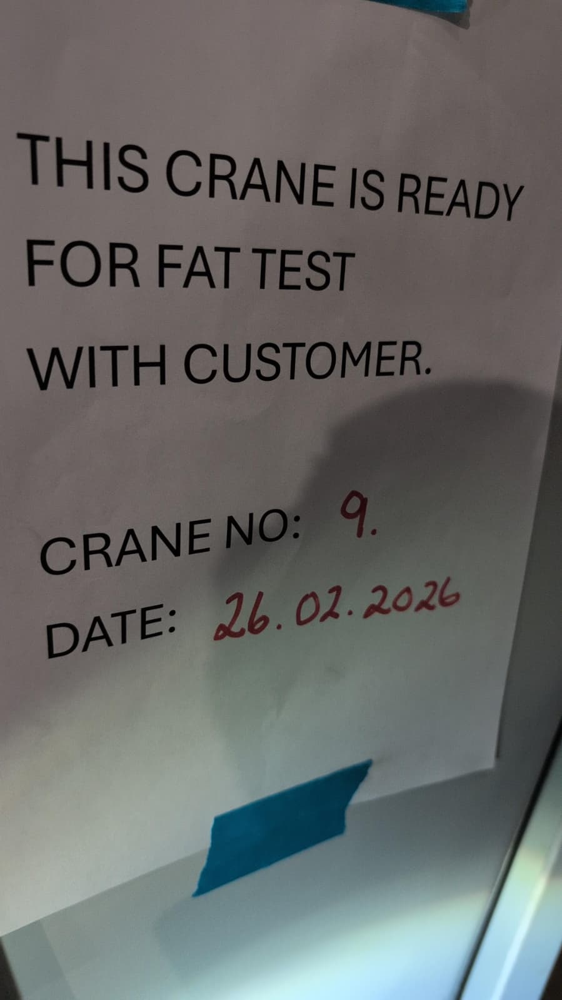</a>
*Non-QC photo: Image shows a document indicating Crane No. 9 is ready for a Factory Acceptance Test (FAT) with the customer on 26.02.2026. This is an administrative notification, not a direct quality control inspection photo of a physical defect or feature on the crane.*

<a href="crane_9_fat_test_ready_sign.jpg">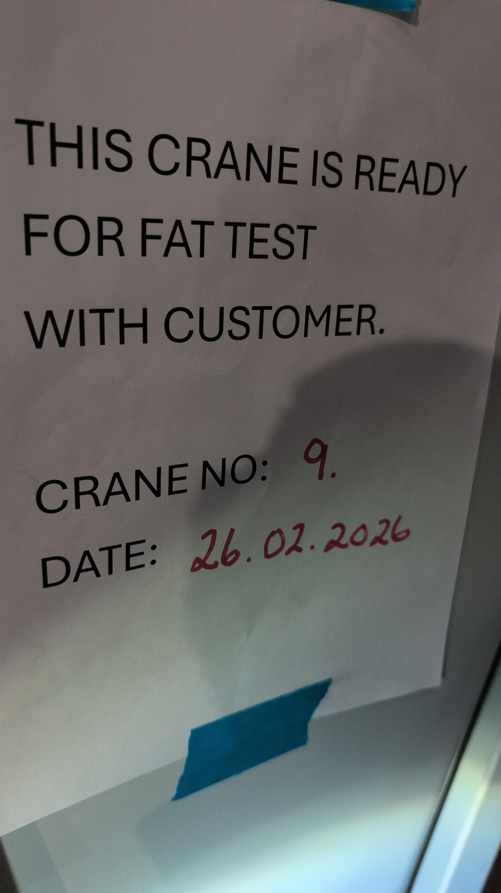</a>
*Non-QC photo: The image displays a sign indicating Crane No. 9 is ready for a Factory Acceptance Test (FAT) with the customer on 26.02.2026. No welding or coating defects, or any physical features of the davit crane, are visible for inspection.*

<a href="crane_9_end_crater_and_pores.jpg">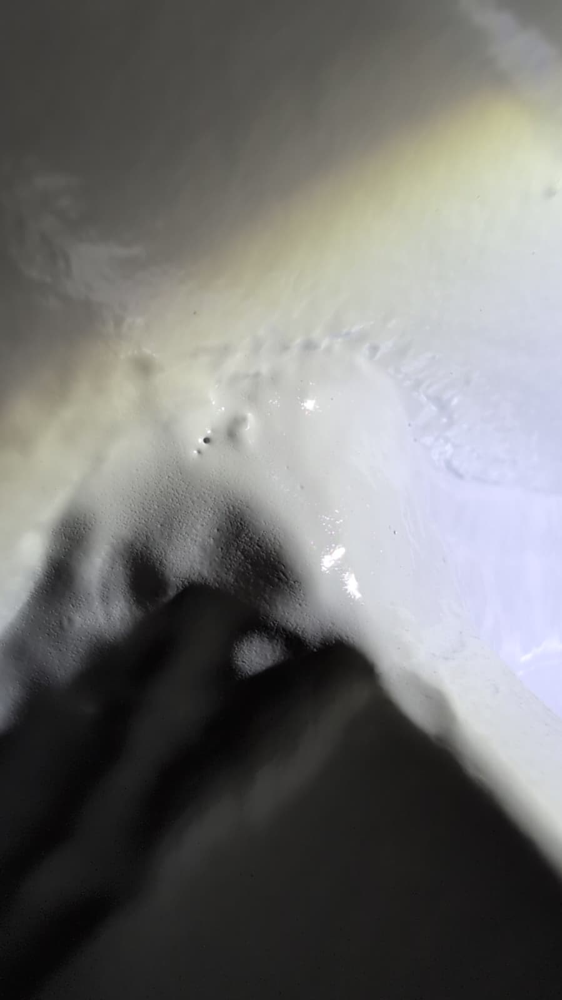</a>
*Coating porosity and an irregular surface texture are visible on a coated surface of Davit Crane Nr 9. These defects were identified via Visual Testing (VT). While appearing minor, the acceptance criteria for pore size and density in the coating specification must be consulted to determine if repair or touch-up is required.*

*Non-QC photo: Macro shot of a foamy liquid surface with a dark, organic shape, likely a hand or fingers, partially visible in the bottom left.*

*Visible is a misalignment of torque stripe/witness marks on two bolts securing a component of the davit crane (Project 25380 Seasight). This VT observation indicates that the bolts may have loosened or were not properly torqued/marked initially. This is a critical issue that is not acceptable and requires immediate investigation and re-torquing of affected fasteners to ensure structural integrity and safety.*

<a href="nr_9_bolt_torque_mark_misalignment.jpg">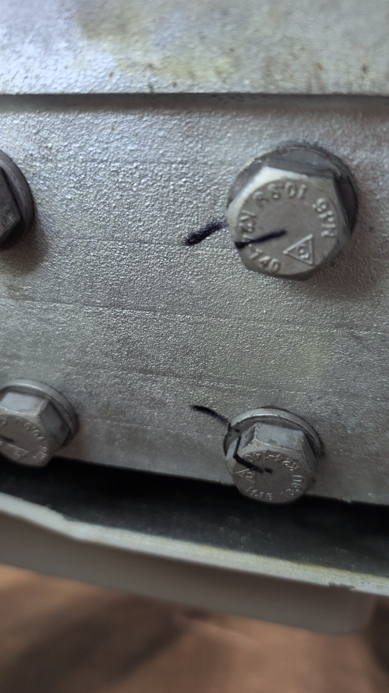</a>
*Misaligned torque stripes (witness marks) are visible on two bolts securing a component of the davit crane (Project 25380 Seasight). This indicates potential loosening or insufficient torque, which is a critical structural concern. Immediate investigation, re-torquing to specification, and re-application of witness marks are required. VT reveals a critical discrepancy.*

*VT analysis identifies a minor coating defect, appearing as a small pinhole or crater, on a coated structural component of the davit crane. While the overall coating exhibits a textured finish, this localized imperfection is noted. It is considered a minor defect, with acceptability dependent on the specific coating specification for project 25380 Seasight.*

*Visible minor paint runs and inconsistent coating thickness are present on the white painted davit crane structure, particularly near the top circular fitting and along the main corner. These are cosmetic paint defects identified via visual inspection (VT). While minor, their acceptability requires verification against project 25380 Seasight's specific finish quality standards.*

<a href="paint_inclusions.jpg">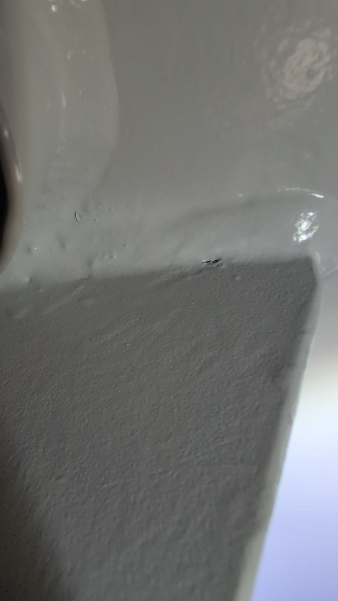</a>
*Minor coating pinholes and surface irregularities are observed at a transition area of a coated structural component on the davit crane (Project 25380 Seasight). These defects are visible via Visual Testing (VT) and may compromise the protective coating. Further evaluation is recommended to determine if these areas meet coating specifications or require localized repair.*

<a href="crane12_paint_drips_and_runs.jpg">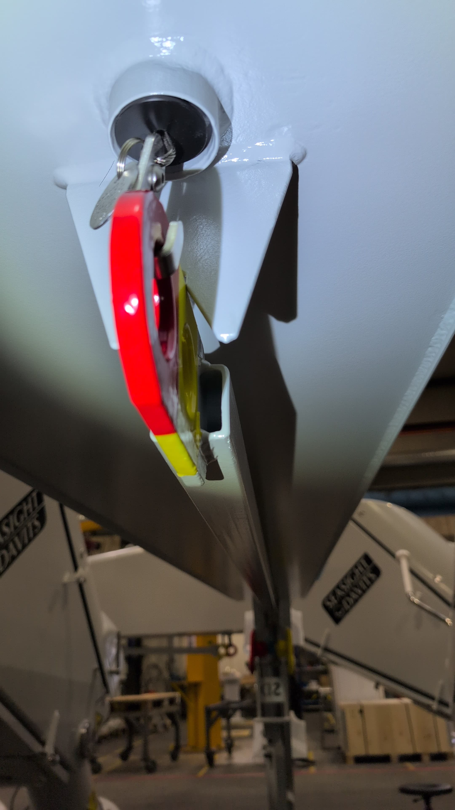</a>
*Minor paint sag/drip is visible on the underside of a white painted support bracket, and slight texture variations/unevenness are present within the adjacent channel beam. These minor coating defects, observed on a davit crane component from Project 25380 Seasight, are primarily aesthetic. Assessed by Visual Testing (VT), these imperfections are likely considered acceptable for this industrial application, not necessitating repair.*

<a href="crane_12_paint_repair_final_check.jpg">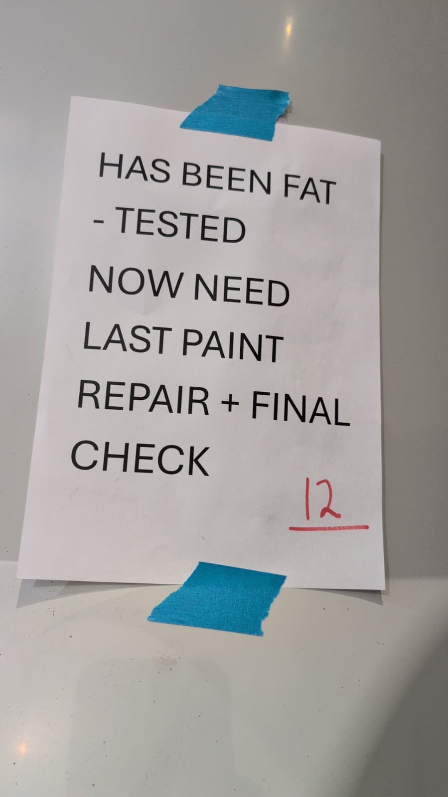</a>
*Non-QC photo: A note taped to an unidentified surface, indicating that item '12' has undergone Factory Acceptance Testing (FAT) and now requires a last paint repair and a final check before completion. This document outlines a procedural step, not a visible defect on a component.*

<a href="crane_12_fat_tested_paint_repair_final_check.jpg">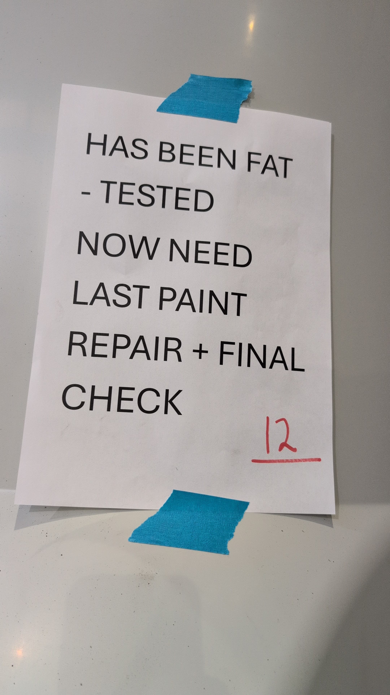</a>
*This note communicates the Quality Control status for davit crane unit #12, indicating it has successfully completed the Factory Acceptance Test (FAT). While the unit has passed major functional checks, it still requires a last paint repair followed by a final visual inspection (VT). This signifies pending cosmetic corrections and a final verification before release.*

<a href="crane_12_uneven_paint_application.jpg">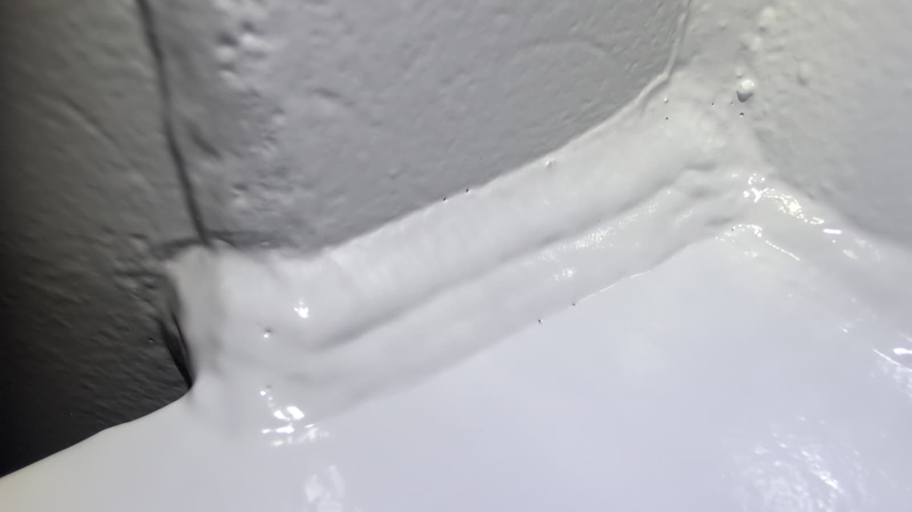</a>
*Visible coating defects include small dark inclusions/contamination and minor surface irregularities within the applied coating at an internal corner transition on a davit crane component. These appear to be minor defects, likely acceptable under general protective coating specifications, but should be noted for future reference. Visual Testing (VT) identified these conditions.*

<a href="davit_crane_weld_seam_unevenness_under_paint.jpg">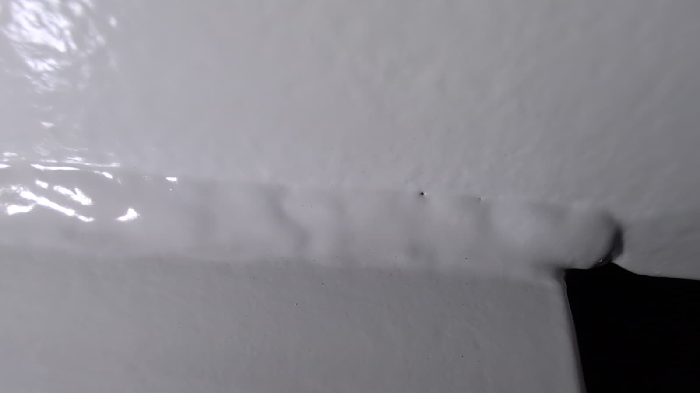</a>
*Visible coating defects include severe runs and sags, particularly along what appears to be a weld seam or structural joint. Numerous small pores are present throughout the coating, and a significant crater or deep indentation is visible towards the right end of the main feature. These significant paint application issues compromise the corrosion protection of this davit crane component and require repair. VT status indicates a non-conforming condition.*

*VT reveals minor paint inclusions/debris on the coated davit crane structure, specifically near a pin hole and adjacent weld seam. Additionally, extraneous yellowish grease/sealant is present on the finished surfaces. These are primarily cosmetic and cleanliness issues; the grease requires removal, and paint defects should be assessed against coating specifications for potential minor touch-up. Prior NDT for weld integrity would have been performed before coating.*

<a href="crane_25380_corner_coating_wavy_texture.jpg">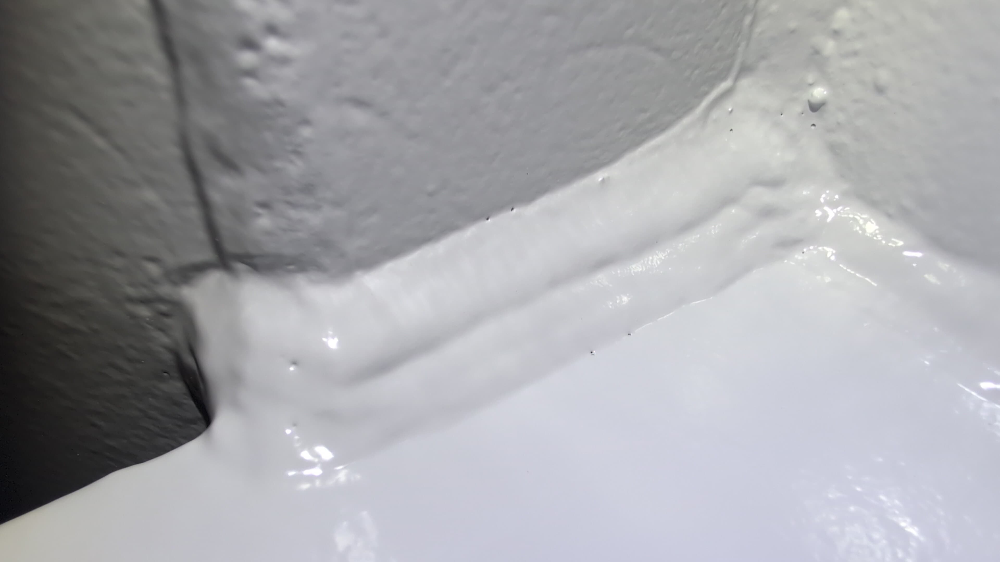</a>
*Visible is an unevenly applied protective coating or sealant fillet bead in an internal corner of a davit crane component. Minor surface irregularities and small inclusions of foreign material are evident within the coating, observable via Visual Testing (VT). While generally continuous, these minor defects may impact the coating's long-term performance or aesthetic. Further review against coating specifications is recommended to determine acceptance or the need for repair.*

*Visual inspection (VT) of a coated weld seam on a davit crane component reveals several coating defects. These include uneven coating thickness, waviness (paint runs/sags), and multiple small depressions or pinholes along the weld bead, which may indicate underlying weld porosity or surface contamination. Such defects reduce corrosion protection and warrant localized repair to ensure long-term integrity.*

<a href="davit_paint_scuff_marks.jpg">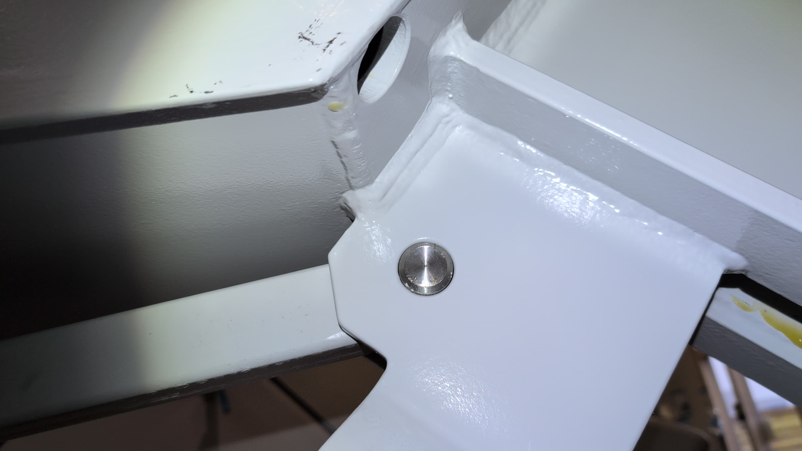</a>
*Visible paint chipping and surface scratches are noted on the painted structural component at the upper left, revealing a darker substrate. Minor yellow drips or residue are also present near the weld seam and along edges. The paint chipping is a minor defect requiring localized touch-up for long-term corrosion protection. These observations are from visual inspection (VT).*

*Multiple pinholes/pores are visible within the coating, concentrated along a linear, rippled feature on a davit crane component, possibly indicating an underlying weld seam. This constitutes an unacceptable coating defect as it compromises corrosion protection and will likely require repair. These issues are discernible through Visual Testing (VT).*

*Minor coating defects, specifically pinholes and surface irregularities, are visible on the white-painted structural column and base flange of the davit crane. These discontinuities, identified via VT, require assessment to ensure adequate long-term corrosion protection. While generally minor, their impact on durability should be confirmed against coating specifications.*

<a href="davit_crane_25380_seasight_paint_pores.jpg">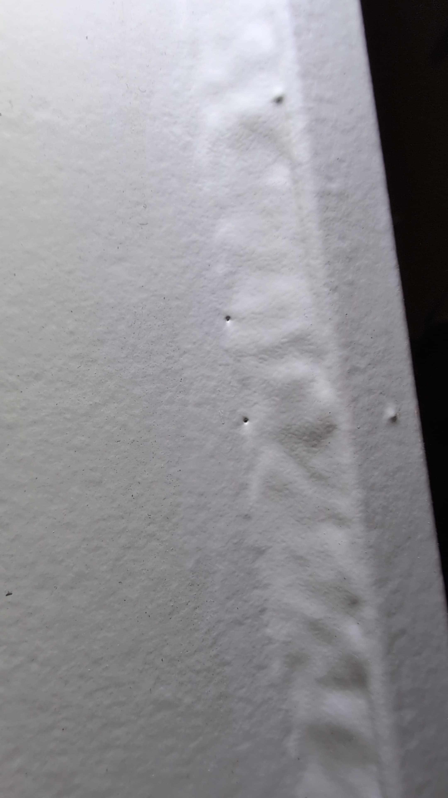</a>
*Multiple small pinholes and an uneven coating texture are visible on a painted surface of the davit crane. These defects, observed via Visual Testing (VT), indicate potential coating application issues that could compromise corrosion protection. While individual pinholes may be minor, their prevalence suggests a quality concern that warrants further inspection and potential repair to ensure long-term integrity.*

<a href="davit_crane_25380_fastener_hole_paint_defect.jpg">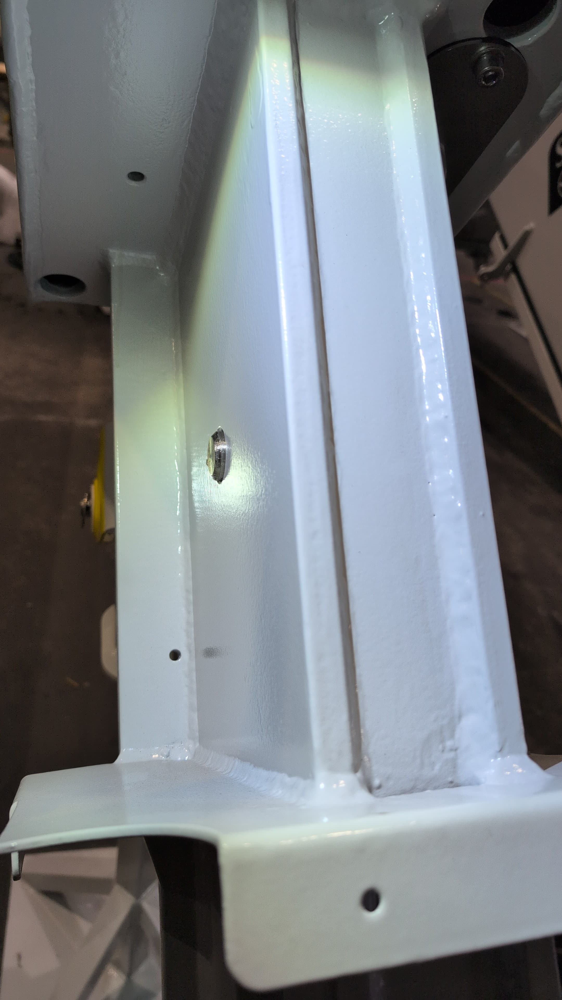</a>
*Minor coating defects, characterized by an uneven and textured paint finish, are visible along the vertical weld seams and edges of the white-painted structural member. This condition, observed via Visual Testing (VT), suggests potential issues with surface preparation, such as painting over unground weld spatter or rough surfaces, which could impact the coating's aesthetic quality and long-term durability. It is recommended to review against Project 25380 Seasight's coating specifications for acceptance.*

<a href="seasight_25380_paint_porosity_at_seam.jpg">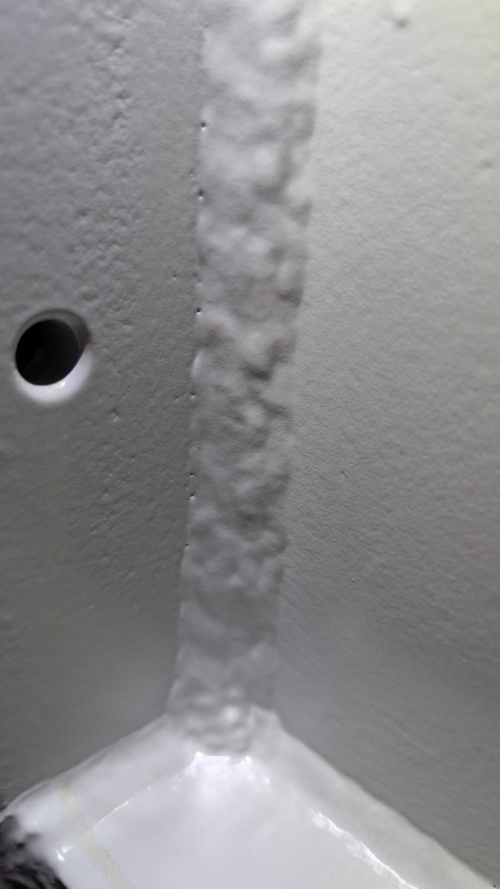</a>
*Visible linear porosity/pinholes are present along a vertical weld seam in an internal corner of the davit crane structure. This coating defect, possibly indicative of underlying weld porosity or improper paint application over an existing substrate (e.g., galvanized steel), is unacceptable. Further investigation via VT and holiday detection is required to determine the full extent and root cause, followed by appropriate repair to restore corrosion protection.*

<a href="crane_25380_seam_bloemkool.jpg">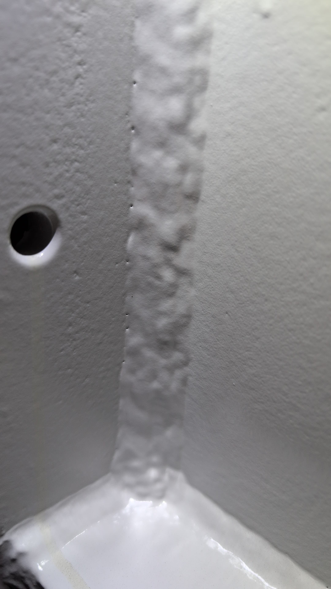</a>
*Paint defects, including uneven coating application and isolated pinholes, are visible on a vertical weld seam of a davit crane component. The uneven application presents as a wavy, bumpy texture over the weld. These are considered minor defects, primarily cosmetic, but require thorough Visual Testing (VT) to confirm specified film thickness and long-term corrosion protection.*

<a href="25380_galva_bloemkool_pitted_hole.jpg">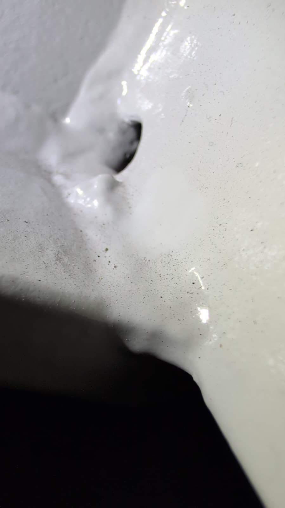</a>
*The image clearly shows severe surface irregularity, consistent with "Bloemkool" (cauliflower) weld formation, on a davit crane component weld seam. Significant porosity, slag inclusions (dark specks), and a potential end crater or deep undercut are visible near the center. This represents a critical quality defect requiring immediate repair to ensure structural integrity and proper coating application. Visual Testing (VT) confirms this severe non-conformance.*

<a href="25380_davit_crane_paint_bloemkool.jpg">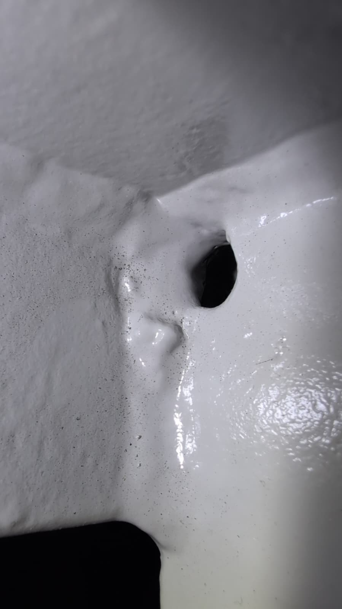</a>
*Visible on a coated davit crane component is a critical void or hole, likely exposing the substrate, alongside severe paint defects including runs, uneven texture, and surface contamination. This significant defect area requires immediate repair and reapplication of the coating after proper surface preparation. The overall condition is unacceptable for long-term service and corrosion protection. This is a Visual Testing (VT) observation.*

<a href="crane_25380_coating_cauliflower_defect.jpg">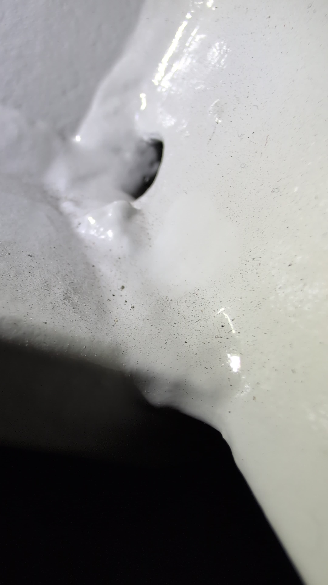</a>
*Visible are widespread porosity and pinholing in a white protective coating on a davit crane component, aligning with the "Bloemkool" description. This indicates significant coating defects, likely due to outgassing over galvanized steel, which compromise corrosion protection. A repair is needed for these areas to restore integrity, as identified during Visual Testing (VT).*

<a href="davit_cranes_25380_cauliflower_paint.jpg">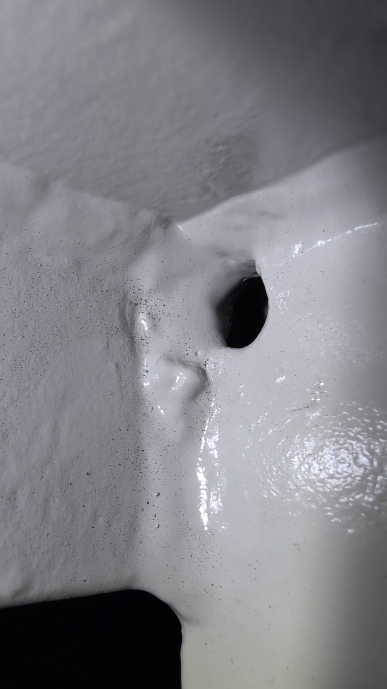</a>
*QC analysis: Widespread coating porosity and contamination are visible on the coated surface, particularly around the opening and in adjacent areas. The numerous small dark specks indicate trapped foreign material or pinholes within the protective coating. This level of defect density and uneven finish is considered unacceptable for a davit crane, as it compromises the coating's protective integrity and will require repair. NDT status: VT performed.*

*Visual inspection (VT) reveals blistering and widespread particulate contamination on a coated surface of the davit crane. The prominent blisters, particularly the larger one centrally located, indicate compromised coating adhesion and potential substrate exposure. These defects are significant and likely require repair to ensure adequate corrosion protection for project 25380 Seasight.*

<a href="seasight_25380_coating_pores.jpg">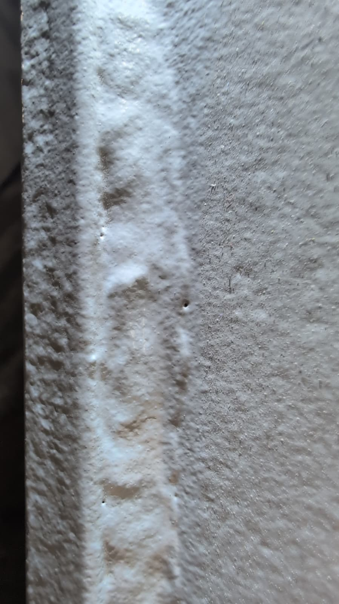</a>
*Visible on a coated surface, likely a davit crane component, are multiple pinholes/pores and an uneven coating application. The presence of porosity indicates potential compromise to corrosion protection and coating integrity, warranting further evaluation against project specifications to determine repair necessity. This is a Visual Testing (VT) observation.*

<a href="davit_crane_surface_pores_roughness.jpg">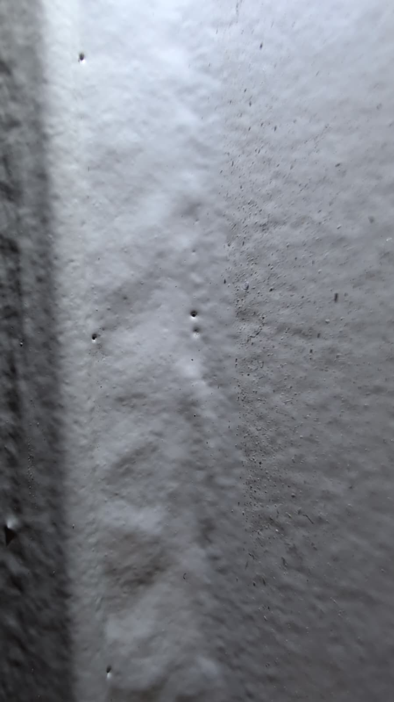</a>
*Visible coating defects on a davit crane component include numerous pinholes, an uneven texture, and surface contamination, potentially indicative of issues with either paint or galvanization. The presence of these defects compromises the protective layer and could lead to accelerated corrosion. Based on Visual Testing (VT), these issues are of moderate severity and require detailed assessment against Project 25380 Seasight's specifications for acceptability or repair.*

<a href="davit_crane_25380_paint_pores_specks_uneven_textur.jpg">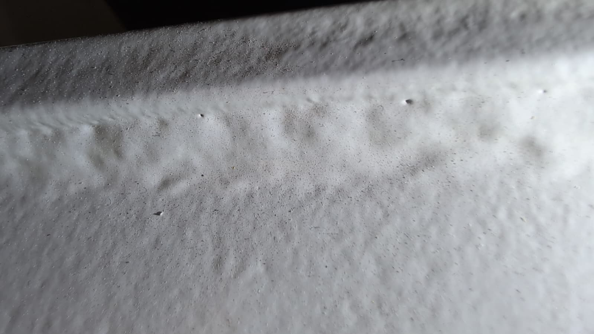</a>
*Coating defects, specifically numerous pinholes/pores and an uneven, rough texture, are visible on a coated component of the davit crane. These defects indicate compromised corrosion protection and poor application quality. A comprehensive visual inspection (VT) is required to determine the severity and necessity of repair.*

<a href="davit_crane_paint_blisters.jpg">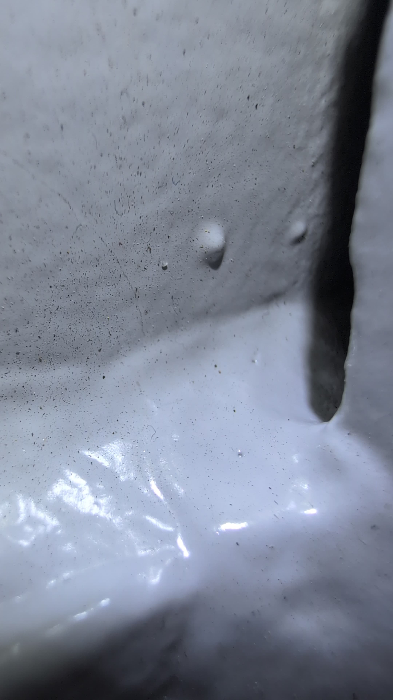</a>
*Paint defects are visible on the coated surface of an unidentified davit crane component, including numerous small surface contaminants and a distinct blister located near a structural edge. While the surface contamination is minor, the blister indicates a potential adhesion failure or trapped contaminant. This condition could compromise corrosion protection and needs further assessment through Visual Testing (VT).*

*The image displays multiple pinholes/pores and scattered surface contamination (dust/debris) on a coated davit crane component. These pinholes indicate localized coating defects that may compromise corrosion protection, particularly in the project's marine context. The severity is considered minor to moderate, and repair would likely be required to ensure adequate protective properties. This assessment is based on Visual Testing (VT).*

<a href="davit_crane_paint_pores_uneven.jpg">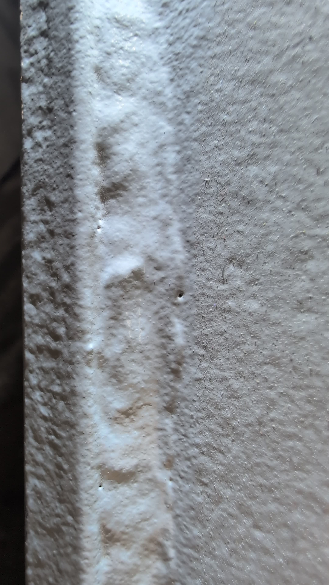</a>
*VT identified significant coating defects on a davit crane structural component, likely along an edge. Visible issues include widespread porosity, pinholes, and at least one prominent pit in the protective coating. This uneven application and compromised surface integrity likely warrant repair to meet project specifications.*

<a href="crane_paint_pores_texture.jpg">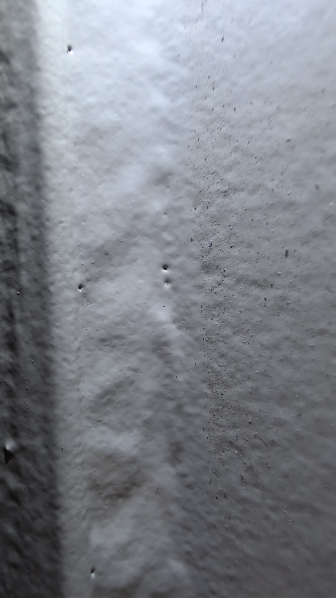</a>
*Widespread surface porosity and an irregular, rough texture are observed on a component surface of the davit crane. These coating defects, likely consistent with galvanizing issues, could compromise long-term corrosion resistance. The condition warrants repair or further assessment against project specifications, as observed through Visual Testing (VT).*

<a href="seasight_25380_davit_crane_pores.jpg">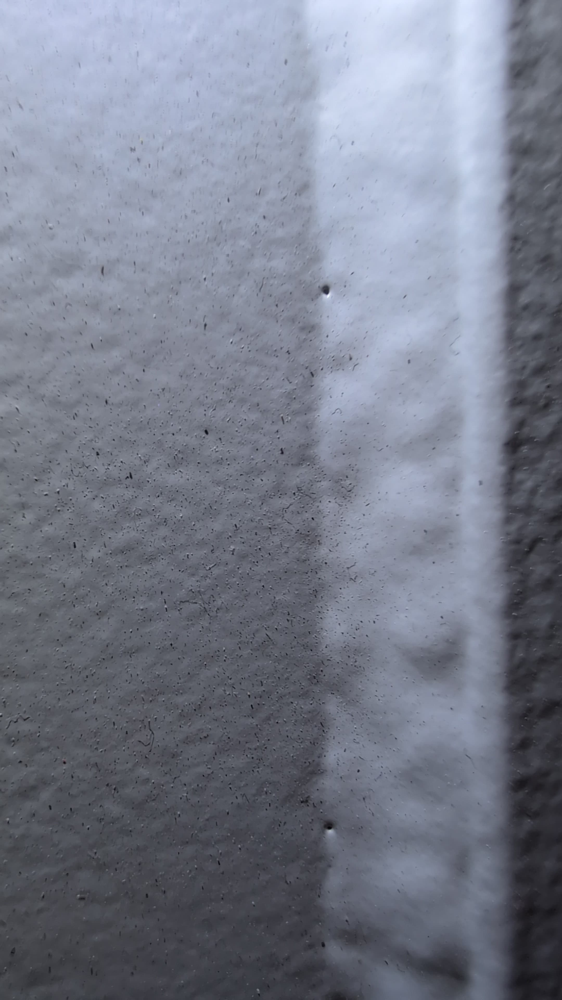</a>
*The image displays a coated surface exhibiting numerous small dark inclusions and a generally uneven texture. A distinct vertical line on the right indicates a transition to a darker, rougher surface. This suggests minor coating defects, potentially from contamination or inconsistent application, requiring assessment against project specifications. Visual Testing (VT) has been performed.*

<a href="25380_davit_crane_paint_roughness_contam_pores.jpg">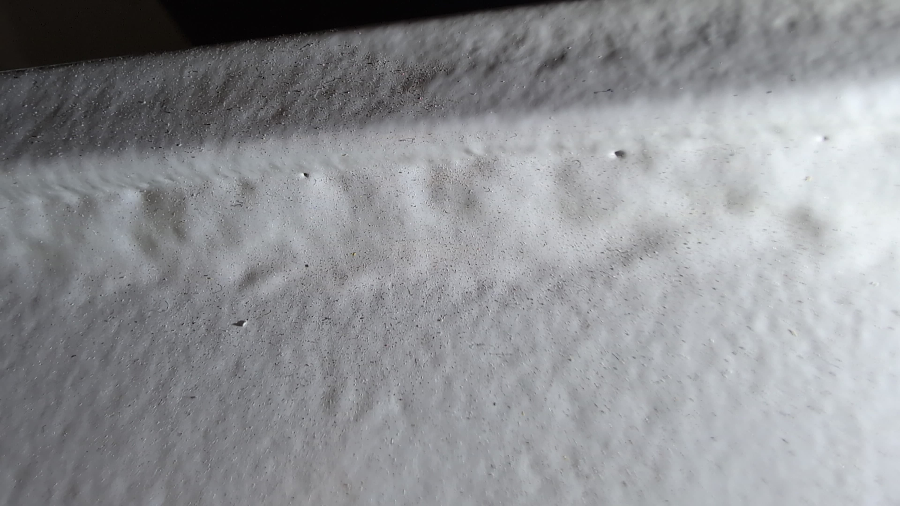</a>
*Numerous small dark particulates are embedded within, and an uneven, textured coating (possible orange peel or minor blistering) is visible on the surface of a davit crane component (Project 25380 Seasight). This widespread condition suggests suboptimal coating application or contamination, potentially impacting durability. While not immediately critical, it is considered minor to moderate and warrants further investigation for root cause and adherence to specifications. This condition is detectable via Visual Testing (VT).*

<a href="davit_crane_25380_paint_pores_linear.jpg">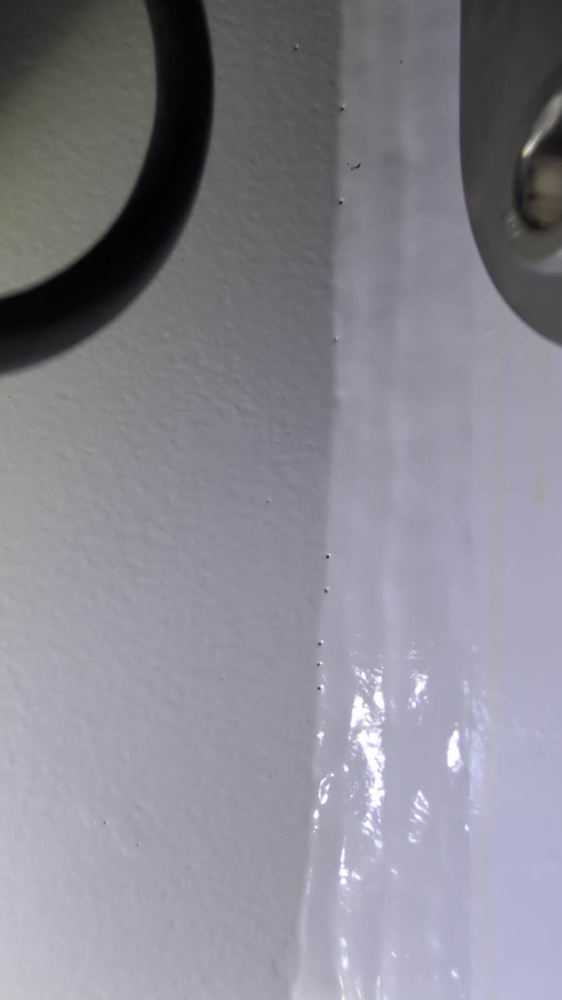</a>
*Pinholes or porosity are visible within the coating, primarily along an edge or weld seam on a davit crane component for project 25380 Seasight. These coating defects, observed via Visual Testing (VT), are minor to moderate in severity. However, they compromise the protective barrier against corrosion in a marine environment and may require localized repair.*

<a href="davit_crane_surface_pores.jpg">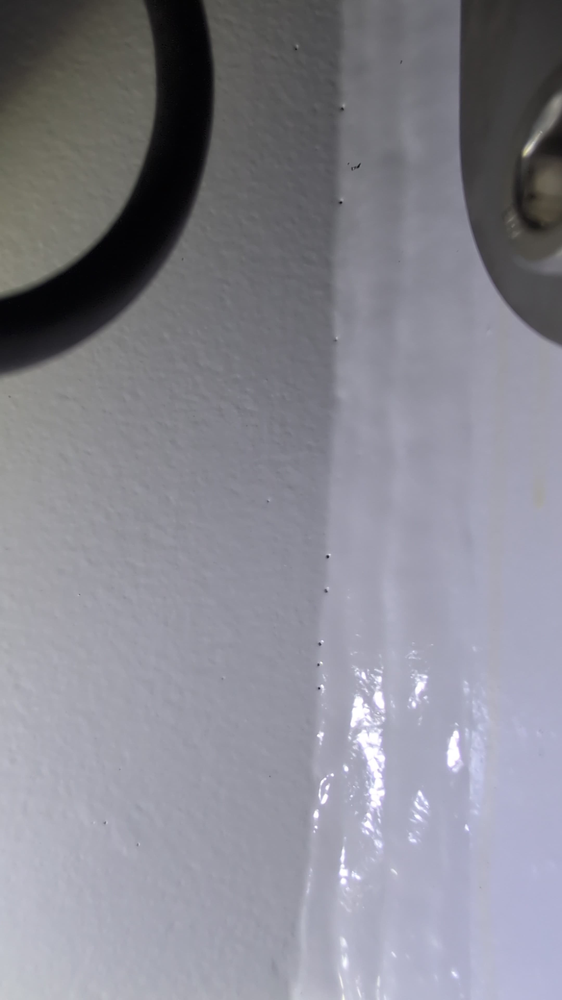</a>
*Multiple minor coating defects, including small dark inclusions and possible pinholes, are visible on a grey coated structural surface of the davit crane. These imperfections are predominantly along a vertical edge/seam and scattered across the area, indicating localized coating quality issues. Assessed as minor via Visual Testing (VT), these defects could affect long-term corrosion protection. Evaluation against project coating specifications is recommended to determine acceptability or need for repair.*

<a href="25380_davit_crane_paint_runs.jpg">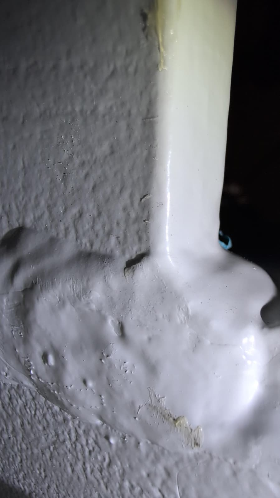</a>
*Significant paint runs and sags, indicative of poor coating application and inconsistent film thickness, are visible on a structural component of the davit crane. This constitutes a moderate paint defect, identified via Visual Testing (VT), which may require corrective action or repair to meet specified aesthetic and protective standards.*

*The photo reveals severe paint sagging and runs, alongside significant uneven coating film thickness on a structural component of the davit crane. This constitutes a major paint application defect, impacting both aesthetics and long-term corrosion protection. These defects are unacceptable and will require repair through sanding and recoating. Visual Testing (VT) confirms these coating deficiencies.*

<a href="davit_25380_weld_undercut_uneven_profile.jpg">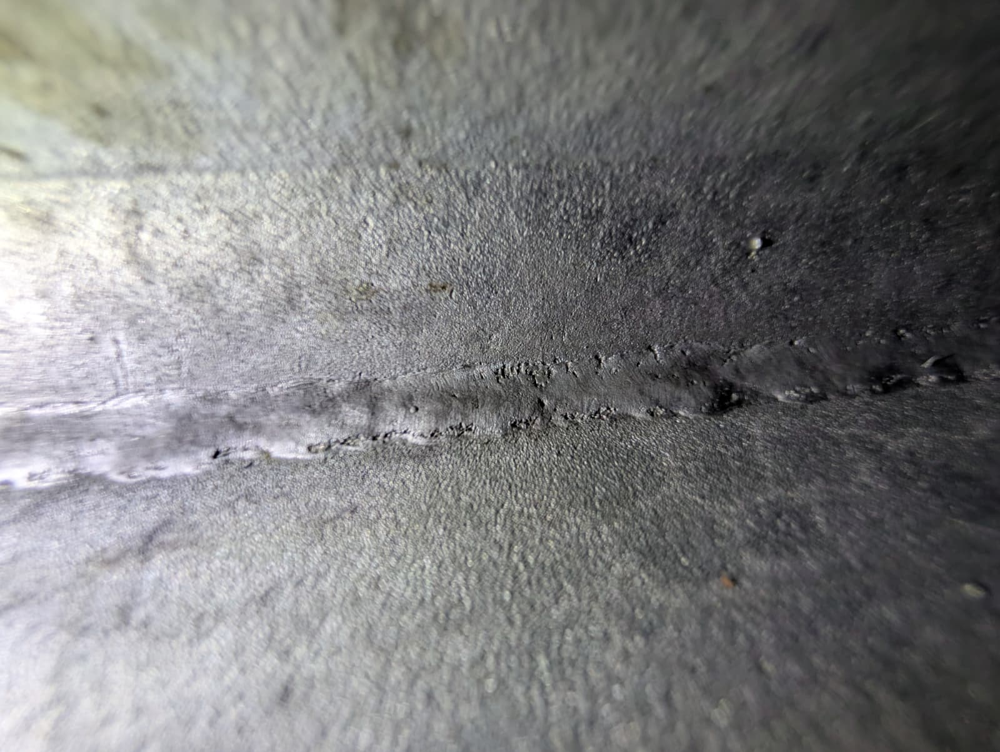</a>
*VT analysis of the weld seam reveals significant surface porosity and an inconsistent weld profile. Minor undercut also appears along sections of the weld toe. This condition is unacceptable and requires repair, followed by re-inspection, to comply with quality standards for project 25380 Seasight.*

<a href="davit_crane_25380_weld_undercut.jpg">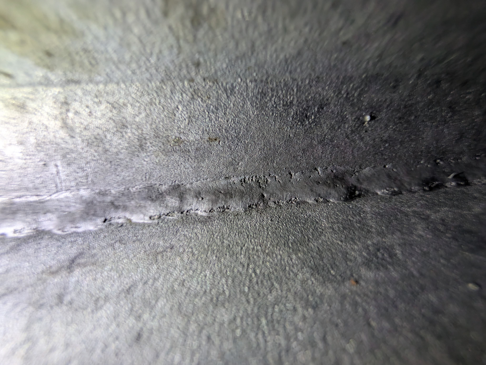</a>
*This image displays a weld seam exhibiting multiple severe defects. Significant undercut is visible along the weld toes, particularly on the upper right side, accompanied by an irregular and potentially cratered weld profile indicative of poor fusion or porosity/slag inclusions. These defects are unacceptable and would fail visual testing (VT), necessitating immediate repair to ensure structural integrity on the davit crane.*

<a href="davit_25380_001_pores.jpg">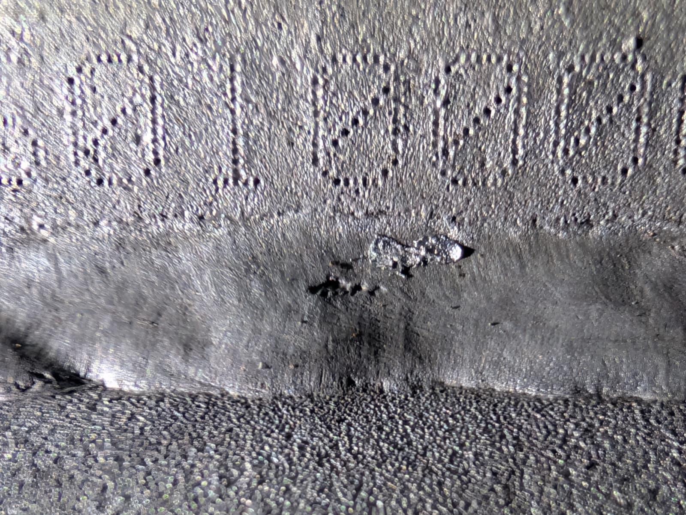</a>
*Localized pitting corrosion and areas of coating breakdown are visible on the surface. These defects are located directly below the dot-peened identification number '8130800' on a davit crane component. The severity is moderate, suggesting this condition is unacceptable for long-term service, particularly in a marine environment, and warrants repair. This assessment is based on Visual Testing (VT).*

*Visible are significant surface irregularities, characterized by widespread rough texture and localized lumps/bumps, consistent with galvanizing issues (e.g., excessive roughness, dross inclusions, or poor flow of zinc) along a weld seam. The defect is observed on a weld seam of a metallic component, likely part of the davit crane structure (project 25380 Seasight). This level of surface irregularity is generally considered a moderate galvanizing defect and needs further evaluation against coating standards to determine if it is acceptable or requires repair/recoating. This is a Visual Test (VT) observation.*

<a href="crane_3013626_slag_inclusion.jpg">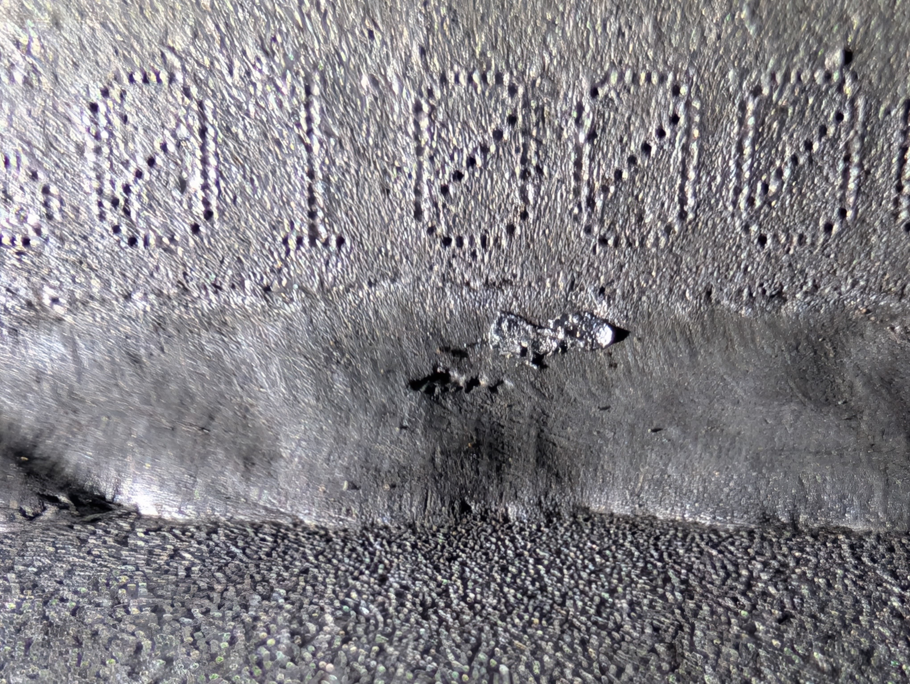</a>
*Visual Testing (VT) reveals an improperly filled end crater or excessive weld reinforcement on component 313600. The irregular, accumulated metallic material indicates a significant surface discontinuity. This condition is unacceptable and requires repair, including grinding to flush and potential re-welding, to meet surface profile specifications and ensure structural integrity for the davit crane.*

*Multiple instances of surface porosity are identified along the weld seam of a davit crane component (Project 25380 Seasight). These irregular voids are likely present within the galvanized coating or are indicative of underlying weld porosity. Visual Testing (VT) reveals these numerous defects, prompting a recommendation for further Non-Destructive Testing (NDT), such as Penetrant Testing (PT) or holiday detection, to assess their depth and impact on structural integrity and corrosion protection, determining if repair is required.*

<a href="25380_davit_galva_line_pores_end_mill_marks.jpg">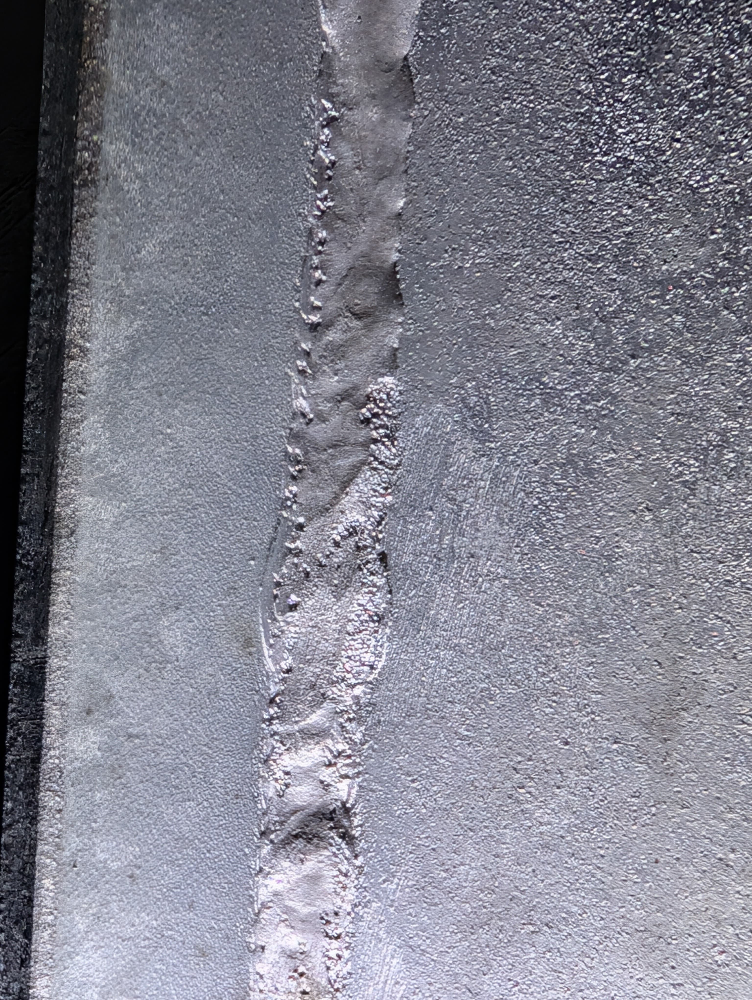</a>
*The central feature appears to be a ground weld seam or repair area on a galvanized davit crane component. Visible are grinding/milling marks that have likely compromised the galvanization, exposing the underlying substrate, alongside what appears to be porosity or zinc blistering within this area. This indicates a significant quality issue concerning both corrosion protection and potentially the underlying weld integrity. The defect is unacceptable and requires repair, including restoration of the corrosion protection, and further non-destructive testing (NDT) such as Ultrasonic Testing (UT) for weld integrity and coating thickness measurement after repair.*

<a href="crane_25380_galva_pores_at_weld.jpg">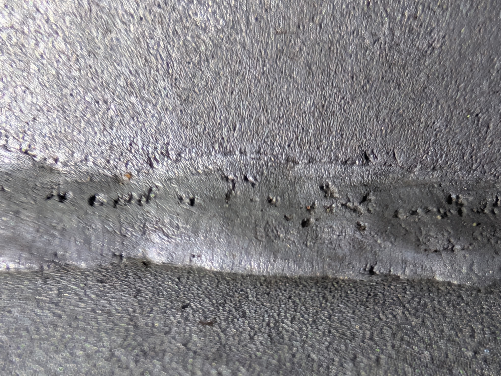</a>
*Visual inspection (VT) reveals numerous localized pores within the galvanized coating, concentrated along a linear feature resembling a weld seam on the davit crane (project 25380 Seasight). While the general texture might be influenced by underlying surface marks, the distinct pitted features are indicative of galvanizing pores. The severity and acceptability of these pores should be assessed against the applicable galvanizing standard (e.g., ISO 1461).*

*09:04 — Nick Geudens:* Lijken porie in galva ... Maar op andere kant ziet het er ook uit dat het met vingerfrees afdrukken zijn dus twijfel

*09:08 — Jelle Nuyens:* Zal wel in de las zitten denk

*09:09 — Jelle Nuyens:* Zijn die MT gekeurd?

*09:09 — Nick Geudens:* Ja die zijn MT gekeurd zeggen ze , ze kunnen raporten

*09:10 — Jelle Nuyens:* 🤔 mt oke met zoon poriën

*09:16 — Jan Verheyen:* Zit volgens mij in de galva

### Als hier klaar ben ga ik andere site  waar nog blanko staal is dan kan ik zien

<a href="crane_25380_flange_galva_residue_inner_rim.jpg">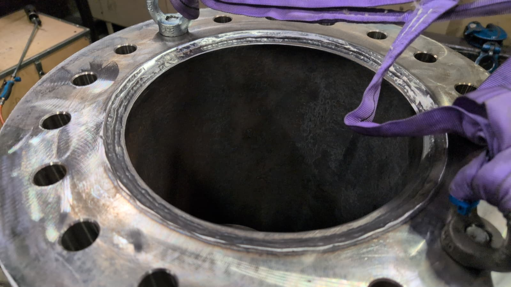</a>
*Visible indications in the white penetrant developer are present along the weld seam, suggesting surface discontinuities such as porosity, lack of fusion, or cracking. The weld also exhibits an irregular and inconsistent profile, visually indicating poor quality. These defects are located on the inner diameter weld seam of the flange from Project 25380 Seasight. The presence of PT indications signifies an unacceptable weld that requires repair to ensure the structural integrity of this davit crane component. Visual Testing (VT) identified initial irregularities, and Dye Penetrant Testing (PT) has confirmed surface flaws.*

<a href="davit_crane_44_layout_marking.jpg">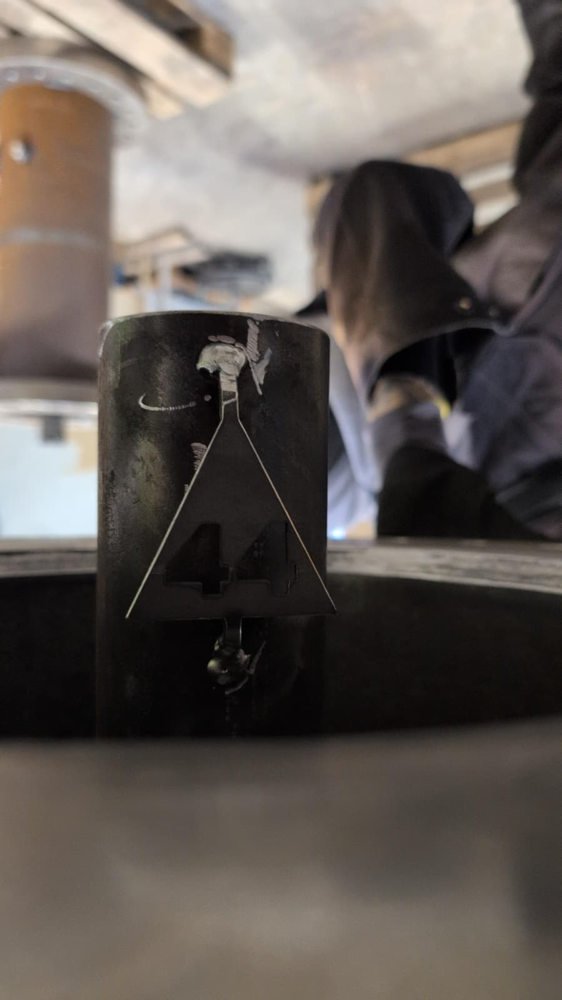</a>
*Visual inspection (VT) of davit crane component #44 reveals an inconsistently applied white graphical marking above the identification plate. The marking exhibits irregular edges and smudges, indicating a minor aesthetic imperfection in its application. This is considered acceptable as it does not compromise readability of the component number or the integrity of the protective coating.*

*Multiple small surface pinholes or porosity are visible on the coated/galvanized surface of the large curved structural component, likely a davit arm for project 25380 Seasight. These discontinuities indicate a compromised protective coating barrier, suggesting a potential for premature corrosion. Based on Visual Testing (VT), further assessment, potentially including holiday detection, and likely repair are required to ensure long-term integrity.*

<a href="davit_crane_weld_toe_undercut.jpg">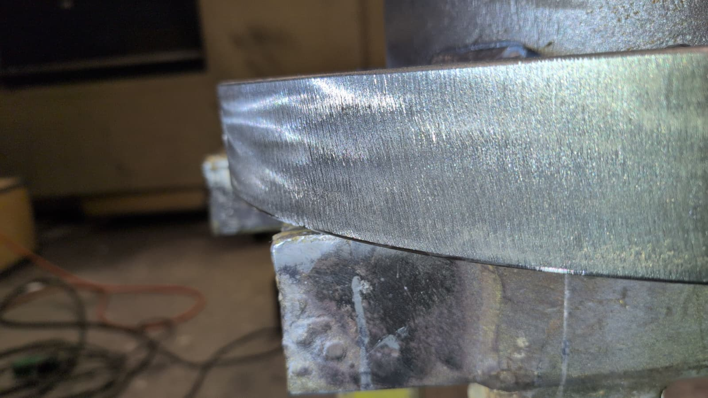</a>
*Visible is an uneven gap between the curved edge of an upper component and the lower support structure, suggesting poor fit-up or improper seating at this interface. The lower support also exhibits a very rough and irregular surface finish, indicative of either heavy weld spatter beneath the coating or inadequate surface preparation. The severity of the gap requires assessment against design specifications, but it appears significant enough to potentially affect load distribution. These observations are primarily from Visual Testing (VT), and the gap's acceptability depends on engineering tolerances for the davit crane.*

<a href="davit_crane_25380_pedestal_tack_welds.jpg">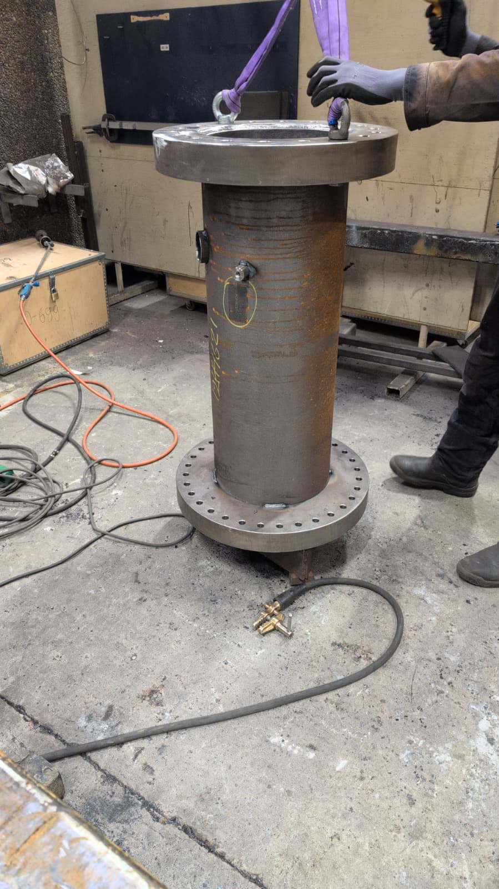</a>
*Unfinished or poorly executed fillet welds are visible securing the bottom flange to the cylindrical column on project 25380 Seasight. These welds exhibit significant unevenness and gaps, indicating they are unacceptable and require completion or rework based on visual inspection (VT). Extensive surface rust and oxidation are also present across the unpainted component. No specific NDT indications (MT/PT) are visible.*

*Visual inspection reveals an irregular weld bead along the inner circumference of the davit crane flange (project 25380 Seasight). The inconsistent profile and rough surface of this feature may compromise its intended function, such as a sealing or structural role. This condition is considered a minor defect and requires further assessment (VT) to determine acceptance criteria based on design specifications.*

*Visible coating irregularities and surface imperfections are observed on crane component #44. There are areas of potentially incomplete coating or damage around the etched design above the number, along with some minor surface pores. These are minor to moderate visual coating defects, requiring further evaluation to ensure adequate corrosion protection, as determined by this visual inspection (VT).*

<a href="davit_crane_fles_no_galva_ok.jpg">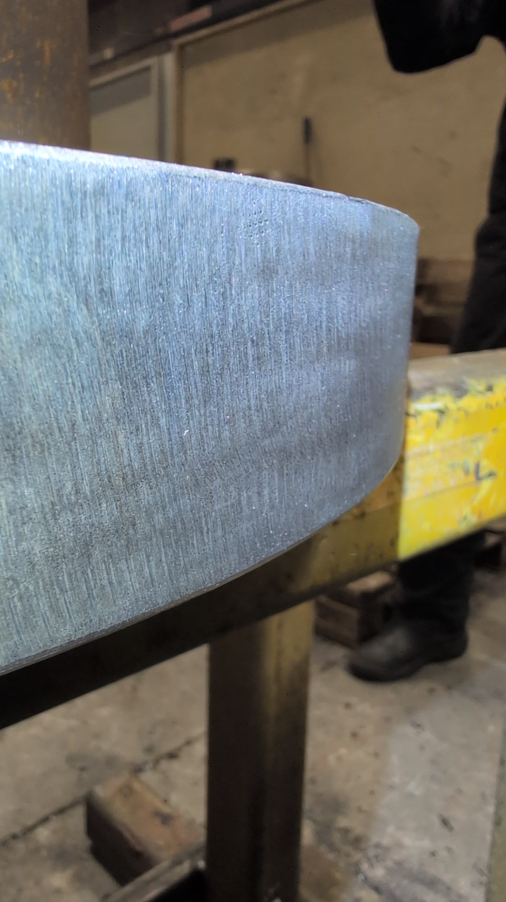</a>
*The photo shows the bare metallic surface of a curved component, identified by the inspector as "de fles," on the project 25380 Seasight davit crane. The surface exhibits a uniform brushed or ground finish, consistent with an ungalvanized state as deemed acceptable by the inspector. No significant welding defects, coating issues, or structural flaws are evident. Based on visual inspection (VT), the component's surface condition is acceptable.*

*The visible metallic component, likely referred to as "de fles," presents an ungalvanized, mechanically finished surface. As per the accompanying inspector note, this non-galvanized state is deemed acceptable for the davit crane component (Project 25380 Seasight). No other critical surface defects like pores, undercut, or cracks are discernible on the primary visible surface via visual inspection (VT).*

*The davit crane component (cylindrical column with flanges, project 25380 Seasight) is fabricated from raw carbon steel. Its ungalvanized state is deemed acceptable per chat context ("De fles is ok zonder galva"). Visible fillet welds at the base of the cylinder show no obvious gross defects via visual inspection (VT). The overall surface condition is consistent with raw material prior to further surface preparation and coating.*

### De fles is ok zonder galva

<a href="davit_crane_set_53_52_galva_ok.jpg">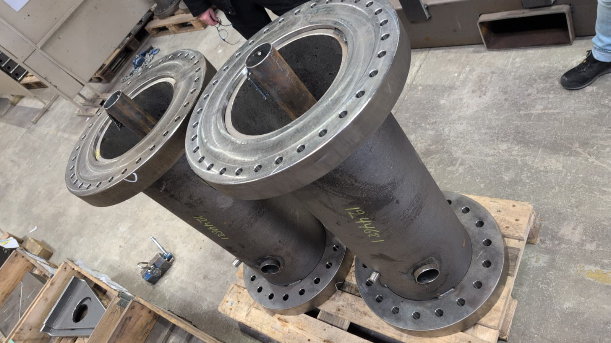</a>
*Visible surface porosity and pitting are observed on the welds connecting the central pipe to the top flanges of both components, identified by markings '12 44621' (likely Set 52 and 53). This condition appears moderate and requires a detailed visual inspection (VT). Further NDT, such as liquid penetrant testing (PT) or magnetic particle testing (MT), is recommended to ascertain the extent and depth of the porosity and determine if repair is needed.*

*Visual inspection (VT) of pipe spools (Sets 52 and 53) reveals generally acceptable weld quality at flange and internal pipe connections. Minor surface irregularities or spatter are visible on some welds but appear to be within typical VT acceptance criteria. The dark surface finish on the pipes indicates a pre-treatment or primer coat, showing a slightly textured appearance. Further NDT such as MT or PT on critical welds would confirm the absence of any tighter surface defects if required by project specifications.*

<a href="set_53_52_galva_rough_finish.jpg">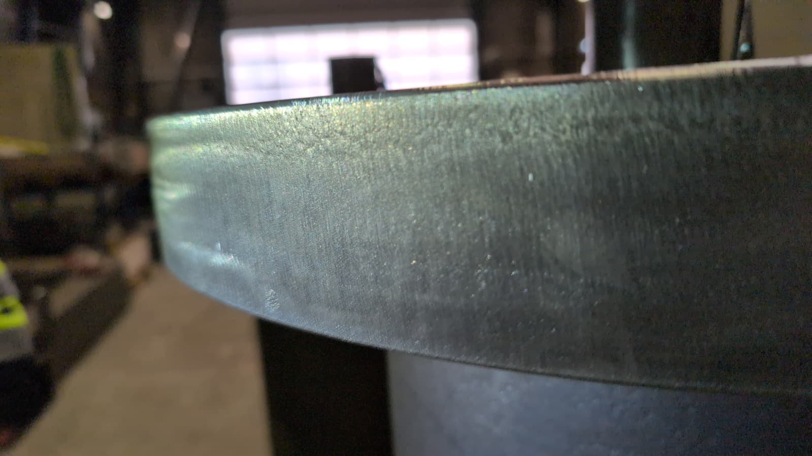</a>
*The component, likely a curved flange or 'bottle' section of the davit crane (Project 25380 Seasight), displays a textured, non-galvanized metallic surface. Visible features include linear machining/grinding marks and a somewhat mottled, rough finish, particularly evident in reflective areas. No obvious welding defects such as undercut, severe porosity, or cracks are discernible. This surface condition is acceptable, consistent with the inspector's note regarding the absence of galvanizing. NDT status is not provided.*

*A coating irregularity, manifesting as a rough and uneven surface finish, is visible on the component's upper edge and flat surface. This appears to be a paint or galvanization defect on a structural element of the davit crane. While appearing minor, this condition requires further Visual Testing (VT) and assessment against specified surface finish and corrosion protection criteria.*

<a href="davit_crane_undercut_verdigris_weld.jpg">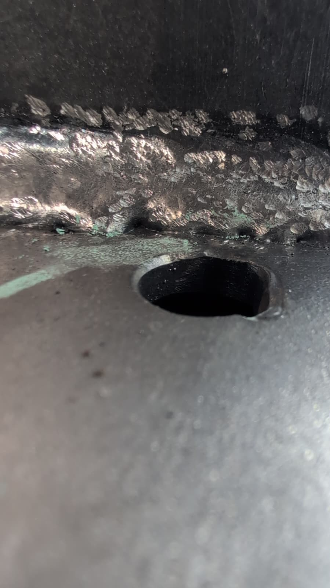</a>
*Visual inspection (VT) reveals significant undercut along the toe of the weld seam on a davit crane component (Project 25380 Seasight). Green discoloration is also visible, indicating potential galvanic corrosion or a compromised protective coating. The undercut requires repair due to its severity, and the affected area needs remediation. Further NDT (MT/PT) is recommended after repair to confirm surface integrity.*

*Visual inspection reveals significant green, granular residue, likely copper oxidation or uncleaned copper-containing material, forming the letters 'CT' above a weld seam on an internal surface, with similar deposits along the weld. This condition, along with visible heat tint on the weld, is unacceptable for a davit crane in a marine environment as it indicates potential corrosion and compromised surface integrity. Further investigation, thorough cleaning, and re-evaluation are required based on this VT observation.*

<a href="davit_crane_25380_weld_undercut_green_residue.jpg">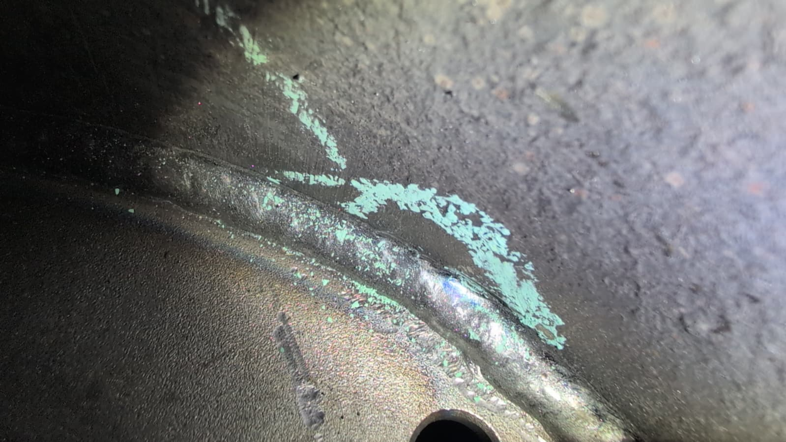</a>
*Extensive paint delamination and flaking are visible on a davit crane component (Project 25380 Seasight), particularly along a weld seam and adjacent surfaces. This severe coating defect compromises corrosion protection and requires repair. Visual Testing (VT) identifies the widespread degradation of the protective coating.*

*Visual inspection (VT) reveals significant undercut along the toe of the weld seam adjacent to the opening, coupled with greenish discoloration suggesting galvanization issues or early corrosion. The weld profile also exhibits irregularities. This condition is unacceptable for a davit crane in a marine environment (Project 25380 Seasight) and necessitates repair to address both weld quality and coating integrity.*

<a href="davit_crane_weld_undercut_rework_mark.jpg">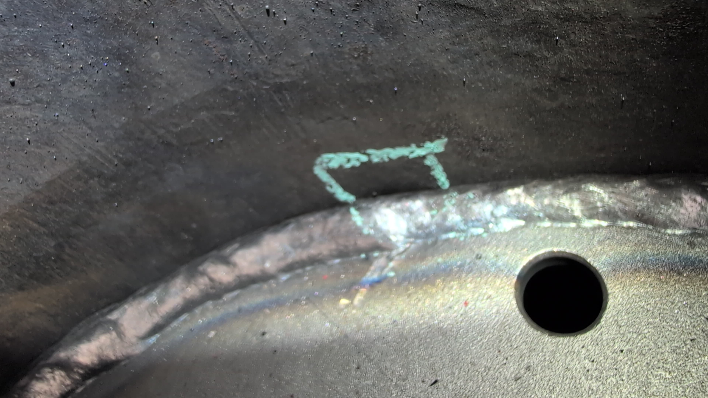</a>
*Visible localized green/blue discoloration, consistent with zinc corrosion (white rust) on the galvanized surface, is present along a fillet weld and adjacent parent material of the davit crane component. A distinct green granular 'T' shaped marking is also visible above the weld, possibly indicating an area of concern or previous inspection. This condition indicates a localized galvanizing defect that compromises corrosion protection and requires further investigation, cleaning, and potential localized repair. Identified via Visual Testing (VT).*

<a href="set_43_weld_undercut_peeling_green_paint.jpg">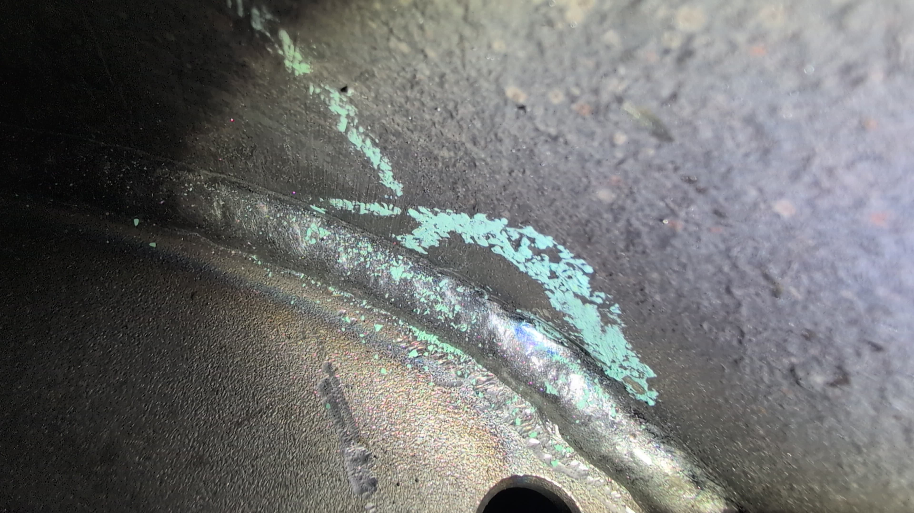</a>
*QC Analysis (Project 25380 Seasight): A significant paint/coating defect is visible on a weld seam and adjacent black steel component of the davit crane. The light blue-green coating shows uneven application and signs of flaking, compromising its protective function. This issue is identified via Visual Testing (VT) and requires repair and re-coating.*

<a href="davit_crane_set_43_42_48_49_weld_undercut.jpg">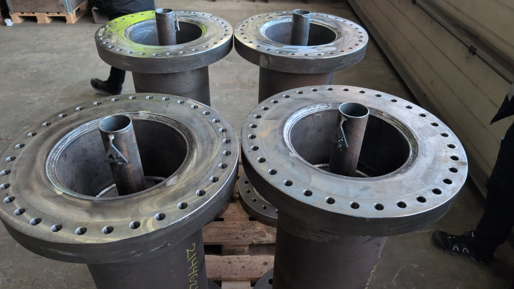</a>
*Four davit crane flange-to-pipe assemblies (Sets 43, 42, 48, 49) are in a pre-coating stage. Visual inspection (VT) of the main flange-to-pipe welds is partially obscured by grinding marks; surface integrity verification via Magnetic Particle Testing (MT) or Penetrant Testing (PT) is recommended to confirm absence of discontinuities like porosity or undercut. The small tack welds on the internal pipes appear to be temporary process aids and are acceptable in this phase. The overall bare metal surface condition is acceptable prior to final coating.*

*The photo shows four flanged pipe sections (Set 43 42 48 49) likely for davit crane Project 25380 Seasight. No significant welding defects such as pores, undercut, or end craters are visibly apparent on the flange-to-pipe welds at this resolution. The flange faces exhibit standard machining marks, and temporary internal pipe supports are present, expected to be removed prior to final assembly. All visible features appear acceptable for the current stage of fabrication (VT).*

### Voor volgende week Zou woensdag zijn en dat is laatste zwarte staal

*Visible coating irregularities and localized lumps, likely dross or uneven galvanizing, are highlighted by green marker on structural seams of crane 34. These areas exhibit a poor surface finish which may impact corrosion protection or subsequent paint adhesion. This Visual Testing (VT) finding requires further assessment and potential grinding/rework to achieve an acceptable coating quality.*

<a href="crane34_surface_crack_green_paint.jpg">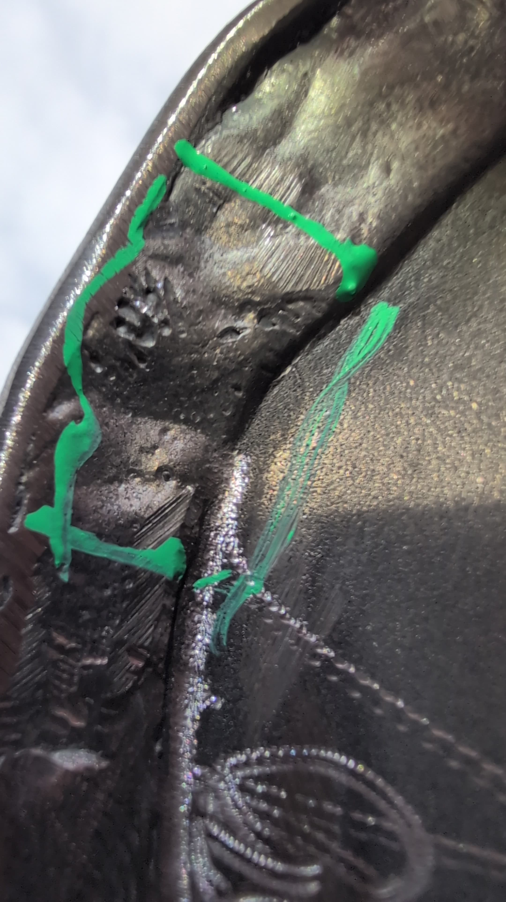</a>
*Visual inspection (VT) on Crane 34 reveals significant surface irregularities, including visible porosity and rough texture, highlighted by bright green markings. These indications, potentially located along a weld seam or casting feature, suggest moderate defects requiring repair. The current NDT status is VT, with further NDT (e.g., MT/PT post-repair) likely needed to confirm acceptability.*

<a href="crane_34_qc_paint_marks.jpg">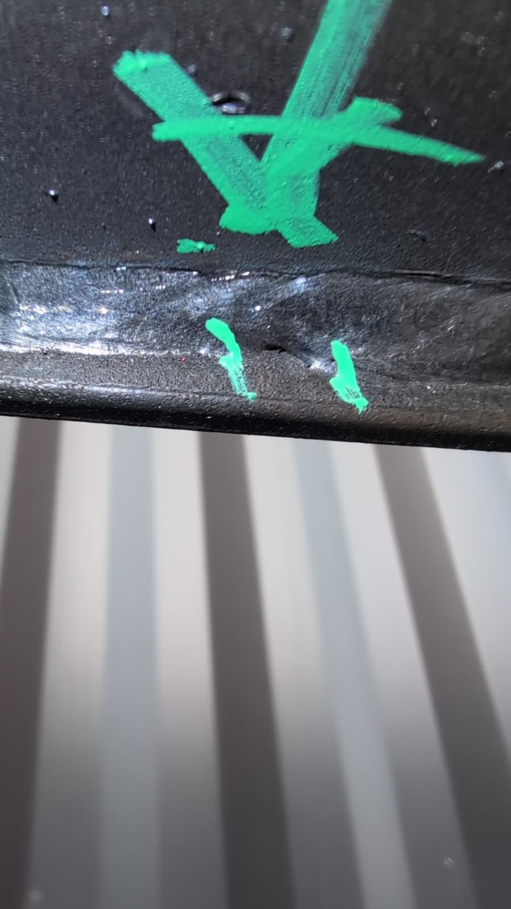</a>
*Visible are green paint markings, including a prominent 'X' and two distinct drips, on a dark structural component of Davit Crane Set 36. The 'X' likely denotes a marked area, possibly indicating an underlying issue or an area inspected. The uncontrolled green paint drips observed via VT constitute a minor paint application defect. This requires review against project coating specifications for acceptability or necessary touch-up.*

<a href="crane_34_qc_marking_green_x_lines.jpg">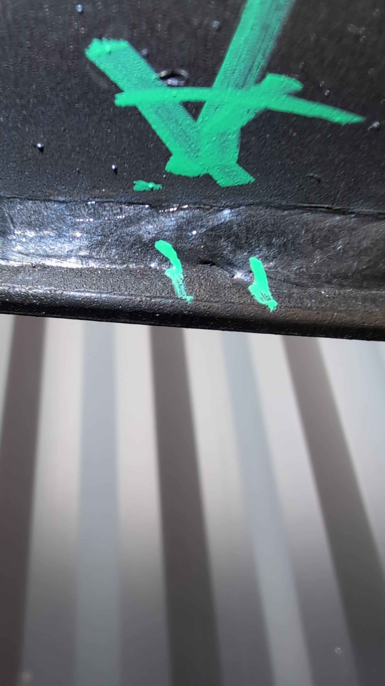</a>
*Green inspector markings, including a "V" and two vertical strokes, are visible on a textured black-coated davit crane component from Set 36 of Project 25380 Seasight. The coating exhibits a generally consistent texture with minor reflective particulates. Based on Visual Testing (VT), these surface features and coating condition are considered acceptable, with no critical defects observed.*

<a href="set_36_crane_weld_cracking_two_locations.jpg">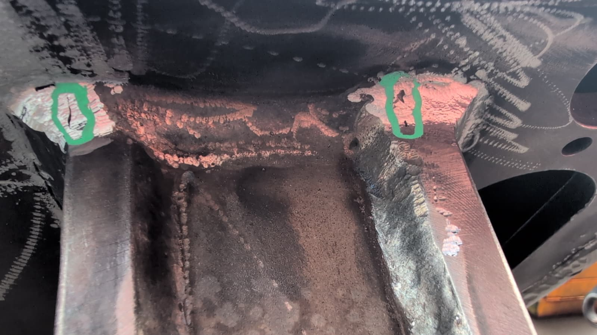</a>
*Visible linear indications (cracks) are present within the fillet welds connecting structural members of the davit crane, as highlighted in the green circles. These critical surface defects are confirmed by Visual Testing (VT) and show positive indications from Liquid Penetrant Testing (PT), evidenced by the white residue around the defects. Immediate repair by grinding out the cracks and re-welding is required.*

*Visual inspection (VT) reveals severe cracks (linear indications) in the weld seams at two locations, highlighted by green marker circles. These critical defects, located in the context of Set 36 and 34, necessitate immediate repair. Further NDT such as MT or PT is recommended to determine the full extent of the cracking prior to repair.*

<a href="davit_crane_set_36_welded_structure_qc.jpg">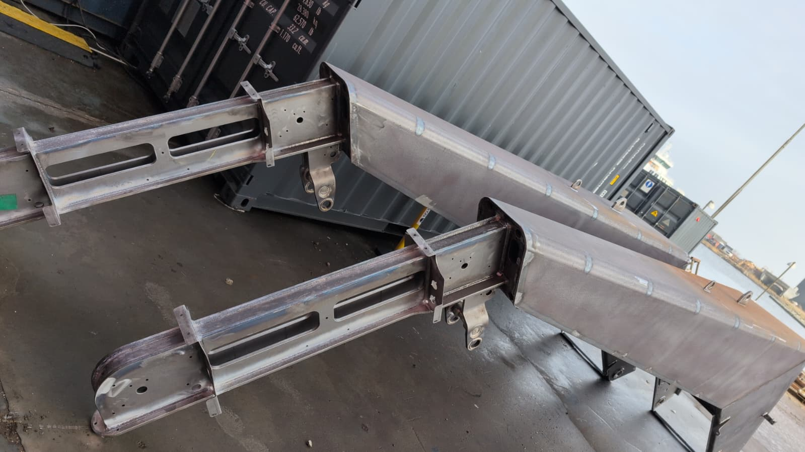</a>
*The visible davit crane components, likely Set 36 and Set 34, show completed welding on bare metal with extensive heat tint and grind marks. The welds appear to be in an acceptable raw state for fabrication, but the components are unfinished, requiring further surface preparation. Full Visual Testing (VT) is necessary to verify weld quality, and Magnetic Particle Testing (MT) should be conducted on critical weld seams to ensure surface integrity before proceeding to abrasive blasting and protective coating application. No significant defects like severe undercut, porosity, or cracks are clearly visible in this general overview.*

*Visual inspection (VT) of crane components Set 36 and 34 reveals minor surface irregularities and spatter on many external weld seams. While no critical structural defects are observed, these welds require further grinding and thorough cleaning. Proper surface preparation is essential to ensure optimal coating adhesion and prevent future corrosion issues.*

### Set 36 en 34

*The image displays a davit crane structural profile with significant discoloration, mottling, and an uneven surface finish. According to the inspector, Magnetic Particle Testing (MT) was performed, but the component was subsequently "half washed off." This incomplete post-MT cleaning compromises the integrity of the NDT, as potential indications could be obscured, and results in an unsatisfactory surface condition. Proper and complete cleaning after MT is required to validate NDT results and ensure an acceptable final product appearance and coating integrity.*

<a href="davit_crane_mt_incomplete_wash.jpg">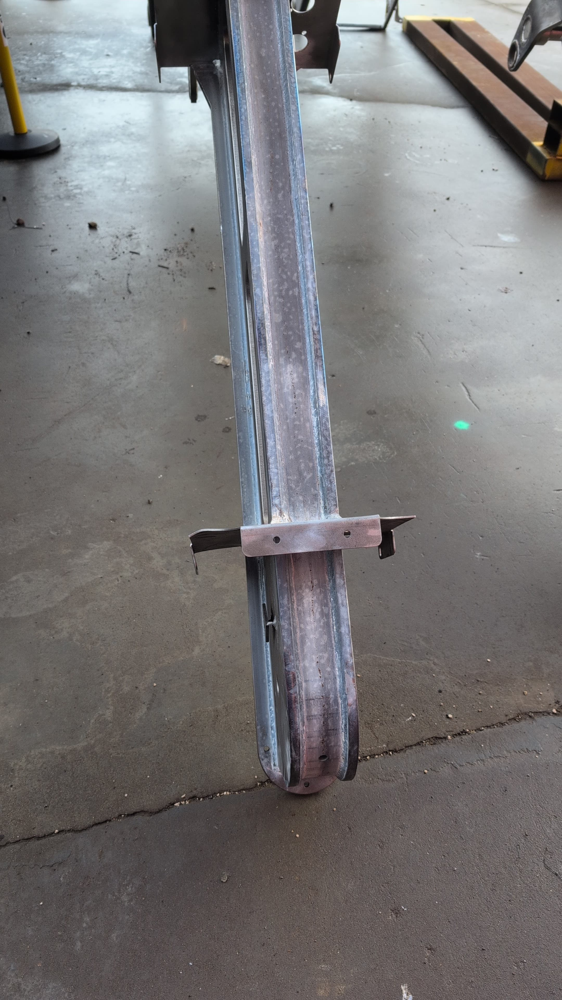</a>
*Visible is an incomplete removal of Magnetic Particle Testing (MT) inspection residue on the davit crane structural component, likely a channel or beam. The mottled and discolored surface indicates that the MT fluid/powder was only partially washed off. This condition requires thorough cleaning to ensure proper surface preparation and prevent potential issues with subsequent coatings or corrosion. MT inspection was performed, but post-inspection cleaning is deficient and needs repair (re-cleaning).*

*10:49 — Jelle Nuyens:* Lassen die met rutiele lasdraad onder de hand of zo?

*10:50 — Nick Geudens:* Ga het vragen maar de las ziet er wel zo uit

### Ik vermoed dat die gaatjes in de galva op eerdere foto toch komen van gaatjes is de las

<a href="davit_cranes_welding_wire_rutile_id.jpg">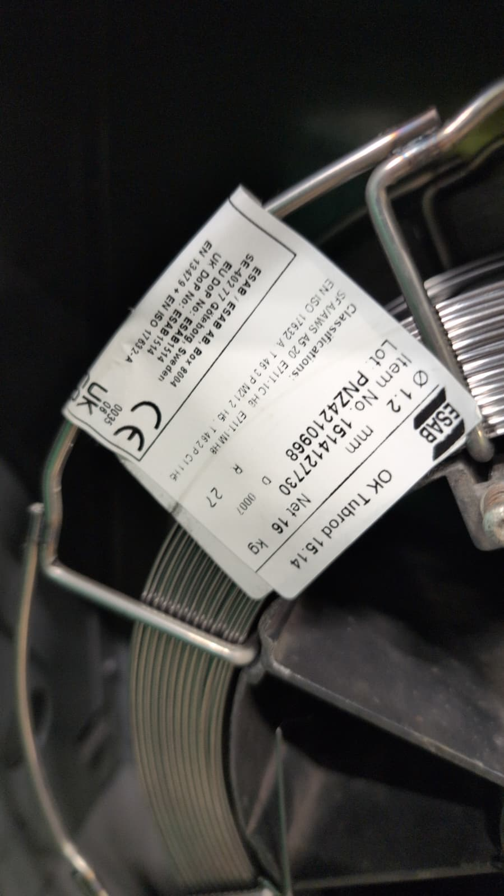</a>
*Non-QC photo: The image shows a label attached to a spool of welding wire (ESAB OK Tubrod 15.14, 1.2mm, Net 16kg, Lot No. PNZ42109968). It does not depict any welding defects, coating issues, or components of a davit crane.*

<a href="davit_cranes_25380_welding_wire_label_porosity.jpg">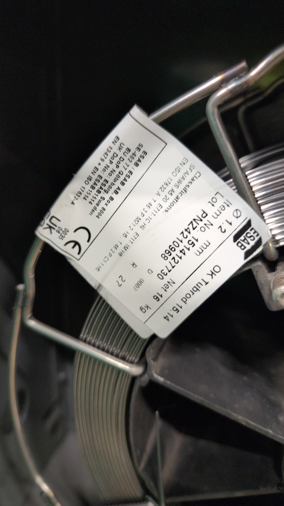</a>
*Non-QC photo: This image displays a label on a spool of ESAB welding wire (OK Tubrod 15.14, Ø 1.2 mm), providing specifications and manufacturing details. It does not show any defects or features on a welded component or coating.*

<a href="25380_seasight_tack_weld_porosity_pre_galva.jpg">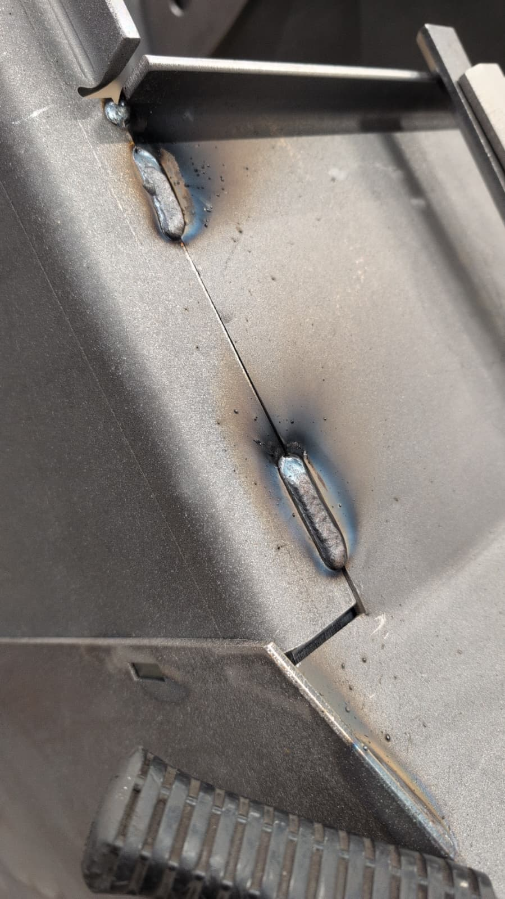</a>
*Visual inspection (VT) identifies multiple areas of surface porosity and weld spatter on the tack welds of this crane component (Project 25380 Seasight). The visible porosity is a moderate defect, which can compromise weld integrity and, as suspected, likely contributes to pinholes or defects in subsequent galvanization. Spatter is also present and requires removal before coating.*

*Visible end craters are present at the termination of multiple short weld beads on a structural component of the davit crane (Project 25380 Seasight). These craters, combined with the apparent lack of continuous fusion and significant weld spatter, indicate poor welding technique and inadequate penetration. If these are intended as structural welds, they constitute a significant defect that requires immediate repair due to the high risk of crack initiation. These issues are clearly identifiable via Visual Testing (VT), and further Magnetic Particle Testing (MT) or Liquid Penetrant Testing (PT) should be performed after repair to ensure integrity.*

<a href="crane_25380_wps_fw_01_008.jpg">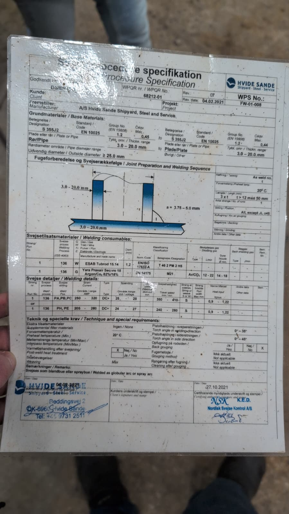</a>
*Non-QC photo: The image displays a welding procedure specification (WPS) document, not a physical weld, crane component, or coating. No defects are visible as it's a photo of documentation.*

<a href="davit_cranes_25380_wps_fw01008_fillet_weld_concern.jpg">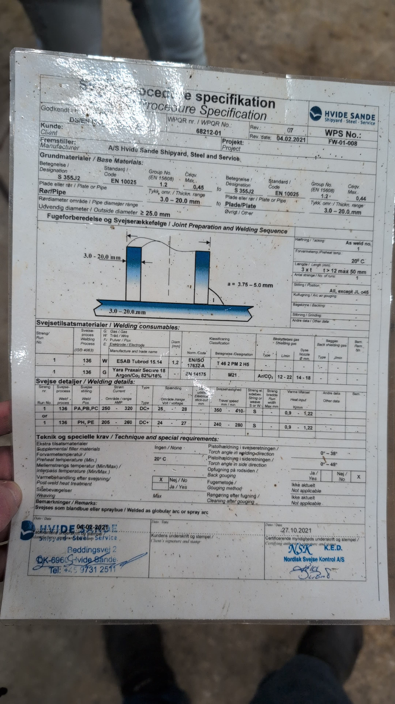</a>
*Non-QC photo: a welding procedure specification document.*

### Die zullen een goeie hoekinbranding hebben denk 🫣

<a href="crane_43_weld_inadequate_penetration.jpg">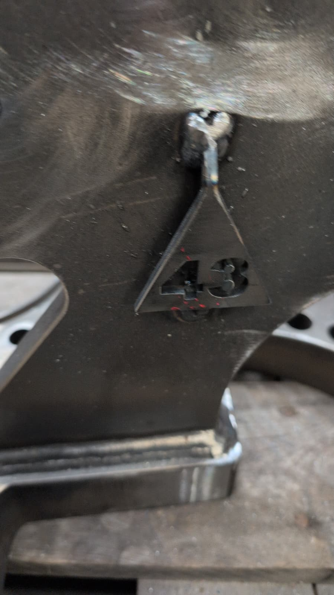</a>
*Undercut is observed at the weld securing the triangular '43' identification tag to the davit crane component (project 25380 Seasight). The weld profile appears inconsistent. Further visual inspection (VT) and depth measurement are required to assess severity. Depending on the depth, repair will likely be necessary as per code requirements.*

<a href="25380_davit_crane_weld_undercut.jpg">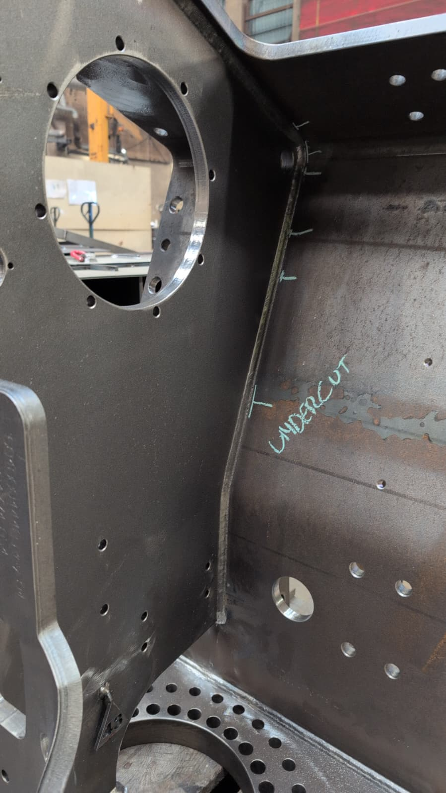</a>
*Visible on project 25380 Seasight davit crane structure, a significant undercut defect is clearly marked along a vertical fillet weld seam. This defect, detected through Visual Testing (VT), indicates an unacceptable deficiency of weld metal at the toe of the weld. Based on the explicit marking, this undercut likely exceeds allowable limits and will require repair to ensure structural integrity.*

*This image shows a vertical fillet weld on a structural component of the davit crane. The weld exhibits clear signs of poor root fusion or insufficient penetration ("hoekinbranding"), particularly visible along the root of the weld on the left plate. This is a severe visual defect (VT) that compromises structural integrity and requires immediate repair.*

<a href="davit_crane_undercut_on_vertical_plate.jpg">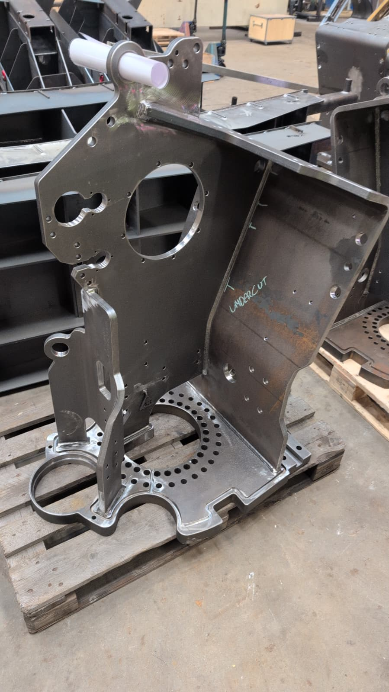</a>
*Undercut weld defect is visible on a major vertical structural plate, as indicated by the chalk marking "UNDERCUT". This defect represents a non-conformance identified through Visual Testing (VT) and requires further assessment to determine if repair is necessary based on specified acceptance criteria.*

*A significant undercut defect is visible along the fillet weld seam joining structural plates of the davit crane component (Project 25380 Seasight). This defect, clearly marked "UNDERCUT," was identified during Visual Testing (VT). Given the nature of a crane component, this condition is unacceptable and requires repair before further processing or assembly.*

<a href="davit_crane_43_weld_undercut.jpg">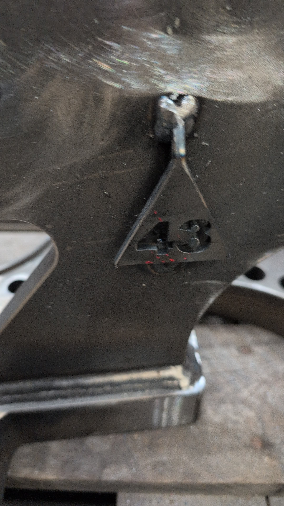</a>
*Undercut is visible at the weld toe attaching the triangular identification tag '43' to the main structural component. While it appears minor, this localized welding defect requires further evaluation against project specifications. Visual Testing (VT) identifies the issue; additional NDT like Magnetic Particle Testing (MT) may be used for a comprehensive assessment if deeper discontinuities are suspected.*

<a href="davit_crane_25380_weld_undercut_1.jpg">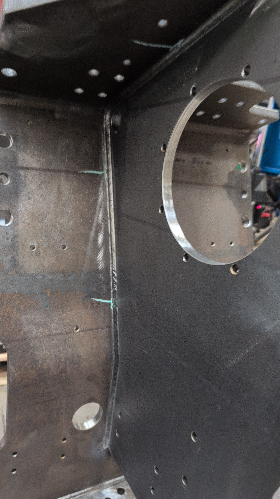</a>
*Visible on the left side of the component are minor surface irregularities along the vertical fillet weld seam, including localized weld spatter and an uneven bead profile. The adjacent raw metal plate also shows some areas of minor surface discoloration and light rust. These conditions necessitate thorough spatter removal and proper surface preparation, such as blast cleaning, prior to any coating application. Based on Visual Testing (VT), the weld appears structurally sound, but cosmetic and preparatory work is required.*

*Undercut is visibly marked with green chalk on the vertical structural plate of the fabricated assembly, adjacent to a weld seam. This defect was identified during Visual Testing (VT). Its severity requires further assessment to determine if it is acceptable or if a repair is necessary per project 25380 Seasight specifications.*

*The image displays component identification "36" on a dark, coated surface, likely part of a davit crane. A green inspector's mark is visible below the identification. No discernible welding or significant coating defects are apparent from this visual inspection. Magnetic Particle Testing (MT) is reported as outstanding for this area.*

<a href="davit_crane_part_white_mt_coat_mt_pending.jpg">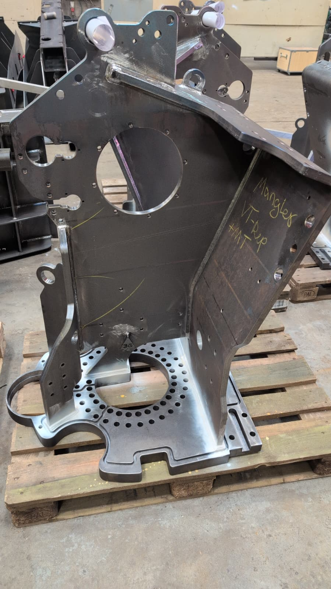</a>
*A VT-identified repair is visible on this davit crane component, indicated by chalk marks "VT-Rep +MT" near the lower central plate (location 385). This repair addresses a defect found during visual testing, evident by the ground area. The "+MT" signifies that Magnetic Particle Testing is required or completed to verify the repair's integrity, which is crucial for assessing final acceptability.*

<a href="crane_36_mt_white_coat.jpg">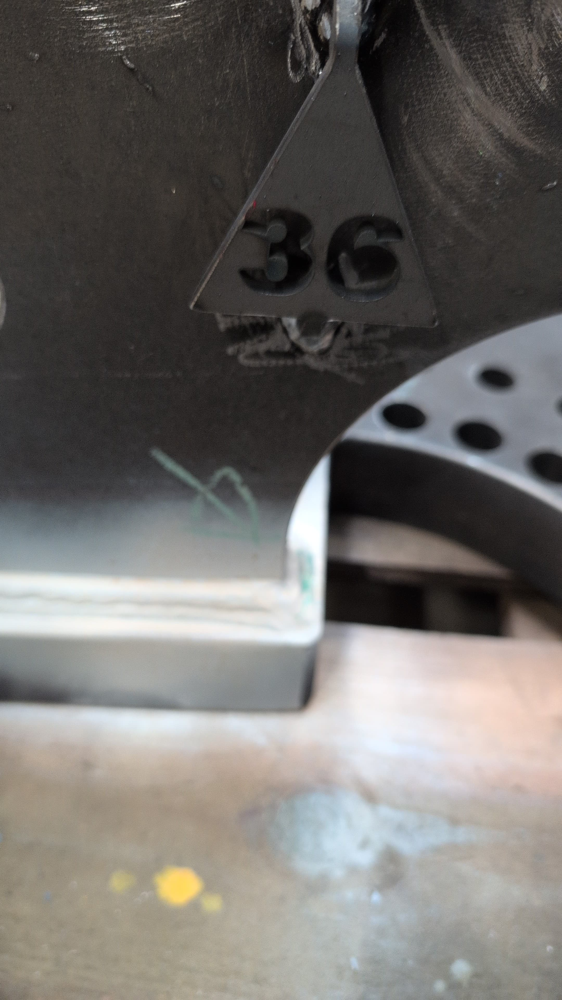</a>
*The photo shows a coated weld area below the identifier "36", exhibiting minor surface irregularities beneath the dark coating. Based on the project context, Magnetic Particle Testing (MT) is still pending for this weld. This constitutes a significant procedural non-conformance as the current coating will likely impede effective MT, necessitating its removal and subsequent reapplication for proper weld inspection.*

*A visually identified defect, marked as "Mangles VT-Rep," is present on the large fabricated steel component. The defect requires repair as indicated by "VT-Rep," and Magnetic Particle Testing (+MT) is also specified, likely for post-repair verification. The component is currently unacceptable and requires corrective action.*

*Inspector's markings, including "RQ" and a green line along the upper horizontal weld toe, are visible on the component from project 25380 Seasight. These markings indicate a flagged area for a potential weld discontinuity (e.g., undercut) at the weld toe and/or a surface irregularity on the adjacent base metal. This condition requires further visual examination (VT) and potentially NDT (PT or MT) to identify the specific defect and determine if repair is needed.*

*Identification tag number '41' is visible, attached by a small fillet weld to the component, likely a davit crane part. The weld appears functional for tag attachment, with no severe visual defects like gross porosity or undercut evident from the photograph. This attachment is considered acceptable via Visual Testing (VT) for its non-structural purpose.*

<a href="davit_crane_25380_corner_weld_dye_crack.jpg">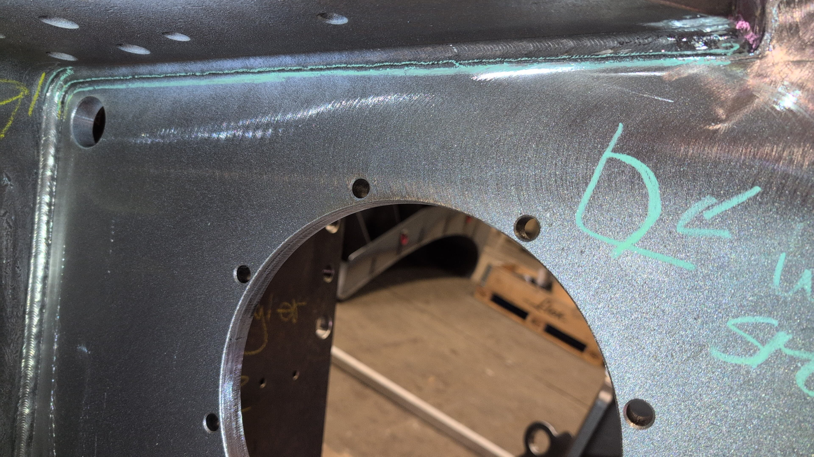</a>
*Visible greenish residue is observed along the horizontal weld seam on the main structural member. This indicates incomplete post-weld cleaning, likely slag or flux residue, which can compromise subsequent coating adhesion. As identified by Visual Testing (VT), this is a minor defect that requires removal prior to final galvanizing or painting to ensure long-term corrosion protection.*

*Handwritten notes on a davit crane component's vertical plate indicate "VT-kop T MT" and the term "Manglen". This suggests a potential defect or area of concern identified during Visual Testing (VT), with Magnetic Particle Testing (MT) either performed or required for the area. The specific defect type and severity cannot be visually assessed, but the markings confirm active QC investigation is in progress.*

<a href="crane_41_marking_tag.jpg">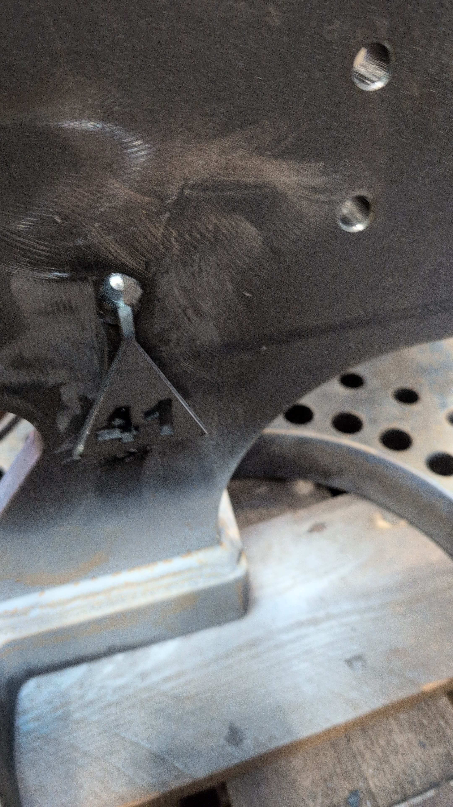</a>
*End crater visible at the termination of the weld securing the small triangular attachment, located near the '41' identification stamp on a structural component of the davit crane. End craters are potential sites for shrinkage cracks, thus this area requires further NDT, specifically Penetrant Testing (PT) or Magnetic Particle Testing (MT), and likely needs repair to ensure structural integrity. This observation is a Visual Test (VT) finding.*

<a href="davit_crane_25380_seasight_vt_rep_mt_markings.jpg">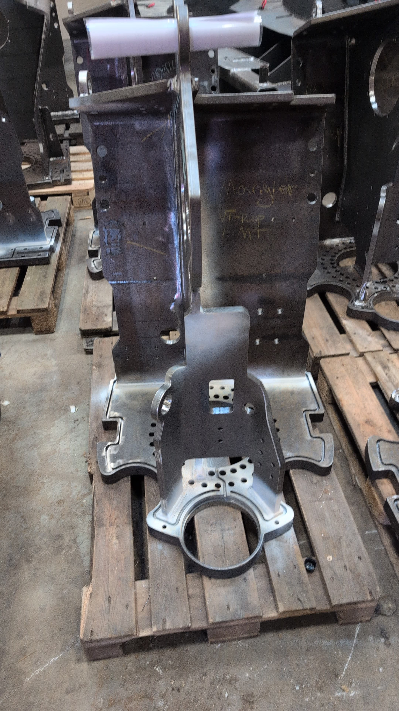</a>
*Visible NDT chalk markings "Mana VT-KMP / MT" are present on the main vertical plate of the davit crane component. These markings confirm that Visual Testing (VT) and Magnetic Particle Testing (MT) have been performed or are designated for this specific area. No significant welding defects (e.g., severe undercut, porosity) or coating imperfections requiring repair are clearly discernible in this image. The overall surface finish appears acceptable for this stage of fabrication, with the NDT status indicating initial inspection.*

*The image displays a fillet weld on a structural component, likely part of Crane #42, as indicated by the visible stamped identifier. Visual inspection (VT) reveals a consistent weld profile with no apparent undercut, significant porosity, or end craters, suggesting acceptable quality. Minor weld spatter is present at the weld toe but is not structurally detrimental. Further NDT (MT/PT) is recommended to confirm the absence of subsurface or fine surface discontinuities.*

<a href="25380_davit_crane_weld_undercut_1.jpg">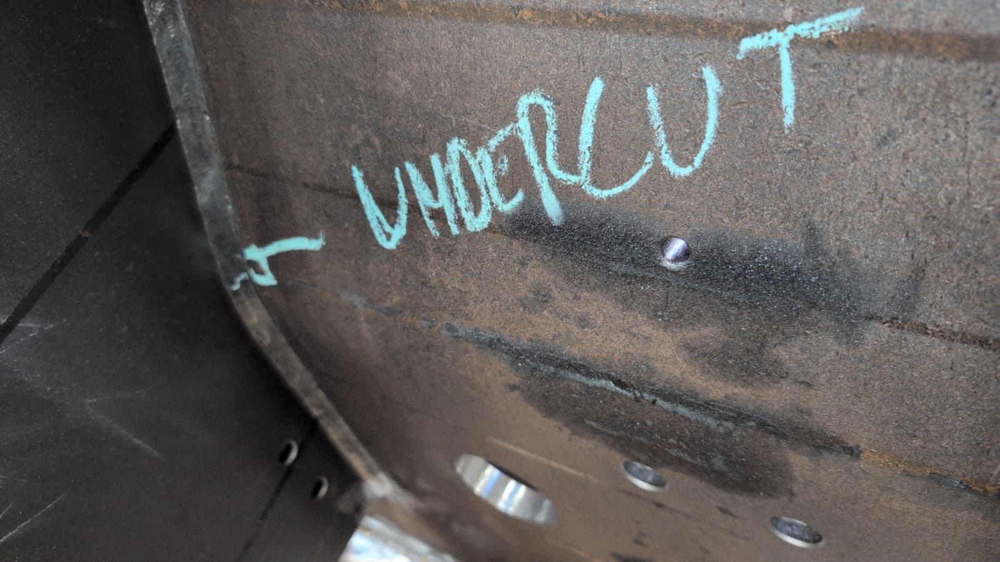</a>
*Undercut is clearly visible and marked with chalk along a weld seam on a structural component of the davit crane. The presence of the marking indicates a detected welding defect that likely exceeds acceptance criteria. This undercut needs repair to ensure structural integrity as per project 25380 Seasight specifications. The defect was identified through Visual Testing (VT).*

<a href="crane_25380_undercut_weld_rework.jpg">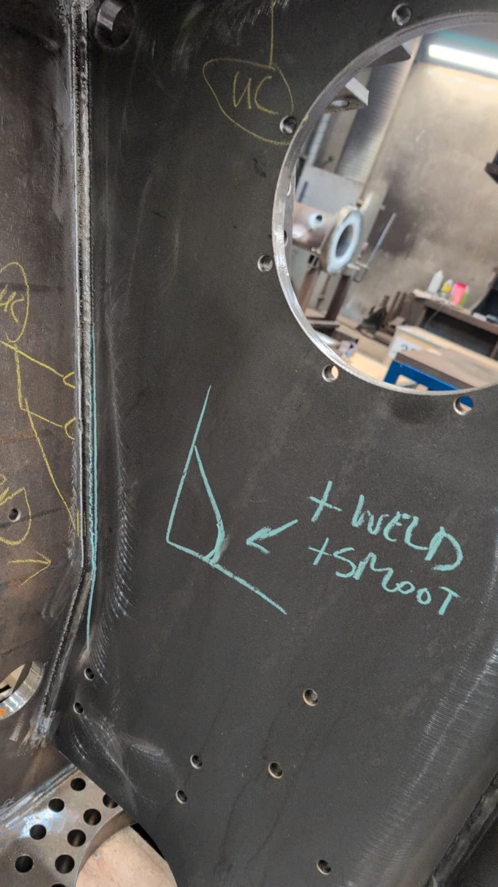</a>
*QC photo shows chalk markings indicating non-conformances on a davit crane structural component. Visible instructions "+ WELD + SMOOT" and a weld profile drawing denote a required weld repair and smoothing operation at a specific location. Multiple "UC" (Unacceptable Condition) markings are also present, signifying other areas requiring attention or repair. These issues have been identified through Visual Testing (VT) and require corrective action prior to final acceptance.*

<a href="crane_42_weld_roughness_and_surface_rust.jpg">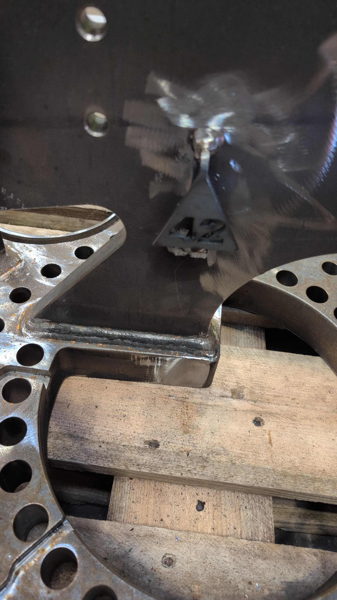</a>
*Visual inspection (VT) of the weld seam on component #42 reveals an acceptable weld profile with no severe defects such as undercut or gross porosity. Minor surface oxidation is present on the adjacent base metal, which is typical for fabricated steel prior to final surface treatment. Based on VT, the weld quality is considered acceptable, but Magnetic Particle Testing (MT) should be conducted as per project specifications for surface discontinuity verification.*

<a href="25380_weld_undercut_marked.jpg">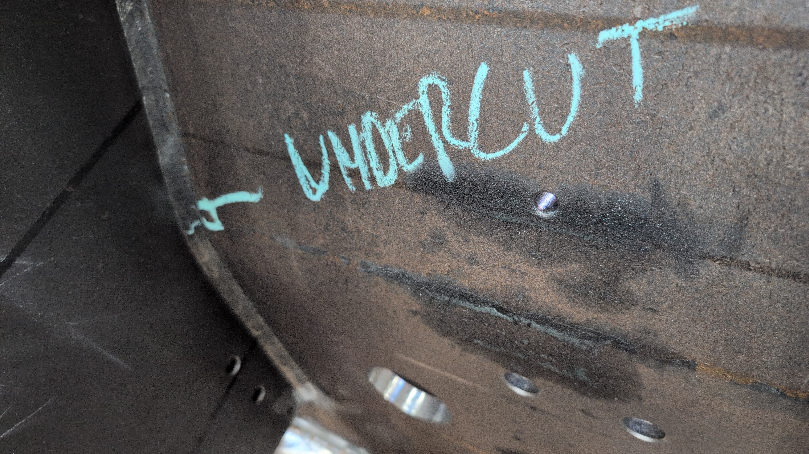</a>
*An undercut weld defect is clearly visible and marked with chalk at the toe of a weld seam on a steel component, likely part of the davit crane structure. The defect has been identified through Visual Testing (VT). Based on the explicit marking, it is considered an unacceptable condition that requires repair.*

*Visual inspection (VT) reveals visible undercut (marked "UC") along a vertical weld seam on an internal structural component, likely a davit crane section. Additionally, the weld profile requires smoothing as indicated by "WELD SMOOT" chalk markings, suggesting an unacceptable finish. These areas require further evaluation per applicable welding codes and likely repair.*

*Visual inspection (VT) of a metal component, identified by tag '40', reveals surface grinding marks and a tack weld securing the identification tag. The tack weld appears rough and exhibits some surface irregularities, but seems adequate for holding the non-structural tag. This condition is likely acceptable; however, confirmation against specific cosmetic standards for identification welds would be required.*

*Undercut defect is visible and marked with green chalk on a weld seam of a structural component. This indicates a prior visual inspection (VT) has identified the issue. Based on the marking, this defect likely requires further evaluation and potential repair to meet project specifications. No other NDT methods are indicated in this view.*

<a href="davit_crane_weld_green_qc_lines.jpg">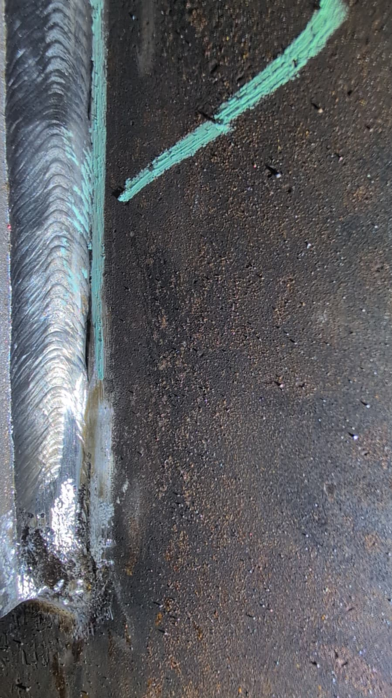</a>
*Visual inspection (VT) of the weld seam reveals a consistent bead profile and acceptable appearance. However, unremoved slag or spatter is present at the bottom of the weld, which is a minor defect requiring post-weld cleaning on this davit crane component. A green reference line is visible parallel to the weld toe. No other NDT indications are apparent from this image.*

<a href="davit_crane_40_id_tag.jpg">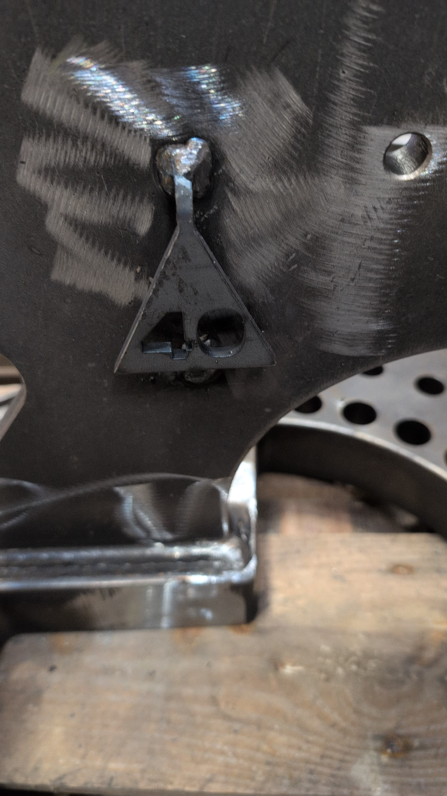</a>
*The photo displays an identification tag with the number '49' securely attached to a metallic davit crane component. Visual inspection reveals no evident weld defects such as pores or undercut on the tag's attachment point. The surrounding surface exhibits standard grinding patterns, and no significant coating or galvanization issues are observed. This component appears acceptable based on the visible features.*

<a href="davit_crane_weld_undercut.jpg">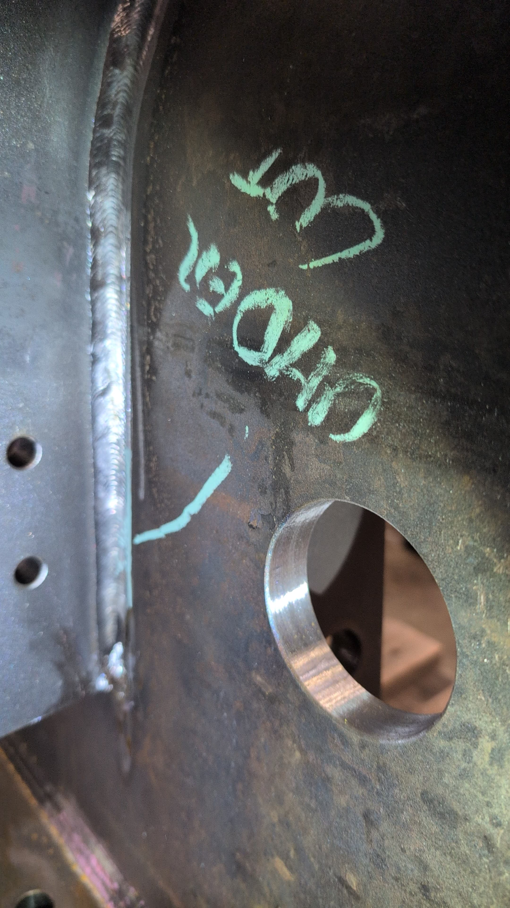</a>
*Undercut weld defect identified via Visual Testing (VT) on a weld seam, explicitly marked with green chalk. The presence of this marked defect indicates it likely exceeds acceptable limits for project 25380 Seasight and requires further evaluation or repair.*

*An unevenly textured green coating is visible adjacent to a vertical fillet weld on a davit crane component. The weld displays good bead formation and no visible defects (VT acceptable). The rough coating finish requires a visual inspection (VT) against specified coating requirements for Project 25380 Seasight to determine its acceptability, as it may indicate an application issue or insufficient protective qualities.*

*Several davit crane structural components are visible, with the rightmost piece showing general surface oxidation and areas of grinding, indicating pre-coating condition or prior work. As per the chat context, Visual Testing (VT) and Magnetic Particle Testing (MT) are still pending for all components shown. Therefore, a complete quality assessment of welds and surface integrity for coating cannot be finalized until NDT is performed and passed.*

<a href="proj_25380_davit_crane_components_ndt_pending.jpg">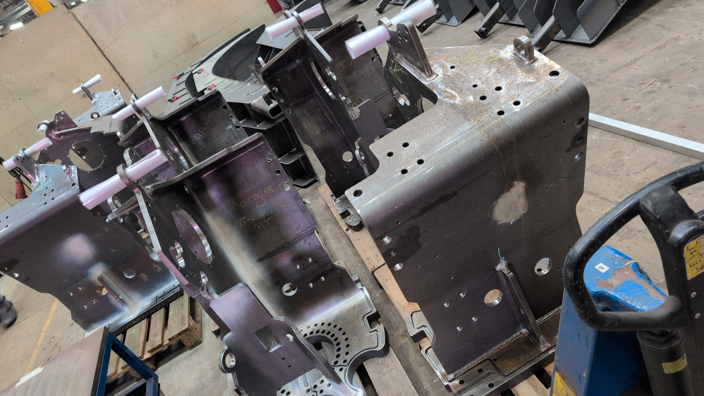</a>
*Visible on a structural component is the marking "VT-REP MT", indicating a previously identified defect that required repair based on Visual Test (VT) and Magnetic Particle Test (MT). Further inspection is needed to confirm the acceptance of this repair, as its current status is not marked. Additionally, an adjacent large metal plate exhibits significant surface corrosion/paint deterioration, which is unacceptable and would require extensive surface preparation before final coating to ensure long-term durability.*

*Visual inspection (VT) of the fabricated davit crane beams, such as part 3753, reveals an uneven application of the yellow primer coat. Some localized areas show variations in color and texture, potentially indicating minor flash rust bleeding through or inconsistent dry film thickness. This is considered a minor coating feature and generally acceptable for a shop primer, assuming surface preparation was adequate and it's not the final protective layer. No critical welding defects like severe undercut, porosity, or end craters were observed.*

*The image shows fabricated steel components for a davit crane, likely in a pre-coating stage within a workshop. Consistent with the inspector's notes, potential undercuts and plate fit-up issues (plate klem) are present on these raw metal structures, although their specific locations or severity are not definitively visible in this general view. Magnetic Testing (MT) and Visual Testing (VT) are still pending for sets 43, 32, 39, and 42, which is essential for comprehensive defect identification and assessment before final finishing.*

<a href="davit_crane_sets_43_32_39_42_rust_qc.jpg">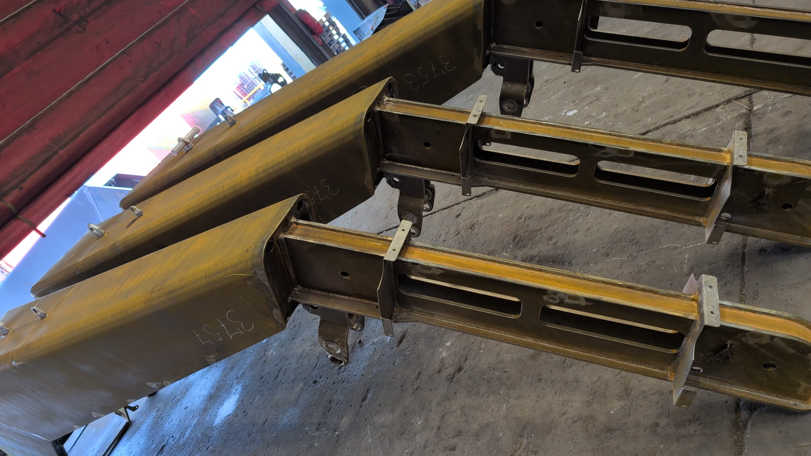</a>
*QC analysis of davit crane components reveals visible undercuts and plate misalignment on weld seams, as noted by the inspector for sets 43, 32, 39, and 42, with part 3753 visible in the photo. These components are currently awaiting final Magnetic Particle Testing (MT) and Visual Testing (VT) to fully assess the severity of these welding defects and determine necessary repairs. The surfaces also show typical oxidation for raw steel which must be addressed prior to final coating.*

<a href="davit_cranes_undercuts_plate_klem.jpg">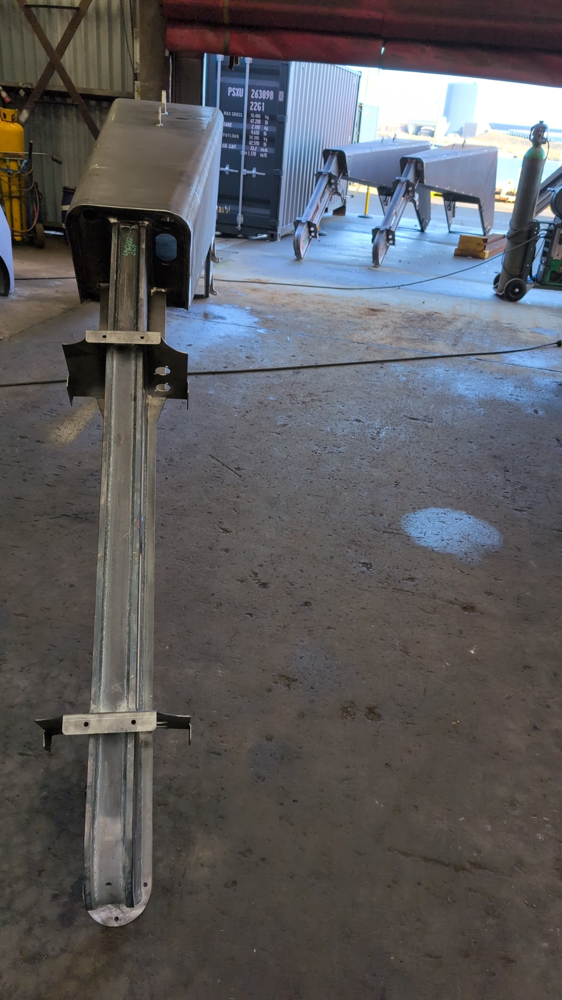</a>
*Undercuts are visible along weld seams of the foreground fabricated component, which is likely part of the davit crane structure. These components (Sets 43, 32, 39, 42, as per chat context) have not yet undergone Visual Testing (VT) or Magnetic Particle Testing (MT). While the visible undercuts appear minor, their severity and any "plate klem" issues will require comprehensive assessment during the scheduled VT and MT inspections.*

### Set 43 & 32 & 39 en 42 Was nog niet MT en VT nagezien, heb hier en daar undercuts en plate klem

*A clear undercut is visible along the edge of a davit crane component, adjacent to a circular feature, possibly a weld depression or countersunk element. This defect was identified during visual inspection (VT), and based on its appearance, likely requires repair. The NDT status indicates that MT and VT were not yet fully completed for the relevant sets (43, 32, 39, 42) when this finding was made.*

*The image depicts minor weld irregularities and potential undercuts in the area highlighted by the green marker, likely on one of the davit crane sets (43, 32, 39, or 42). The textured surface appears to be a coating or galvanized finish. Formal Visual Testing (VT) and Magnetic Particle Testing (MT) are still outstanding for these components, as indicated in the inspector's notes, suggesting further evaluation is required.*

<a href="25380_davit_crane_lifting_eye_no_mt_test.jpg">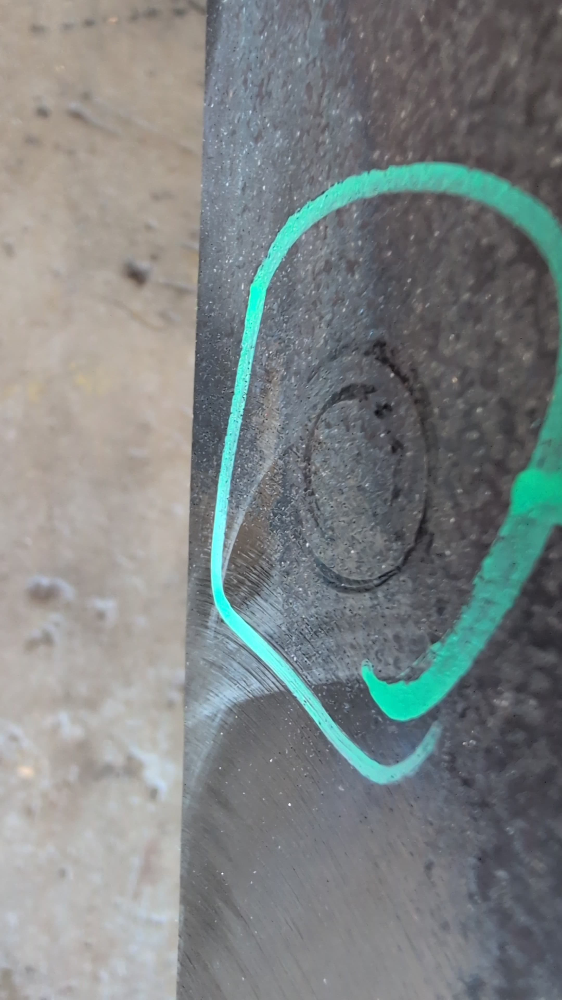</a>
*The image reveals a potential undercut highlighted by the green marking, located around a circular feature on the davit crane. This observation aligns with the inspector's notes regarding undercuts present on Sets 43, 32, 39, or 42. While severity cannot be fully determined from this photo, it indicates an area requiring closer attention. As per the chat context, these sets still need to undergo Visual Testing (VT) and Magnetic Particle Testing (MT) for complete evaluation.*

<a href="crane_25380_lifting_eye_pt_pores.jpg">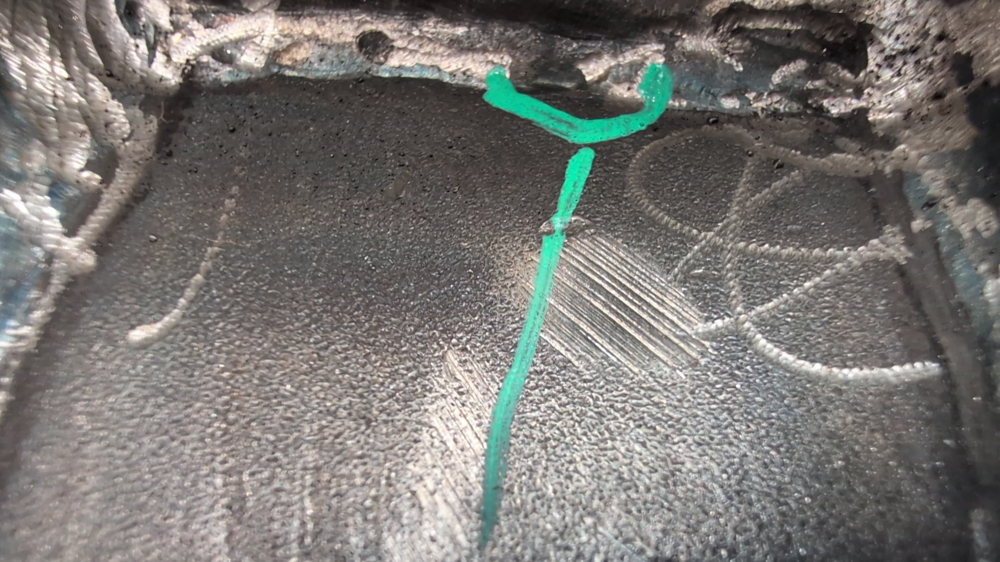</a>
*The image displays severe issues with the hot-dip galvanization, highlighted in green, likely on a lifting eye area of the crane arm (Project 25380 Seasight). The coating is excessively rough, uneven, and appears to contain dross inclusions, hindering effective Visual Testing (VT). This surface condition also impedes proper Magnetic Particle Testing (MT), which the context indicates has not been performed on these lifting eyes. The galvanization quality is substandard and needs further assessment and potential repair to ensure structural integrity and enable comprehensive NDT.*

*13:28 — Jelle Nuyens:* Het was mij op gevallen dat de hijsogen op de kraanarm ook niet mt gekeurd worden

*13:28 — Jelle Nuyens:* Moet da nie gebeuren?

*13:30 — Nick Geudens:* Dat zal dan PT moeten want dat is inox

*13:33 — Nick Geudens:* Die er nog liggen moeten nog MT en PT gebeuren ze moeten ook nog VT gekeurd worden , maar ben er wel snel over geweest  op tekening is het a3 las , vond het ook mager , daarom gemeten en tekening gepakt. Bij de geschilderde zie ik het niet.  Maar zal is vragen of het gebeurt is als ik ze dadelijk zie. Laatste FAT test

### Anja weet het antwoord er niet op moeten ze navragen. Goei vraag , was ik zelf ook vergeten te zien.

*The visible white coating on the Seasight Davits crane (Project 25380) appears uniform and free of obvious defects such as peeling, chipping, or significant runs. No discernible welding defects like undercut or porosity are visible on the painted surfaces. Based on visual inspection (VT) of the visible components, the coating condition is acceptable, indicating a satisfactory finish at this stage of the inspection.*

*The painted surfaces of Crane No: 10 (Projectnr: 25380) display a consistent and uniform white coating, indicating satisfactory coating application. No significant welding defects like undercut, excessive porosity, or end craters are visibly apparent on the structural components. The crane is marked as ready for its Factory Acceptance Test, suggesting prior Visual Testing (VT) of welds and coatings has been completed and deemed acceptable.*

*15:06 — Nick Geudens:* Alles wat ik vandaag gezien had was nog VT en MT en PT nog niet klaar ... En voor rest moest ze e-mail voor kijken wat gekeurd is want ze hebben geen eigen Vt en Mt en Pt  is exstre firma en dan moeten ze daar raporten van vragen.

