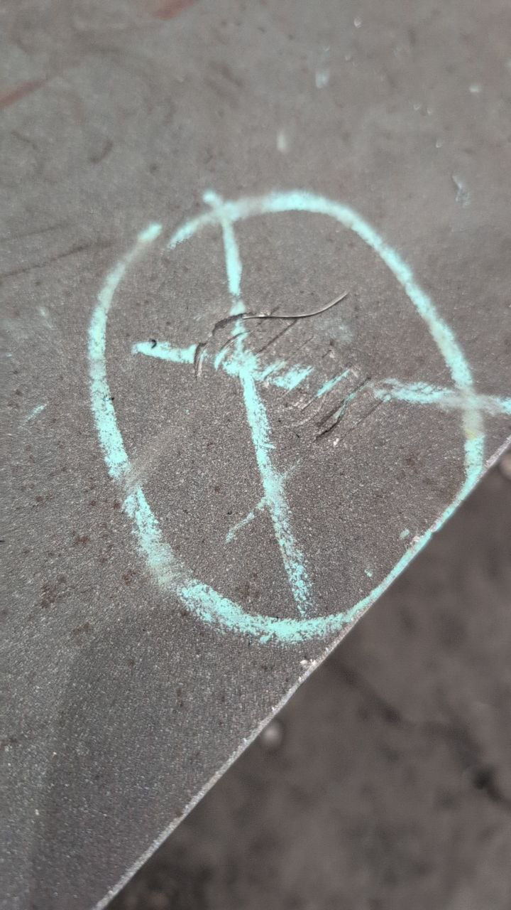
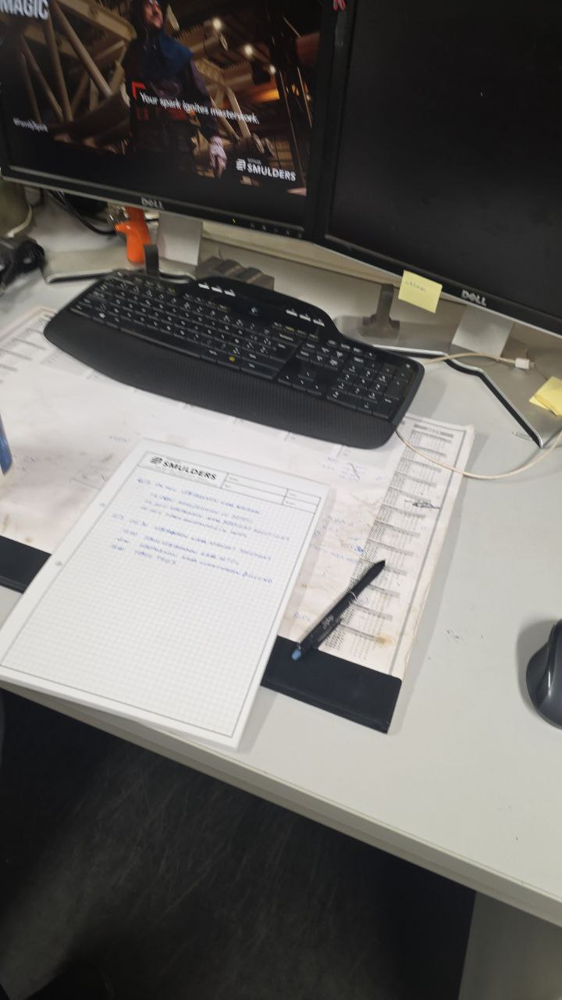
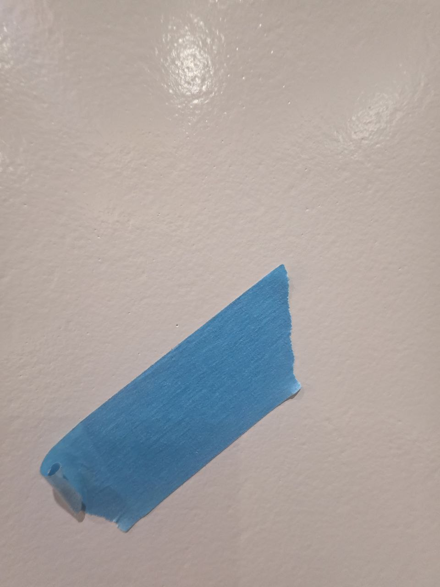

# QC Log — test

---
## 05/03/2026

### Welding

- [Nick] Plate klem — [plate_klem_surface_scratches_debris_20260305_081633.jpg]
  

### Coating / Galva

### NDT

### General

- [Nick] Plate klem – Surface inspection: Multiple scratches and abrasions across plate surface, concentrated around chalk-marked target area (circle with cross). Foreign material (metal shaving/wire fragment) found at centre intersection of chalk cross – possibly embedded in surface. Surrounding area shows pronounced surface irregularities. No welds or coating present in view. Area already flagged on-site with chalk mark. Photo: plate_klem_surface_scratches_debris_20260305_081633.jpg

---
## 06/03/2026

### Welding

- [User_8419669675] Analyseer deze foto — [office_desk_workspace_no_qc_items_20260306_053109.jpg]
  

### Coating / Galva

### NDT

### General

- [User_8419669675] Wat vind je van deze verffout — [qc_photo_20260306_150042.jpg]
  
